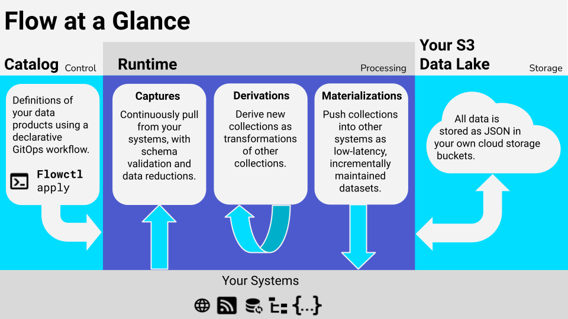

 | **[Docs home](https://docs.estuary.dev/)** | **[Free account](https://go.estuary.dev/sign-up)** | **[Data platform comparison reference](https://docs.estuary.dev/getting-started/comparisons)** | **[Email list](https://www.estuary.dev/newsletter-signup/)**

    
         

### Build millisecond-latency, scalable, future-proof data pipelines in minutes.

Estuary Flow is a DataOps platform that integrates all of the systems you use to produce, process, and consume data.

Flow unifies today's batch and streaming paradigms so that your systems
– current and future – are synchronized around the same datasets, updating in milliseconds.

With a Flow pipeline, you:

-   📷 **Capture** data from your systems, services, and SaaS into _collections_:
    millisecond-latency datasets that are stored as regular files of JSON data,
    right in your cloud storage bucket.

-   🎯 **Materialize** a collection as a view within another system,
    such as a database, key/value store, Webhook API, or pub/sub service.

-   🌊 **Derive** new collections by transforming from other collections, using
    the full gamut of stateful stream workflow, joins, and aggregations — in real time.

## Get started
Ready to try out Flow? [Sign up](https://dashboard.estuary.dev/register)
for free to get started! 🚀

Have questions? We'd love to hear from you:

- Join our [Slack Community](https://go.estuary.dev/slack)
- Reach out [directly](https://go.estuary.dev/say-hi)

---

## Using Flow

Flow combines a low-code UI for essential workflows and a CLI for fine-grain control over your pipelines.
Together, the two interfaces comprise Flow's unified platform.
You can switch seamlessly between them as you build and refine your pipelines, and collaborate with a wider breadth of data stakeholders.

* The UI-based web application is at **[dashboard.estuary.dev](https://dashboard.estuary.dev)**.
* The **flowctl CLI** can be downloaded per [these instructions](https://docs.estuary.dev/getting-started/installation/#get-started-with-the-flow-cli).

➡️ **Sign up for a free Flow account [here](https://go.estuary.dev/sign-up).**

*See the [BSL license](./LICENSE-BSL) for information on using Flow outside the managed offering.*

## Resources

-   📖 [Flow documentation](https://docs.estuary.dev/)

-   🧐 **Examples and tutorials**
    - [Documentation tutorials](https://docs.estuary.dev/getting-started/tutorials/)
    - Blog & GitHub tutorials
       - [Continuous materialized view in Postgres](https://www.estuary.dev/how-to-create-a-real-time-materialized-view-in-postgresql/)
       - [Kafka to Hasura GraphQL pipeline](https://www.estuary.dev/how-to-connect-kafka-to-hasura-graphql/)
       - [Flow transformations at http endpoints](https://github.com/estuary/flow-cf-workers-example)
    - Many [examples/](examples/) are available in this repo, covering a range of use cases and techniques.

## Support

The best (and fastest) way to get support from the Estuary team is to [join the community on Slack](https://join.slack.com/t/gazette-dev/shared_invite/enQtNjQxMzgyNTEzNzk1LTU0ZjZlZmY5ODdkOTEzZDQzZWU5OTk3ZTgyNjY1ZDE1M2U1ZTViMWQxMThiMjU1N2MwOTlhMmVjYjEzMjEwMGQ).

You can also [email us](mailto:support@estuary.dev).

## Connectors

Captures and materializations use connectors:
plug-able components that integrate Flow with external data systems.
Estuary's [in-house connectors](https://github.com/orgs/estuary/packages?repo_name=connectors)
focus on high-scale technology systems and change data capture (think databases, pub-sub, and filestores).

Flow can run Airbyte community connectors using
[airbyte-to-flow](https://github.com/estuary/airbyte/tree/master/airbyte-to-flow), allowing us to support a greater variety of SaaS systems.

**See our website for the [full list of currently supported connectors](https://www.estuary.dev/integrations/).**

If you don't see what you need, [request it here](https://github.com/estuary/connectors/issues/new?assignees=&labels=new+connector&template=request-new-connector-form.yaml&title=Request+a+connector+to+%5Bcapture+from+%7C+materialize+to%5D+%5Byour+favorite+system%5D).

## How does it work?

Flow builds on a real-time streaming broker created by the same founding team called [Gazette](https://gazette.dev).

Because of this, Flow **collections** are both a batch dataset –
they're stored as a structured "data lake" of general-purpose files in cloud storage –
and a stream, able to commit new documents and forward them to readers within milliseconds.
New use cases read directly from cloud storage for high-scale backfills of history,
and seamlessly transition to low-latency streaming on reaching the present.

- [Learn more about how Gazette works here](https://gazette.readthedocs.io/en/latest/index.html).

- [Learn more about how Flow works here](https://docs.estuary.dev/concepts/).

### What makes Flow so fast?

Flow mixes a variety of architectural techniques to achieve great throughput without adding latency:

-   Optimistic pipelining, using the natural back-pressure of systems to which data is committed.
-   Leveraging `reduce` annotations to group collection documents by key wherever possible,
    in memory, before writing them out.
-   Co-locating derivation states (_registers_) with derivation compute:
    registers live in an embedded RocksDB that's replicated for durability and machine re-assignment.
    They update in memory and only write out at transaction boundaries.
-   Vectorizing the work done in external Remote Procedure Calls (RPCs) and even process-internal operations.
-   Marrying the development velocity of Go with the raw performance of Rust, using a zero-copy
    [CGO service channel](https://github.com/estuary/flow/commit/0fc0ff83fc5c58e01a09a053419f811d4460776e).
