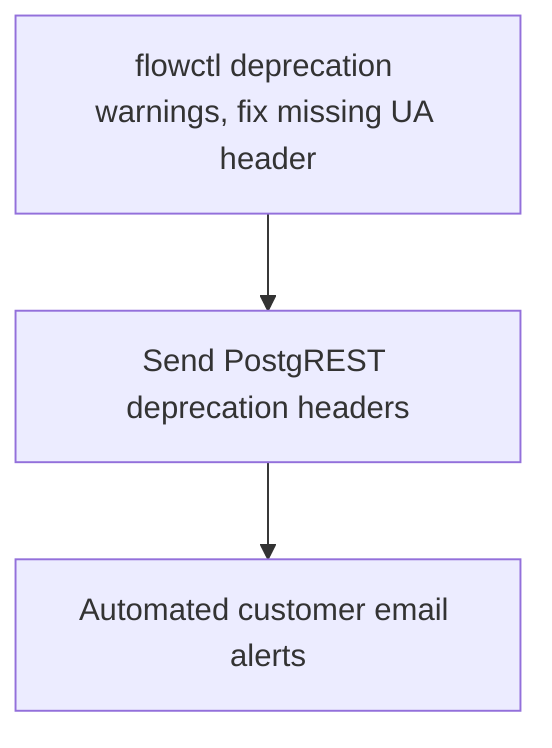

# API Deprecation Lifecycle

## Executive Summary

Estuary maintains an evolving product API, but today we have no mechanism to retire an endpoint once it's in use. The immediate motivator is the user-management migration from PostgREST to GraphQL — flowctl users are still hitting the old PostgREST endpoints, and we have no systematic way to detect that or steer them to the replacement.

Supabase logs show who's calling what, but only with seven days of retention — not long enough to track adoption of a replacement endpoint. Communicating deprecation to customers is either a mass email or relies on institutional knowledge of which customers happen to be using which APIs.

This plan establishes a general-purpose deprecation lifecycle for the control-plane API. The challenge: while we control the dashboard UI and can migrate it to new endpoints on our own schedule, flowctl is installed on customer machines and older versions will continue to call deprecated endpoints indefinitely unless we give ourselves a way to see them and reach their operators.

- Engineering gets visibility into which tenants (and which flowctl versions) are calling a given endpoint - once request volume drops below some acceptable threshold, we can remove the endpoint.
- Deprecated endpoints announce themselves via standard `Deprecation`/`Sunset` response headers.
- flowctl surfaces those headers noisily, printing a stderr warning on every response from a deprecated endpoint so the signal reaches the operator running the command or reading CI logs.
- Affected customers get targeted outreach — automated, periodic email alerts with increasing frequency as the sunset date approaches — specific tenants still calling a deprecated endpoint hear about it directly.

At current scale, flowctl adoption is small enough that watching call volume in Loki and reaching out to affected customers is the primary enforcement mechanism. We'll hold off on Sunset headers and actual endpoint removal until the warning (P1) and alerting (P3) machinery is live and broadly adopted. Until then, deprecation headers plus human support follow-up is sufficient.

## Technical Notes

### Signaling deprecation to API consumers

Both PostgREST and GraphQL endpoints return standard `Deprecation` and `Sunset` headers. GraphQL additionally marks deprecated operations and fields in the schema itself, so schema-aware clients get the signal through introspection as well. Successor information (e.g. "use the `listConnectors` GraphQL operation instead") is stored in the deprecation table and surfaced in flowctl warnings and alert emails rather than via a `Link` header — GraphQL operations don't have their own URLs, so a link isn't meaningful.

### PostgREST deprecation headers set via pre-request function

PostgREST supports a `db-pre-request` configuration — a Postgres function that runs before every request and can set response headers via `set_config('response.headers', ...)`. We use this to inject deprecation headers.

The deprecation metadata lives in a `deprecated_endpoints` table — endpoint path, deprecation date, optional sunset date, and a human-readable successor description (e.g. "use the `listConnectors` GraphQL operation"). The pre-request function looks up `current_setting('request.path')` against this table and sets `Deprecation` and (if present) `Sunset` headers. The same table serves as the source of truth for alert emails to communicate successor info to users.

## Open Questions

- **Pre-request table lookup performance.** The `deprecated_endpoints` table is the single source of truth for deprecation metadata — used by the pre-request header injection, alert emails, and potentially a GraphQL query for flowctl to enrich deprecation warnings. But the pre-request function runs on every PostgREST request, so we need to verify the per-request cost of the table lookup is negligible (the table will be tiny and should stay in the buffer cache, but we should confirm this).

## Phases

### P1: flowctl deprecation warnings

flowctl learns to inspect responses from the control-plane API for `Deprecation` and `Sunset` headers and prints a human-readable warning on stderr, once per invocation, including the sunset date and successor information when present. We aren't setting either of these headers yet.

The warning message distinguishes between two contexts. When the deprecated call originates from a built-in flowctl subcommand, the warning tells the user to update flowctl — the newer version already uses the successor endpoint. When it originates from a user-defined raw API call, the warning names the deprecated endpoint and its sunset date if known. Successor information (which endpoint or operation to use instead) becomes available once the deprecation table exists in P2 — flowctl can query it to enrich the warning.

This phase also fixes a bug: flowctl already constructs a `flowctl-<version>` User-Agent and applies it to its agent-API HTTP client, but the PostgREST client never receives the header. As a result, every PostgREST call from flowctl currently arrives at the server with an empty UA.

### P2: PostgREST deprecation signaling

Build the `deprecated_endpoints` table and the PostgREST pre-request function that injects `Deprecation` (and eventually `Sunset`) headers based on it. Then use it to deprecate our first endpoints — likely `user_grants` and `role_grants` once the GraphQL operations that replace them ship as part of the user-management migration. An endpoint must not be marked deprecated until flowctl's own subcommands have migrated to the successor — otherwise the "update flowctl" advice in the deprecation warning would be wrong. After this phase we can actually begin deprecating PostgREST endpoints: customers running an updated flowctl see warnings (from P1), engineering uses Loki to see who's still calling a given endpoint, and we do manual customer outreach based on that visibility.

This LogQL query shows who's calling specific endpoints, filtering out dashboard and Supabase JS traffic to isolate programmatic callers. Once the P1 UA fix has propagated, we can filter on `user_agent` directly instead of excluding known non-flowctl callers by referer and client info.

```logql
{service="edge_logs"}
  | metadata_request_path =~ "/rest/v1/(user_grants|role_grants).*"
  | metadata_request_method != "OPTIONS"
  | metadata_request_headers_x_client_info !~ "supabase-js-web/.*"
  | metadata_request_headers_referer !~ "https://dashboard\\.estuary\\.dev.*"
  | line_format "{{.metadata_request_method}} {{.metadata_request_path}} {{.metadata_response_status_code}} sub={{.metadata_request_sb_jwt_authorization_payload_subject}} ua={{.metadata_request_headers_user_agent}}"
```

### P3: Automated customer email alerts

_Speculative — details will firm up once P2 is in use ... and we have enough customers using flowctl to justify._ A new alert type on the existing alerting infrastructure sends periodic email alerts to tenants still calling deprecated endpoints. Alerts only fire once a sunset date is set — no sunset, no emails. As the sunset date approaches, alert frequency increases: roughly weekly at first, then every few days, then daily as the deadline nears.

## Phase Dependencies


