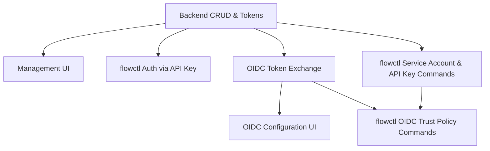

# Service Accounts

## Executive Summary

CI/CD pipelines, AI agents, and other programmatic integrations need stable credentials
that aren't tied to a human's `user_grants`.

A **service account** is a non-human identity that authorized the same way as a human
user — same `user_grants`, same resource access, same `user_roles()` resolution.

A service account can authenticate in one of two ways:

- **API key** — a long-lived credential we mint with a user-configurable lifetime
  that counts down from creation and does NOT reset on each use. Like a refresh
  token, it is exchanged via `generate_access_token` for a short-lived JWT; the
  JWT is the bearer token used against PostgREST and the rest of the stack.
- **OIDC** — the service account is configured to trust an external identity
  provider (GitHub Actions, for example). The IdP signs a short-lived token
  with its private key; we validate it against the issuer's JWKS and exchange
  it for a short-lived Estuary access token. No long-lived secrets to manage.

A service account can have multiple active API keys and OIDC configurations
simultaneously, enabling zero-downtime rotation — mint a new key, update
consumers, then revoke the old one.

Any admin can create a service account, but can only grant it access to their own
prefix or something more specific — an `acmeCo/` admin can create a service account
scoped to `acmeCo/staging/`, but an `acmeCo/staging/` admin cannot grant access to
`acmeCo/` or `acmeCo/prod/`.

Both service accounts and their credentials are fully manageable from the dashboard UI
and from `flowctl`, so admins can script provisioning (e.g., bootstrap a CI environment)
or drive everything interactively from the browser.

## Technical notes

- **`auth.users` rows.** Service accounts are real Supabase users. All existing RLS policies,
  PostgREST authorization, `user_roles()` resolution, and `role_grants` traversal work
  unchanged. _This avoids putting the PostgREST-to-GraphQL migration on the critical
  path to releasing the service account feature._

- **`internal.service_accounts` table.** A new table keyed by `auth.users.id` that
  holds service-account-specific metadata (owning prefix, display name, created-by,
  disabled state). Its presence is also what distinguishes a non-human `auth.users`
  row from a real person — code paths that assume "auth.users means a human"
  (member lists, onboarding) filter by joining against this table.

- **API keys get their own `internal.api_keys` table.**
  API keys behave much like refresh tokens: long-lived credentials exchanged via
  `generate_access_token` for a short-lived access token. An API key is reusable
  until it's revoked or expires at a fixed date (no sliding window like a refresh token has).

- **One `user_grants` row per service account.** Each SA has exactly one grant.
  This makes ownership unambiguous: whoever admins that prefix, manages
  the SA. Disabling the SA deletes the `user_grants` row and revokes all API keys and
  OIDC trust policies, so every avenue of access is cut at once. `prefix` and
  `capability` columns on `internal.service_accounts` mirror the original grant so this
  information survives a deletion (and could be used to re-enabled the SA) — the UI
  can still show the disabled SA with its intended scope. Access to multiple prefixes,
  when needed, is modeled through `role_grants` rather than adding `user_grants`.

## Phase dependency graph



Two independent branches off the root: the API key branch (P2, P5, P6) and the OIDC
branch (P3, P4, P7). P7 is the only phase with two upstream dependencies (P3 for
the backend it wraps, P6 for the subcommand tree it extends).

## Phase 1 — Service Account CRUD & Tokens (Backend)

Delivers the complete service account lifecycle via GraphQL. The mutations can
be driven by any authenticated admin (GraphQL playground, curl, or flowctl using
their existing human credentials). Once minted, an API key becomes a usable
credential by POSTing it to `generate_access_token` to receive a short-lived JWT
— that JWT is what actually goes in the `Authorization: Bearer` header. The raw
`flow_sa_...` string is not itself a valid Bearer token; flowctl only handles the
exchange transparently once Phase 5 lands.

### Data Model

**`internal.service_accounts`**:

| Column         | Type                        | Notes                                                                                                                         |
| -------------- | --------------------------- | ----------------------------------------------------------------------------------------------------------------------------- |
| `user_id`      | UUID PK, FK → `auth.users`  | The service account's identity                                                                                                |
| `prefix`       | `catalog_prefix` NOT NULL   | Owning prefix — set at creation, immutable. Used for authorization on all management operations (disable, key rotation, etc.) |
| `capability`   | `grant_capability` NOT NULL |                                                                                                                               |
| `display_name` | TEXT NOT NULL               | Human-readable label (e.g., "CI deploy bot")                                                                                  |
| `created_by`   | UUID FK → `auth.users`      | Audit trail — which human created this                                                                                        |
| `last_used_at` | TIMESTAMPTZ                 | Updated on each `generate_access_token()` call via any of this account's api keys                                             |
| `disabled_at`  | TIMESTAMPTZ                 | Set by `disableServiceAccount` — account cannot authenticate and is shown as disabled in the UI                               |
| `created_at`   | TIMESTAMPTZ                 |                                                                                                                               |
| `updated_at`   | TIMESTAMPTZ                 |                                                                                                                               |

The referenced row in `auth.users` has no password and no OAuth identity. Application-layer
queries that need to distinguish service accounts from humans (member lists, onboarding)
join against `internal.service_accounts`.

**`internal.api_keys`** — credentials for service accounts (separate from human `refresh_tokens`):

| Column               | Type                   | Notes                                                         |
| -------------------- | ---------------------- | ------------------------------------------------------------- |
| `id`                 | UUID PK                |                                                               |
| `service_account_id` | UUID FK → `auth.users` | Which service account this key authenticates as               |
| `secret_hash`        | TEXT NOT NULL          | Hashed secret (plaintext returned once at creation)           |
| `label`              | TEXT NOT NULL          | Human-readable label (e.g., "GitHub Actions")                 |
| `expires_at`         | TIMESTAMPTZ NOT NULL   | Hard cutoff — no sliding window                               |
| `created_by`         | UUID FK → `auth.users` | Which human created this key                                  |
| `last_used_at`       | TIMESTAMPTZ            | Updated on each `generate_access_token()` call using this key |
| `created_at`         | TIMESTAMPTZ            |                                                               |

**Token format:** API keys are prefixed `flow_sa_` followed by base64-encoded `{id}:{secret}`.
The prefix routes server-side lookups to `internal.api_keys`, and helps users distinguish
service account keys from personal refresh tokens.

Update `generate_access_token()` to accept an API key input alongside the existing
`{refresh_token_id, secret}` input. The two shapes are mutually exclusive and
routed by which field is present:

- **New input** — `{api_key: "flow_sa_..."}`: decode the base64 `{id}:{secret}`
  payload, look up in `internal.api_keys`, verify `secret_hash`, check `expires_at`,
  update `last_used_at`, mint a JWT with `service_account_id` as `sub`.
- **Existing input** — `{refresh_token_id, secret}`: unchanged, routes through
  `public.refresh_tokens` as today.

Response shape is unchanged (`{access_token, refresh_token?}`). The optional
`refresh_token` is never set for the api-key branch — API keys don't rotate;
the same `flow_sa_...` string is reused until its `expires_at`.

The additive input shape keeps the RPC fully backward compatible with existing
flowctl clients.

### GraphQL API

**Mutations:** (requires admin capability on the prefix)

- `createServiceAccount(prefix, capability, displayName)` → `{ userId, prefix, capability, displayName, createdAt }`
  - Creates `auth.users` row + `internal.service_accounts` row + `user_grants` row
    for `(user_id, prefix, capability)` as the only grant

- `disableServiceAccount(userId)` → `Boolean`
  - Deletes all `user_grants` (removes catalog access) and all `api_keys` (invalidates credentials)
  - Sets `internal.service_accounts.disabled_at = now()`
  - The `auth.users` row is intentionally preserved — several tables (`drafts`, `publications`,
    `publication_specs`) reference it with default `NO ACTION` FK constraints, so
    a hard delete would require cascading cleanup of audit history. Keeping the row is simpler and
    preserves attribution.
  - A disabled service account cannot authenticate (no api_keys, no grants) but remains
    visible in the UI as disabled for auditability

- `enableServiceAccount(userId)` → `Boolean`
  - Clears `internal.service_accounts.disabled_at` and re-creates the `user_grants` row
    for `(user_id, prefix, capability)` using the service account's original `prefix` and `capability`
  - Does NOT restore previously revoked `api_keys` — the admin must mint new ones via
    `createApiKey`

- `createApiKey(userId, label, validFor)` → `{ keyId, secret }`
  - Creates an `internal.api_keys` row for the target service account with `expires_at = now() + validFor`
  - `validFor`: ISO 8601 duration (e.g., `P90D`, `P1Y`)
  - Returns the `flow_sa_`-prefixed secret exactly once — never retrievable again

- `revokeApiKey(keyId)` → `Boolean`
  - Deletes the `api_keys` row

**Queries:**

- `serviceAccounts(after, first)` → paginated list
  - Includes: `userId`, `displayName`, `prefix`, `capability`, `createdBy`, `createdAt`,
    `apiKeys[]` (each with `keyId`, `label`, `createdAt`, `expiresAt` — secrets are
    not retrievable since only `secret_hash` is stored)
  - **Requires:** caller is admin (or read?) on `prefix`

### Verification

- [ ] Create service account with grant to `acmeCo/` → create API key → exchange for
      access token via `generate_access_token()` → use JWT with PostgREST and GraphQL
      → grants resolve normally through `user_roles()`
- [ ] API key with elapsed `expires_at` → `generate_access_token()` rejects
- [ ] Disable service account → all API keys revoked, grant removed, account marked disabled
- [ ] Disabled service account can't create new API keys
- [ ] Re-enabled service account has same access as before
- [ ] Multiple active API keys on same service account → all work (rotation scenario)
- [ ] `acmeCo/staging/` admin cannot manage a service account with prefix `acmeCo/prod/`
- [ ] Service account does NOT appear in tenant member lists

---

## Phase 2 — Service Account Management UI (Frontend)

Uses Phase 1 APIs with no backend changes.

### Views

**Service Accounts list** (under tenant admin area):

- Table: display name, prefix, created by, created date, API key count
- Scoped to the admin's current tenant prefix
- "Create Service Account" action

**Service Account detail:**

- Display name (editable)
- Prefix (read-only, set at creation)
- API keys list: label, created date, expires date, status (active / expired)
- "Create API Key" action with copy-once secret display + configurable lifetime
- "Revoke API Key" action per key
- "Disable Service Account" action with confirmation

### API Key Creation UX

1. Admin clicks "Create API Key"
2. Enters label (e.g., "GitHub Actions") and lifetime (dropdown: 90 days, 180 days, 1 year, custom)
3. System returns the `flow_sa_`-prefixed secret — the admin configures it in their
   CI system (or flowctl, per Phase 5), which exchanges it for a short-lived access
   token on each run
4. Secret is displayed once in a copy-able field with a warning that it won't be shown again
5. Admin copies and configures their CI/CD system

### Verification

- Create service account, create API key, copy secret → use in API call → works
- Secret display disappears on navigation — not retrievable
- Expired API keys show visual indicator
- Disable service account → shown as disabled in list

---

## Phase 3 — OIDC Token Exchange (Backend)

Enables external identity providers (GitHub Actions, GitLab CI, cloud provider
workload identity) to exchange their OIDC tokens for short-lived Estuary access
tokens. Eliminates long-lived secrets in CI/CD.

### Design

Implements a token exchange endpoint inspired by RFC 8693. An external OIDC token
is exchanged for a short-lived JWT scoped to a specific service account's grants.

**`internal.oidc_trust_policies`** — maps external identities to service accounts:

| Column               | Type                   | Notes                                                                 |
| -------------------- | ---------------------- | --------------------------------------------------------------------- |
| `id`                 | flowid PK              |                                                                       |
| `service_account_id` | UUID FK → `auth.users` | Which service account to act as                                       |
| `issuer`             | TEXT NOT NULL          | OIDC issuer URL (e.g., `https://token.actions.githubusercontent.com`) |
| `subject_pattern`    | TEXT NOT NULL          | Regex or exact match on `sub` claim                                   |
| `claims_filter`      | JSONB                  | Additional claim constraints (e.g., `{"repository": "estuary/flow"}`) |
| `max_token_lifetime` | INTERVAL               | Upper bound on issued token lifetime                                  |
| `created_by`         | UUID FK → `auth.users` |                                                                       |
| `created_at`         | TIMESTAMPTZ            |                                                                       |

**Endpoint:** `POST /auth/v1/token-exchange` (or GraphQL mutation)

```
{
  "grant_type": "urn:ietf:params:oauth:grant-type:token-exchange",
  "subject_token": "<external OIDC JWT>",
  "subject_token_type": "urn:ietf:params:oauth:token-type:jwt",
  "requested_token_type": "urn:ietf:params:oauth:token-type:access_token"
}
```

**Flow:**

1. Decode external JWT, extract `iss` and `sub`
2. Fetch issuer's JWKS (cached) and verify signature
3. Match against `oidc_trust_policies` — `issuer` + `subject_pattern` + `claims_filter`
4. Mint a short-lived JWT with the matched service account's `user_id` as `sub`
5. Return access token (no refresh token — short-lived only)

**Authorization for trust policy management:** caller must be admin on the
linked service account's `prefix`.

### Verification

- Configure GitHub Actions trust policy → run workflow → token exchange succeeds
  → API calls work with service account's grants
- Mismatched subject or claims → rejected
- Expired external token → rejected
- Token lifetime respects `max_token_lifetime`

---

## Phase 4 — OIDC Configuration UI (Frontend)

Extends service account detail view with trust policy management, using Phase 3 APIs.

### UX

- "OIDC Trust Policies" section on service account detail
- "Add Trust Policy" with guided setup per provider:
  - GitHub Actions: repo name → auto-fills issuer + subject pattern
  - GitLab CI: project path → auto-fills
  - Custom: manual issuer URL + subject pattern + optional claims
- Display active policies with issuer, subject pattern, and last-used timestamp

### Verification

- Create trust policy through UI → GitHub Actions workflow authenticates successfully
- Delete trust policy → subsequent workflow runs fail authentication
- Provider-specific templates pre-fill correct values

---

## Phase 5 — flowctl Authenticates as a Service Account

Lets CI jobs run flowctl using a service account API key instead of a
human's refresh token. Depends only on the `generate_access_token` RPC
change from Phase 1. Ships independently of Phase 6.

Today flowctl picks up a long-lived credential from the `FLOW_AUTH_TOKEN`
env var ([config.rs:162-173](crates/flowctl/src/config.rs#L162-L173)),
expecting a base64-encoded JSON refresh token `{id, secret}`. CI jobs set
this to a refresh token tied to a human user — awkward because the
credential is personal, uses a sliding expiry (never forced to rotate),
and breaks if the human's account is deleted.

After Phase 5, the same env var also accepts a `flow_sa_...` API key:

```yaml
- run: flowctl catalog publish --specs ./catalog.yaml
  env:
    FLOW_AUTH_TOKEN: ${{ secrets.ESTUARY_API_KEY }} # flow_sa_... string
```

**Detection is by prefix.** In [config.rs](crates/flowctl/src/config.rs),
the `FLOW_AUTH_TOKEN` handler branches on whether the value starts with
`flow_sa_`. The existing base64-JSON path is untouched — base64's alphabet
doesn't include `_`, so the two formats can't collide, and existing CI
jobs that feed a refresh token through this env var keep working unchanged.

### Config changes

- Add `user_api_key: Option<String>` to `Config` alongside `user_refresh_token`.
  Mutually exclusive in practice — whichever is set drives credential refresh.
- Load path: if `FLOW_AUTH_TOKEN` starts with `flow_sa_`, populate `user_api_key`;
  otherwise decode as today into `user_refresh_token`.
- No config-file migration needed. Existing `~/.config/flowctl/*.json` files
  that contain `user_refresh_token` are unaffected.

### `refresh_authorizations` changes

[flow-client/src/client.rs:462](crates/flow-client/src/client.rs#L462):

- New branch: if `user_api_key` is set, call `generate_access_token` with the
  new `{api_key}` input (Phase 1), get back an access token, return the api
  key unchanged. Skip the "auto-create a refresh token" branch — the API key
  IS the long-lived credential.
- Existing refresh-token branches are unchanged.

### New auth command

`flowctl auth api-key --token flow_sa_...` stores the key into the config
file for interactive workstation use. The existing `flowctl auth token`
remains for short-lived access tokens and for the interactive login flow.

### Verification

- [ ] Existing CI job using a base64-JSON refresh token in `FLOW_AUTH_TOKEN`
      continues to work with no changes
- [ ] `FLOW_AUTH_TOKEN=flow_sa_...` set in env → flowctl runs as the service
      account, grants resolve through `user_roles()` to the service account's
      prefix
- [ ] Expired API key in `FLOW_AUTH_TOKEN` → flowctl fails with a clear error
      (no attempt to refresh, since API keys don't rotate)
- [ ] Access token nearing expiry is re-minted from the API key on the next
      request; the API key itself is not rotated or re-written anywhere
- [ ] `flowctl auth api-key --token flow_sa_...` persists to config and
      subsequent invocations authenticate correctly

---

## Phase 6 — flowctl Service Account & API Key Commands

Adds a `flowctl service-accounts` subcommand tree covering service account
lifecycle and API key management. Depends only on Phase 1. Ships
independently of Phase 5; until then, admins drive provisioning from the
dashboard (Phase 2) or exchange the secret returned by `api-keys create` via
`generate_access_token` (the same flow a refresh token uses today) to obtain
a short-lived JWT for ad-hoc `Authorization: Bearer` use.

Lives at [crates/flowctl/src/service_accounts/](crates/flowctl/src/service_accounts/)
alongside existing top-level subcommands like `catalog`, `draft`, and `auth`.

**Pattern to follow:** [crates/flowctl/src/alert_subscriptions/](crates/flowctl/src/alert_subscriptions/)
is the closest shape — full CRUD (`list-query.graphql`, `create-mutation.graphql`,
`update-mutation.graphql`, `delete-mutation.graphql`) wired through
`graphql_client::GraphQLQuery` derives and the shared `post_graphql<Q>()` helper
in [crates/flowctl/src/graphql.rs](crates/flowctl/src/graphql.rs). The module
header comment in `graphql.rs` documents the derive attributes (`extern_enums`,
`response_derives`, scalar mapping) that these queries will need.

### Command surface

```
flowctl service-accounts list [--prefix <prefix>]
flowctl service-accounts create --prefix <prefix> --capability <read|write|admin> --name <display-name>
flowctl service-accounts disable <user-id>
flowctl service-accounts enable <user-id>

flowctl service-accounts api-keys list <user-id>
flowctl service-accounts api-keys create <user-id> --label <label> --valid-for <duration>
flowctl service-accounts api-keys revoke <key-id>
```

`--valid-for` accepts an ISO 8601 duration (`P90D`, `P1Y`) to match the
GraphQL input type.

### Output ergonomics

- Default output follows the existing `--output` convention (`table` | `yaml` |
  `json`) from [crates/flowctl/src/output.rs](crates/flowctl/src/output.rs) so
  `list` commands are human-readable by default and scriptable with `-o json`.
- `api-keys create` prints the `flow_sa_`-prefixed secret to stdout **once**, with
  the rest of the row metadata on stderr. This lets CI scripts do:
  ```bash
  SECRET=$(flowctl service-accounts api-keys create $ID --label ci --valid-for P90D -o json | jq -r .secret)
  ```
  without secrets leaking into captured stderr logs or `set -x` traces.
- A prominent warning reminds the caller that the secret is not retrievable.

### Scripting example

Documented in the command's long help:

```bash
# Bootstrap a CI service account end-to-end
USER_ID=$(flowctl service-accounts create \
  --prefix acmeCo/ci/ --capability admin --name "GitHub Actions" \
  -o json | jq -r .userId)

flowctl service-accounts api-keys create "$USER_ID" \
  --label "github-actions-main" --valid-for P90D \
  -o json | jq -r .secret > ci-token.txt
```

### Verification

- [ ] `create` → `api-keys create` → use returned secret as `FLOW_AUTH_TOKEN`
      → `flowctl catalog list` succeeds (end-to-end CLI round trip; requires
      Phase 5 for the `FLOW_AUTH_TOKEN` consumption side, or alternatively
      exchange the secret via `generate_access_token` and use the resulting
      JWT as the `Authorization: Bearer` header)
- [ ] `disable` removes grants and API keys; subsequent `api-keys create` fails
- [ ] `list` respects the caller's admin scope — a `acmeCo/staging/` admin does
      not see `acmeCo/prod/` service accounts
- [ ] `-o json` output is stable and parseable for all list/create commands
- [ ] `api-keys create` secret goes to stdout only; stderr contains no secret
      material even under `flowctl --log-level debug`

---

## Phase 7 — flowctl OIDC Trust Policy Commands

Extends the `flowctl service-accounts` tree with an `oidc` subcommand group
for managing trust policies from the CLI. Depends on Phase 3 (backend) and
Phase 6 (subcommand structure to hang off of). Ships independently of
Phase 4; until then, admins manage trust policies via Phase 3's GraphQL
or via the future Phase 4 UI.

### Command surface

```
flowctl service-accounts oidc list <user-id>
flowctl service-accounts oidc create <user-id> --issuer <url> --subject <pattern> [--claim key=value]... [--max-lifetime <duration>]
flowctl service-accounts oidc delete <policy-id>
```

`--max-lifetime` accepts an ISO 8601 duration to match the GraphQL input type.

Output ergonomics follow Phase 6's conventions (`--output` flag, `-o json`
scriptability).

### Verification

- [ ] `oidc create` with a GitHub Actions issuer → workflow token-exchange
      succeeds (same check as Phase 3, driven from the CLI)
- [ ] `oidc list` shows the configured policies with issuer, subject pattern,
      and last-used timestamp
- [ ] `oidc delete` removes the policy; subsequent token-exchange attempts
      matching that policy are rejected
- [ ] Attempting to manage a trust policy for a service account the caller
      doesn't have admin rights on is rejected

---

## Migration & Compatibility Notes

### auth.users integration

Service accounts are `auth.users` rows. GoTrue won't interact with them (no
password, no OAuth), but they occupy the same ID space. Code paths that assume
`auth.users` means "a human" — tenant member lists, onboarding flows — need to
filter service accounts out by joining against `internal.service_accounts`.

### PostgREST compatibility

Because service accounts are `auth.users` with standard `user_grants`, the existing
`generate_access_token()` → JWT → PostgREST flow works unchanged. The JWT `sub`
is the service account's UUID, and `user_roles()` resolves its grants normally.

### flowctl compatibility

flowctl changes are split across Phases 5, 6, and 7 and are fully backward compatible:

- **Phase 5** (auth): existing config files (`~/.config/flowctl/*.json` with
  `user_refresh_token`) are unaffected — the new api-key path adds a sibling
  `user_api_key` field without touching the refresh-token one. `FLOW_AUTH_TOKEN`
  gains prefix-based dispatch: `flow_sa_...` → api key, anything else → existing
  base64-JSON refresh-token path. Base64's alphabet excludes `_`, so the two
  formats can't collide and existing CI jobs are undisturbed.
- **Phase 1** (backend): the `generate_access_token` RPC grows a new input
  shape (`{api_key}`) alongside the existing `{refresh_token_id, secret}` —
  older flowctl versions using the old shape continue to work unchanged.
- **Phase 6** (management): adds a new `flowctl service-accounts` subcommand
  tree; no changes to existing commands.
- **Phase 7** (OIDC CLI): adds an `oidc` subcommand group under
  `flowctl service-accounts`; no changes to existing commands.

### Data plane auth

Data plane HMAC auth is completely separate. Service accounts that need data plane
access will get it through the normal task activation flow (their grants authorize
catalog operations, which produce data plane tokens as a side effect).

### Credential expiry semantics

Human refresh tokens (`public.refresh_tokens`): sliding window (`updated_at + valid_for`, resets on use).
Service account API keys (`internal.api_keys`): fixed window (`expires_at`, set once at creation, never resets).
These live in separate tables — no overloaded semantics.
