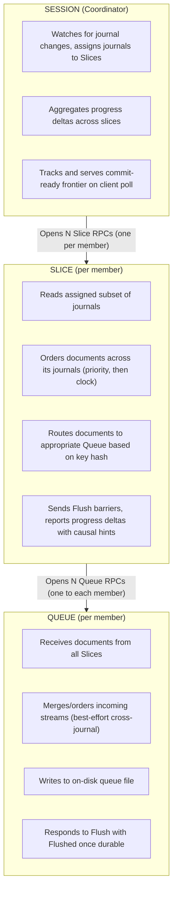

# Shuffle V2: Coordinated Disk-Backed Reads

## Background

Flow tasks (derivations, materializations) read from source collection journals via a "shuffle" system that routes documents to the appropriate task shard based on shuffle key hashes. This allows downstream shard processing to work in parallel over balanced, non-overlapping sets of transaction keys. The current implementation (`go/shuffle/`) has a few key limitations:

1. **In-memory document staging**: Shuffled documents are held in memory buffers. This limits how far reads can progress ahead of downstream processing and creates memory pressure under high throughput.

2. **Per-shard independent checkpoints**: Each shard maintains its own read offsets. While reads are *mostly* leveled across shards (due to ring-based coordination), there's no single checkpoint representing "data ready to process across all shards." This prevents coordinated transactions.

3. **Logical reads per-shard and journal**: Each shard starts an RPC for every journal read by the task, and each ACK is broadcast to every shard. This doesn't scale well if there are 100k journals.

## Objectives

1. **Disk-backed queues**: Shuffled documents are written to on-disk queue files, allowing reads to progress well ahead of downstream processing without memory pressure.

2. **Coordinated checkpoints**: A single checkpoint update represents data that's ready to process across *all* shards, enabling coordinated multi-shard transactions.

3. **Idempotent transaction recovery**: If a transaction is prepared for processing, fails, and restarts, the system replays the exact same transaction extents.

4. **Improved scaling**: The system must scale comfortably to 10 shards with 100k journals, and beyond.

5. **Cross-journal transaction visibility**: When a producer commits a transaction spanning multiple journals within the same cohort, all journals' committed data becomes visible in the same NextCheckpoint.

## Current Architecture Summary

The existing shuffle system has two roles that task shards play simultaneously. Both roles run in the same process; the "server side" coordinator is elected among members via HRW hashing, not a separate service.

**Client side** (per-shard):
- `ReadBuilder` creates `read` instances for each source journal
- `governor` orders documents across reads using a priority heap (priority first, then adjusted publication clock)
- Documents delivered to consumer via channel

**Server side** (coordinator):
- `Coordinator` manages `ring`s keyed by (journal, replay, buildID). The `replay` boolean distinguishes ongoing reads from bounded "replay reads" used to re-read uncommitted transactions when they commit.
- Each `ring` reads a journal, extracts shuffle keys, fans out to `subscriber`s
- Coordinator selection via `RangeSpec` overlap (key and R-clock, "rotated clock")
  - If multiple shards match the range, Highest Random Weight (HRW) is used to tie-break.
- Multiple subscribers to the same journal share one underlying read

Key characteristics:
- RangeSpec constraints minimize data movement by preferring coordinators with overlapping key ranges.
  - Optimization: if partition labels cover the shuffle key, all documents must de-facto route to a single pre-known shard
- Backpressure via exponential backoff, with cancellation after ~2 minutes of no progress

## New Architecture

### Protocol Overview

The new design introduces a 3-level RPC hierarchy. Coordinator selection (which member hosts the Session) is determined by the encapsulating context and is out of scope for this protocol—this allows the same protocol to serve both production task shards and ad-hoc topologies like local `flowctl` runs.

### Concepts

**Causal Hints**: ACKs are documents written to journals by a Producer ID (contained in the UUID), which contain a clock that acknowledges all preceding lesser-clock documents from that producer in the journal. As a related extension of this work, ACK documents may include _other_ journals the producer wrote to in the same transaction. These are "causal hints" that allow for correlation of producer transactions across multiple journals.

**Cohorts**: Journals are grouped into cohorts based on their shuffle configuration (priority and read-delay). Cohorts are the unit of transaction visibility coordination: causal hints are only tracked within a cohort, allowing different cohorts to make progress independently. Cohorts are derived from bindings: all sources sharing the same `(priority, read_delay)` tuple belong to the same cohort. The Session and Slice RPCs each build a mapping of journal-prefix-to-bindings and binding-to-cohort at startup to facilitate filtering and projection of hinted journals to bindings, and bindings to cohorts. Cohorts are assigned ascending integers by walking ordered task bindings and identifying unique `(priority, read_delay)` tuples.

**Journal Tags**: Journals are identified by name, but names can be long (200+ chars) and chatty within a protocol. The Session RPC picks an arbitrary assignment of journal name => integer tag (e.x. by assigning a next sequential tag ID to novel journal names), which is broadcast to all Slice RPCs and baked into checkpoints. Thereafter journals are referred to by their tag short-hand.

### Startup Sequence

1. Session coordinator opens Session RPC with task, member topology, and resumption checkpoint (`last_commit`, optional `read_through`)
2. Session opens Slice RPCs to each member
3. Each Slice opens Queue RPCs to every member, responds Opened once all Queue channels established
4. Queue RPCs from all Slices converge on the member's shared disk queue file, respond Opened once ready
5. Session is ready once all Slices have responded Opened (which implies all Queues are ready)
6. If any Slice or Queue fails to Open, the entire Session fails immediately
7. Session starts journal watch, broadcasts journal tags to all Slices, and sends StartRead/StopRead to designated Slices as journals change

### Main Loop

1. Slices read documents from assigned journals, ordered by priority then publication clock
2. Each document is routed to the owning Queue based on key hash/r-clock and member range
3. Slices periodically send Flush to all Queues, wait for Flushed responses
4. After Flush completes, Slice reports ProgressDelta to Session, including causal hints extracted from ACK documents (filtered to relevant cohort journals not already confirmed by this Slice)
5. Session aggregates progress deltas, updates producer frontiers, prepares NextCheckpoint when client polls

### Checkpoint Semantics

**`last_commit`**: The fully committed checkpoint. All reads resume from this point.

**`read_through`**: Optional. Represents a transaction that was prepared but not committed before failure. On recovery, the Session waits until Slices have reported progress such that the producer frontier for all (cohort, producer) pairs reaches or exceeds the commit clocks in the `read_through` checkpoint. The first NextCheckpoint is then exactly `read_through`, enabling idempotent transaction retry.

**`NextCheckpoint`**: A sparse delta containing only journals with progress since last checkpoint. Client merges this into their base checkpoint. NextCheckpoint reflects aggregate progress available at poll time; Session does not await or synchronize with Slices (except blocking for a first ProgressDelta if no progress has yet occurred).

**Producer Frontier Model**: Session tracks a "complete frontier" per (cohort, producer)—the highest transaction clock through which all that producer's cross-journal transactions are confirmed complete. A transaction is complete when all hinted journals within the cohort have reported the producer committed at that clock. When generating NextCheckpoint:
- Journal read_through offsets reflect actual read progress (not held back)
- Producer commit states are filtered by complete frontier: a producer appears committed only up to its complete frontier, even if raw progress shows later commits
- Transactions after the complete frontier appear as uncommitted, with begin_offset from the oldest pending transaction

This model allows unrelated producers to make independent progress. If producer P has a pending cross-journal transaction while producer Q (writing only to one journal) commits, Q's commit is immediately visible in NextCheckpoint—P's pending state doesn't block Q. Producers with no pending cross-journal hints (including those writing to only one journal) have their commits immediately complete—no hints means no journals to await.

## Key Design Decisions

### Transaction Visibility

**Base guarantee**: A Slice owns its assigned journals completely and doesn't report progress until all Queues have flushed those journals' documents. This guarantees all Queues have the complete, ordered sequence for each journal.

**Cross-journal coordination via causal hints**: When a Slice observes an ACK, it extracts these hints and reports them to the Session alongside its ProgressDelta. The Session uses hints to coordinate visibility:

1. When producer P commits in journal A with hints [B, C], Session records a pending transaction for (cohort, P) awaiting confirmation from B and C
2. As Slices report P committed in B and C, Session marks those journals confirmed
3. Once all hinted journals confirm, the transaction is complete and P's complete frontier advances
4. NextCheckpoint generation filters producer states by complete frontier

**Hint filtering**: Slices filter hints before reporting:
- Only journals in the same cohort (different cohorts make progress independently)
- Only journals that are sources for this task
- Exclude journals already confirmed by this Slice (a Slice reading both A and B can confirm both locally)

**Cross-cohort transactions**: If a producer writes to journals in different cohorts, hints crossing cohort boundaries are discarded. Each cohort tracks its own frontier for that producer, and the producer's commits become visible independently per cohort. This is intentional: different priorities and read-delays imply independent visibility semantics.

### Conservative Read Strategy

The current implementation reads optimistically from the latest offset. When an uncommitted transaction later commits, the system must go back and perform bounded "replay reads" to re-read that transaction's documents—these are distinguished by the `replay` boolean in ring keys.

The new design reads conservatively from the **earliest begin_offset** of any uncommitted producer in the checkpoint. This means uncommitted transaction data is read immediately (before the ACK arrives), eliminating replay reads entirely. The tradeoff is potentially re-reading already-committed data on startup if producers have long-running uncommitted transactions.

### Flush as Coordination Primitive

The Flush/Flushed barrier is the mechanism for knowing data is durable:
- Slice sends Flush to all Queues
- Each Queue responds Flushed once preceding documents are on disk
- Only after all Flushed responses does Slice report ProgressDelta
- Ergo Session only reports progress that has been flushed by all Queues

At most one Flush is in-flight from any given Slice at a time (multiple Slices may have concurrent Flushes).
A Slice starts a Flush after enqueuing an ACK document.
If a Flush is already in progress, it awaits its completion and then
starts a next Flush. Upon the completion of each Flush, a Slice sends
a ProgressDelta to its Session. Open uncommitted transactions,
even long-lived ones, don't trigger a flush until ACK,
as until then there's no meaningful progress to report.

Pending flushes do not head-of-line block sends of queued documents:
as load increases, the number of queued documents acknowledged by each flush similarly increases.

It's intended that Queue RPCs may become "stuffed" as the sender outpaces the reader.
This backpressures from queues to Slices, and from Slices to their individual journal reads.

The overall rate of progress will be bounded by the write throughput of the slowest Queue file,
and all participants will make progress together.

The Session RPC aggregates ProgressDeltas and polled client NextCheckpoint requests
are *not* subject to backpressure: they surface already completed, available progress.

### ACK Document Handling

ACK documents serve two purposes: marking transaction commit for downstream processing, and carrying causal hints for cross-journal coordination.

**Queue routing optimization**: ACK documents could naively broadcast to all Queues, but this doesn't scale to 100k journals where most transactions touch only a few journals. Slices track the cumulative key/r-clock range of documents seen per producer. When an ACK arrives, it's only broadcast to Queues whose ranges intersect the tracked extent. The tracked range accumulates across all documents from a producer, ensuring ACKs reach all relevant Queues even if documents were routed to different Queues over time.

**Causal hint extraction**: ACK documents embed the list of other journals the producer wrote to in this transaction. When a Slice reads an ACK, it extracts these hints for reporting to the Session. This is independent of Queue routing: hints inform the Session's frontier tracking, while Queue routing determines which downstream shards need to see the ACK for processing.

### Fail-Fast Recovery Model

Any failure (Slice dies, Queue write fails, gRPC stream error) fails the entire Session. All queue files are discarded. The Session is recreated from scratch using checkpoint inputs.

Error propagation flows up the RPC hierarchy:
1. Queue write failure → Queue stream closes
2. Slice detects Queue stream closure → Slice stream closes
3. Session detects Slice stream closure → Session fails

This keeps the failure model simple: no partial state recovery, no deduplication needed at Queues. Member topology changes (shard additions, removals, or failures) are handled via fail-fast: the Session terminates and restarts from checkpoint with the new topology.

### Queue Dequeue is Out-of-Band

The Queue RPC protocol handles enqueue and flush only. Downstream consumers read from queue files directly via file access, with hole punching to release disk space. Consumers learn of available data through periodic NextCheckpoint polls of the Session—the specific notification mechanism varies by context and is outside this protocol's scope.

### Session State is Ephemeral

Session re-derives all state from `last_commit` and `read_through` on startup. There's no persistent state beyond the checkpoint inputs. This enables clean restart semantics.

## Scale Considerations

**gRPC Streams**: With M members, each Slice opens M Queue RPCs, and Session opens M Slice RPCs. Total streams: M + M² (Session→Slices + Slices→Queues). For example, at M=10 members with N=100k journals, the current system requires up to M×N = 1M RPCs, while the new system requires only M + M² = 110 streams. At M=100 members, each member handles ~100 incoming Queue streams—manageable because M is orders of magnitude smaller than N.

**Journal Watches**: Today, every shard independently maintains a watch over all task journals, using it to start/drain reads that aggregate into the coordinator's physical read. The new architecture consolidates this: a single Session owns the journal watch and directs Slices via StartRead/StopRead. This reduces watch overhead from M to 1.

**Checkpoint Size**: With many journals, checkpoint deltas must be sparse (only journals with actual progress). Full checkpoints are tracked separately by the client.

**Journal Assignment**: Uses same range-overlap/HRW logic as current implementation to minimize data movement. Shuffle key optimization still applies.

## Non-Goals (Out of Scope)

- Coordinator selection (determined by encapsulating context)
- Supplemental fault detection beyond gRPC stream errors
- Partial failure recovery (fail-fast model only)
- Queue file format specification (documents written as-is to model realistic disk backpressure; format details deferred)
- Dequeue protocol (direct file access, notification via NextCheckpoint polling)
- ACK document hint embedding (assumed available from upstream; this protocol consumes hints, doesn't define how they're produced)

## Migration Path

The new protocol is a separate implementation from the current shuffle system. Both can coexist during migration. The transition involves:
1. Implementing the new Session/Slice/Queue protocol with producer frontier tracking
2. Updating reactors to use disk queues instead of in-memory channels
3. Updating checkpoint handling for coordinated transactions and cross-journal visibility
