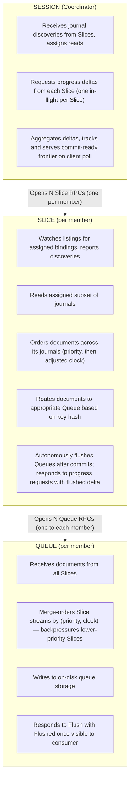

# Shuffle V2: Coordinated Disk-Backed Reads

## Background

Flow tasks (derivations, materializations) read from source collection journals via a "shuffle" system that routes documents to the appropriate task shard based on shuffle key hashes. This allows downstream shard processing to work in parallel over balanced, non-overlapping sets of transaction keys. The legacy implementation (`go/shuffle/`) has a few key limitations:

1. **In-memory document staging**: Shuffled documents are held in memory buffers. This limits how far reads can progress ahead of downstream processing and creates memory pressure under high throughput.

2. **Per-shard independent checkpoints**: Each shard maintains its own read offsets. While reads are *mostly* leveled across shards (due to ring-based coordination), there's no single checkpoint representing "data ready to process across all shards." This prevents coordinated transactions.

3. **Logical reads per-shard and journal**: Each shard starts an RPC for every journal read by the task, and each ACK is broadcast to every shard. This doesn't scale well if there are 100k journals.

## Objectives

1. **Disk-backed queues**: Shuffled documents are written to on-disk queue files, allowing reads to progress well ahead of downstream processing without memory pressure.

2. **Coordinated checkpoints**: A single checkpoint update represents data that's ready to process across *all* shards, enabling coordinated multi-shard transactions.

3. **Idempotent transaction recovery**: If a transaction is prepared for processing, fails, and restarts, the system replays the exact same transaction extents.

4. **Improved scaling**: The system must scale comfortably to 10 shards with 100k journals, and beyond.

5. **Cross-journal transaction visibility**: When a producer commits a transaction spanning multiple journals within the same cohort, all journals' committed data becomes visible in the same NextCheckpoint.

## Legacy Architecture Summary

The existing shuffle system has two roles that task shards play simultaneously. Both roles run in the same process; the "server side" coordinator is elected among members via HRW hashing, not a separate service.

**Client side** (per-shard):
- `ReadBuilder` creates `read` instances for each source journal
- `governor` orders documents across reads using a priority heap (priority first, then adjusted publication clock)
- Documents delivered to consumer via channel

**Server side** (coordinator):
- `Coordinator` manages `ring`s keyed by (journal, replay, buildID). The `replay` boolean distinguishes ongoing reads from bounded "replay reads" used to re-read uncommitted transactions when they commit.
- Each `ring` reads a journal, extracts shuffle keys, fans out to `subscriber`s
- Coordinator selection via `RangeSpec` overlap (key and R-clock, "rotated clock")
  - If multiple shards match the range, Highest Random Weight (HRW) is used to tie-break.
- Multiple subscribers to the same journal share one underlying read

Key characteristics:
- RangeSpec constraints minimize data movement by preferring coordinators with overlapping key ranges.
  - Optimization: if partition labels cover the shuffle key, all documents must de-facto route to a single pre-known shard
- Backpressure via exponential backoff, with cancellation after ~2 minutes of no progress

## New Architecture

### Protocol Overview

The new design introduces a 3-level RPC hierarchy. A **member** is a participant in the shuffle topology—typically a task shard (reactor instance), though ad-hoc topologies like local `flowctl` runs also use this abstraction. The **Coordinator** is an external controller that opens the Session RPC; it is always hosted by the first member in the member list. (Note: this is a different concept from the old "Coordinator" in the `go/shuffle/` architecture, which was an elected ring manager. In the new design, the Coordinator is simply the caller that starts and drives the Session.) Coordinator selection is out of scope for this protocol—this allows the same protocol to serve both production task shards and ad-hoc topologies like local `flowctl` runs.


```mermaid
flowchart TB
    subgraph SESSION["SESSION (Coordinator)"]
        S1["Receives journal discoveries from Slices, assigns reads"]
        S2["Requests progress deltas from each Slice (one in-flight per Slice)"]
        S3["Aggregates deltas, tracks and serves commit-ready frontier on client poll"]
    end

    subgraph SLICE["SLICE (per member)"]
        SL0["Watches listings for assigned bindings, reports discoveries"]
        SL1["Reads assigned subset of journals"]
        SL2["Orders documents across its journals (priority, then adjusted clock)"]
        SL3["Routes documents to appropriate Queue based on key hash"]
        SL4["Autonomously flushes Queues after commits; responds to progress requests with flushed delta"]
    end

    subgraph QUEUE["QUEUE (per member)"]
        Q1["Receives documents from all Slices"]
        Q2["Merge-orders Slice streams by (priority, clock) — backpressures lower-priority Slices"]
        Q3["Writes to on-disk queue storage"]
        Q4["Responds to Flush with Flushed once visible to consumer"]
    end

    SESSION -->|"Opens N Slice RPCs (one per member)"| SLICE
    SLICE -->|"Opens N Queue RPCs (one to each member)"| QUEUE
```

### Concepts

**Bindings**: A binding is the unit of configuration for reading a source collection within a task. Each derivation transform and each materialization binding produces one shuffle binding. A binding carries the metadata that determines _how_ documents are read and shuffled: the source collection, shuffle key (explicit, lambda-computed, or defaulting to the source key), partition selector, priority, read delay, validation schema, and cohort index. Read delay is enforced by the Slice: a document is held and not routed to Queues until its publication clock is at least `read_delay` in the past.

**R-Clock (Rotated Clock)**: Each document's UUID v1 Clock is transformed into a 32-bit R-Clock by XORing the timestamp with its 4-bit sub-tick sequence counter and then bit-reversing the result. This produces a high-entropy value from the otherwise sequential clock, enabling uniform distribution across shard ranges. Each member's `RangeSpec` defines a 2D ownership region over (shuffle key hash, R-Clock), and documents are routed to the member(s) whose range encompasses both dimensions. Member ranges collectively cover the full 2D space—every document matches at least one member. Read-only derivation transforms filter documents by R-Clock range; materializations use the full R-Clock range.

**Causal Hints**: ACKs are documents written to journals by a Producer ID (contained in the UUID), which contain a clock that acknowledges all preceding lesser-clock documents from that producer in the journal. ACK documents also embed references to _other_ journals the producer wrote to in the same transaction. These are "causal hints" that allow for correlation of producer transactions across multiple journals. (Hint embedding in ACK documents is assumed to exist; this protocol consumes hints but does not define how they're produced.)

**Message Flags**: Each document carries one of three flags: **OUTSIDE_TXN** (a single-document, self-contained transaction that implicitly acts as its own ACK), **CONTINUE_TXN** (part of a pending transaction, not committed until a corresponding ACK), or **ACK_TXN** (commits all preceding CONTINUE_TXN messages from the same producer with lesser-or-equal clock). OUTSIDE_TXN and ACK_TXN are collectively "commit documents" that trigger flush and progress reporting. Zero-clock messages (a legacy artifact from the initial introduction of sequencing) are not supported.

**Cohorts**: Journals are grouped into cohorts based on their shuffle configuration (priority and read-delay). Cohorts are the unit of transaction visibility coordination: causal hints are only tracked within a cohort, allowing different cohorts to make progress independently. Each binding carries an explicit `cohort` field computed during binding construction: ascending integers assigned by walking task bindings in binding-index order and identifying unique `(priority, read_delay)` tuples. The Session and Slice RPCs use the binding's cohort field to facilitate filtering and projection of hinted journals to bindings, and bindings to cohorts.

**Complete Frontier**: The Session tracks a *complete frontier* per (cohort, producer)—the highest transaction clock through which all that producer's cross-journal transactions are confirmed complete within the cohort. A transaction is complete when all hinted journals within the cohort have reported the producer committed at that clock. The complete frontier determines transaction visibility in NextCheckpoint: a producer's commits are only visible up to its complete frontier, even if raw progress shows later commits. Producers with no pending cross-journal hints have their commits immediately complete. See Checkpoint Semantics for full details.

**Delta-Encoded Journal Names**: Frontiers and progress deltas reference journals by name, but names can be long (200+ chars) and repetitive within an ordered sequence. Portions of the protocol use delta-encoding: sequenced protocol messages encode a truncation count and suffix relative to the preceding journal name. Within a binding group, consecutive journal names typically share long common prefixes.

### Startup Sequence

1. Coordinator opens Session RPC with task and member topology
2. Session opens Slice RPCs to each member
3. Each Slice opens Queue RPCs to every member, responds Opened once all Queue channels established
4. Queue RPCs from all Slices converge on the member's shared disk queue file, respond Opened once ready
5. Session is ready once all Slices have responded Opened (which implies all Queues are ready). Session responds Opened to the Coordinator.
6. If any Slice or Queue fails to Open, the entire Session fails immediately
7. Coordinator streams the `resume_checkpoint` frontier to the Session as chunked `FrontierChunk` sequences. These may be large and are streamed rather than sent in a single message. Producers with non-zero `hinted_commit` represent read-through state: transactions that were prepared but not yet committed during the previous session.
8. Session sends Start to all Slices. Each Slice begins listing watches for its assigned bindings (distributed round-robin: binding index mod member count). Slices report discovered journals back to the Session via ListingAdded. Listing watches remain active for the lifetime of the Session—journal discovery is ongoing, not limited to startup.
9. Session receives ListingAdded from Slices, resolves per-journal checkpoint state, and assigns each journal to a Slice via StartRead. StartRead includes the journal's per-producer state from `resume_checkpoint` (producer ID, last acknowledged clock, and begin offset for each tracked producer), which the Slice uses to initialize its duplicate filtering high-water marks and to determine the conservative read offset. Assignment uses range-overlap to narrow candidate members, then best-effort balances across them—preferring members whose key range overlaps the journal's partition key range so that the reading Slice's co-located Queue receives the majority of documents, minimizing network transfer. If a journal is deleted, the Slice observes a JOURNAL_NOT_FOUND error on its read stream and stops reading naturally; any documents already enqueued to Queues are captured by the next Flush cycle.

### Main Loop

1. Slices read documents from assigned journals, ordered by priority then adjusted clock (publication clock + read delay)
2. Slices filter duplicate data documents using per-producer clock tracking: CONTINUE_TXN and OUTSIDE_TXN documents with clock ≤ max(`last_commit`, `max_continue`) — the higher of the last committed clock and the highest uncommitted clock — are discarded before routing, avoiding unnecessary Queue writes (see Slice-Side Duplicate Filtering). ACK_TXN documents always go through the ACK handler, which determines whether the ACK is a normal commit, a harmless duplicate, or a rollback (see Rollback Handling)
3. Each non-filtered data document (CONTINUE_TXN and OUTSIDE_TXN) is routed to the owning Queue based on key hash/r-clock and member range. ACK_TXN documents are not enqueued—they trigger flush and progress reporting only.
4. Slices autonomously maintain at most one in-flight Flush to Queues whenever a commit has been observed (ACK_TXN or OUTSIDE_TXN) since the last Flush. This runs independently of Session requests. See Progress Synchronization.
5. Session maintains one outstanding ProgressRequest per Slice. On receiving a request, the Slice responds once at least one Flushed has completed since its last response (which may have already occurred), with the accumulated ProgressDelta including causal hints extracted from ACK documents (filtered to relevant cohort journals not already confirmed by this Slice).
6. Session aggregates progress deltas as they arrive, updates producer frontiers, and immediately sends the next ProgressRequest to the responding Slice. NextCheckpoint is prepared when the client polls.

### Checkpoint Semantics

**`resume_checkpoint`**: The fully committed frontier from which the session resumes. All reads resume from this point. Producers with non-zero `hinted_commit` represent read-through state: transactions that were prepared but not yet committed during the previous session. On recovery, the Session waits until Slices have reported raw progress such that every (journal, producer) pair with a `hinted_commit` has a committed clock reaching or exceeding that hint. The completion condition is evaluated purely in terms of producer clocks—offsets are advisory and used only to establish a read-from position on next startup. Once this condition is met, the Session emits the read-through frontier as the first NextCheckpoint, bypassing the Producer Frontier Model for that one checkpoint. This enables idempotent transaction retry: the consumer replays the exact same prepared transaction. Subsequent NextCheckpoints use the normal frontier model. Recovery relies on re-reading data already written to journals (guaranteed by the conservative read strategy), not on producers being alive or producing new data.

**`NextCheckpoint`**: A sparse delta containing only journals with progress since last checkpoint. Client merges this into their base checkpoint. NextCheckpoint reflects aggregate progress available at poll time; Session does not await Slices beyond what it has already received from outstanding ProgressRequests (except blocking until at least one Slice has responded if no progress has yet occurred).

**Producer Frontier Model**: Session tracks a "complete frontier" per (cohort, producer)—the highest transaction clock through which all that producer's cross-journal transactions are confirmed complete. A transaction is complete when all hinted journals within the cohort have reported the producer committed at that clock. When generating NextCheckpoint:
- Journal offsets reflect actual flushed read progress (not filtered by the frontier)
- Producer commit states are filtered by complete frontier: a producer appears committed only up to its complete frontier, even if raw progress shows later commits
- Transactions after the complete frontier appear as uncommitted, with begin_offset from the oldest pending transaction

This model allows unrelated producers to make independent progress. If producer P has a pending cross-journal transaction while producer Q (writing only to one journal) commits, Q's commit is immediately visible in NextCheckpoint—P's pending state doesn't block Q. Producers with no pending cross-journal hints (including those writing to only one journal) have their commits immediately complete—no hints means no journals to await.

## Key Design Decisions

### Transaction Visibility

**Base guarantee**: A Slice owns its assigned journals completely and doesn't report progress until all Queues have flushed those journals' documents. This guarantees all Queues have the complete, ordered sequence for each journal.

**Cross-journal coordination via causal hints**: When a Slice observes an ACK, it extracts these hints and reports them to the Session alongside its ProgressDelta. The Session uses hints to coordinate visibility:

1. When producer P commits in journal A with hints [B, C], Session records a pending transaction for (cohort, P) awaiting confirmation from B and C
2. As Slices report P committed in B and C, Session marks those journals confirmed
3. Once all hinted journals confirm, the transaction is complete and P's complete frontier advances
4. NextCheckpoint generation filters producer states by complete frontier

**Hint filtering**: Slices filter hints before reporting:
- Only journals in the same cohort (different cohorts make progress independently)
- Only journals that are sources for this task
- Exclude journals already confirmed by this Slice's flushed producer state (a Slice reading both A and B can confirm both locally). This is best-effort: it depends on which journals' ACKs the Slice has processed and flushed prior to reporting. The Session handles redundant hints gracefully.

**Cross-cohort transactions**: If a producer writes to journals in different cohorts, hints crossing cohort boundaries are discarded. Each cohort tracks its own frontier for that producer, and the producer's commits become visible independently per cohort. This is intentional: different priorities and read-delays imply independent visibility semantics.

**ACK intent guarantee**: Producer ACK writes are backed by a write-ahead log (WAL). The intents to ACK all journals in a transaction are logged together atomically before any ACK is actually written to a journal. The recovery mechanism ensures all logged ACK intents are eventually written. This provides two key guarantees: (1) if any journal receives an ACK for a transaction, all journals in that transaction will eventually receive their ACKs (which means pending cross-journal frontier entries always resolve given liveness of the recovery mechanism); (2) if the WAL commit fails, recovery writes the prior committed transaction's ACKs as rollbacks, and the failed transaction's ACKs are never written to any journal, so the Session never observes a pending cross-journal entry for a failed transaction.

### Conservative Read Strategy

The legacy implementation reads optimistically from the latest offset. When an uncommitted transaction later commits, the system must go back and perform bounded "replay reads" to re-read that transaction's documents—these are distinguished by the `replay` boolean in ring keys.

The new design reads conservatively from the **earliest begin_offset** of any uncommitted producer in the checkpoint. This means uncommitted transaction data is read immediately (before the ACK arrives), eliminating replay reads entirely. The tradeoff is potentially re-reading already-committed data on startup if producers have long-running uncommitted transactions.

### Slice-Side Duplicate Filtering

Duplicate data documents arise from two sources: (1) the conservative read strategy may re-read already-committed data on startup when producers have long-running uncommitted transactions, and (2) journals provide at-least-once delivery, so a producer's buffered batch of CONTINUE_TXN documents may be appended to the journal multiple times if the initial write appears to fail but actually succeeds.

Each Slice tracks two clocks per producer per journal: `last_commit` (the clock of the last committing ACK_TXN or OUTSIDE_TXN) and `max_continue` (the highest clock of any uncommitted CONTINUE_TXN, or zero if no pending documents). A producer's *pending span* is the range of uncommitted CONTINUE_TXN document clocks above `last_commit` through `max_continue`. When `max_continue` is zero, the producer has no pending span.

To avoid writing duplicate data to Queue files, Slices filter data documents (CONTINUE_TXN and OUTSIDE_TXN) before routing to Queues: any data document with clock ≤ max(`last_commit`, `max_continue`) is discarded. This catches both already-committed duplicates (re-reads where clock ≤ `last_commit`) and intra-transaction duplicates (retried batches where clock ≤ `max_continue`). The filtering is cheap (a single integer comparison per document) and eliminates unnecessary disk I/O.

ACK_TXN documents are exempt from this filter and always reach the ACK handler. The handler determines the appropriate action based on the producer's state: normal commit, harmless duplicate, or rollback (see Rollback Handling).

Duplicate data documents are expected during normal operation and are not error conditions.

### Progress Synchronization

Progress flows through the system via two decoupled mechanisms: autonomous flush pipelining at the Slice, and pull-based progress reporting between Session and Slice.

**Autonomous flush pipelining**: Each Slice maintains at most one in-flight Flush to its Queues. When a commit is observed (an ACK_TXN is read or an OUTSIDE_TXN is enqueued) and no Flush is in-flight, the Slice immediately sends a Flush to all Queues. Each Queue responds Flushed once all preceding documents are visible to the consumer. When a Flushed completes, if any commit has been observed since the Flush was sent, the Slice starts another Flush immediately. This runs continuously and independently of Session progress requests, ensuring flush latency is pipelined with the Session↔Slice request round-trip rather than serialized after it. Open uncommitted transactions, even long-lived ones, do not trigger a Flush until a commit is observed, as until then there is no meaningful progress to flush.

**Pull-based progress reporting**: The Session maintains exactly one outstanding ProgressRequest per Slice. On receiving a request, the Slice responds once at least one Flushed has completed since its last response—if one has already completed, the response is immediate; otherwise the Slice awaits the next Flushed completion. The ProgressDelta reflects all state flushed across all Flush/Flushed cycles since the last response: producer clocks, read offsets, and causal hints. Documents held by the Slice (e.g., awaiting read_delay expiry) or enqueued but not yet flushed are not represented. The Session processes the delta and immediately sends the next ProgressRequest to that Slice.

**Latency pipelining**: In the steady state, while the Session processes a ProgressDelta and sends the next ProgressRequest, the Slice has already started (and possibly completed) its next Flush cycle. The ProgressRequest often finds flushed progress already waiting, eliminating the flush latency from the critical path. This reduces end-to-end synchronization latency from flush-time-plus-round-trip to approximately the maximum of the two.

**Natural batching**: The Slice accumulates progress state internally—producer clocks, causal hints—across Flush/Flushed cycles and bundles everything into one delta when responding to a ProgressRequest. The longer between requests, the more aggregation occurs per delta. This bounds Session processing to at most M deltas in flight (one per member), regardless of journal or producer count.

**Backpressure**: Document sends to Queues are not gated by flush or progress synchronization—documents flow continuously as the Slice reads and routes them. Each Queue merge-orders its incoming Slice streams by (priority DESC, adjusted clock ASC), preferentially draining higher-priority and earlier-clock streams first. Under contention, lower-priority Slice streams back up, which backpressures those Slices and in turn their journal reads. This is the mechanism by which the system as a whole reads higher-priority data before lower-priority data: the Queue's intake ordering propagates back through Slices to journal reads. The overall rate of progress is bounded by the write throughput of the slowest Queue, and all participants make progress together.

**Decoupled NextCheckpoint**: The Session's aggregated state and the client's NextCheckpoint polls are not subject to progress synchronization backpressure—they surface already completed, available progress. Queue data is not consumable by downstream readers until it appears in a NextCheckpoint, so the progress synchronization rate does not affect durability guarantees.

### Commit Document Handling

Only data documents (CONTINUE_TXN and OUTSIDE_TXN) are routed to Queues. ACK_TXN documents are not enqueued—they trigger flush and progress reporting at the Slice, and their causal hints are extracted for the Session, but no ACK content is written to queue files. Consumers learn about committed transactions through NextCheckpoint, which advances producer commit states; documents in queue files are pending until the checkpoint frontier includes them.

OUTSIDE_TXN documents are single-document, self-contained transactions. They are enqueued like any data document (routed by key hash and r-clock) and additionally trigger a flush cycle, since they implicitly commit themselves. They do not carry causal hints (there are no other journals involved in the transaction).

**Causal hint extraction**: ACK_TXN documents embed the list of other journals the producer wrote to in this transaction. When a Slice reads an ACK_TXN, it extracts these hints for reporting to the Session, which uses them for cross-journal frontier tracking.

### Rollback Handling

A rollback occurs when a producer crashes mid-transaction and its recovery mechanism writes ACK intents from the prior committed transaction (see ACK intent guarantee). This produces ACKs whose clock is strictly less than the largest prior clock written by that ProducerID—specifically, less than the clocks of the now-abandoned CONTINUE_TXN documents from the failed transaction. After crash recovery, the producer selects a new ProducerID; the old ID will not produce new data.

**Detection via pending span**: The Slice detects a rollback when it receives an ACK for a producer that has a pending span (`max_continue` > 0) and the ACK's clock does not advance past `max_continue`. This detection is reliable because the producer write protocol guarantees that CONTINUE_TXN and ACK phases never interleave within a journal: producers write all CONTINUE_TXN documents and flush, then write WAL intents and flush, then write ACKs and flush, and only then begin the next transaction's CONTINUE_TXN documents. If the Slice has a pending span and the ACK doesn't commit it, the ACK must be from crash recovery.

**Slice handling**: On detecting a rollback, the Slice discards the producer's pending span (resets `max_continue` to zero). Rollbacks are handled entirely at the Slice level—the Session is not involved. The failed transaction never produced ACK_TXN documents, so no causal hints were extracted and no pending frontier entries exist at the Session for the failed transaction. The prior committed transaction's hints resolve normally through the standard confirmation path.

**Deep rollback (clock < `last_commit`)**: If the rollback ACK's clock is strictly less than the producer's `last_commit`, the producer recovered a checkpoint older than its most recent committed transaction. The Slice resets the producer's state to the rollback clock. This degrades exactly-once semantics to at-least-once for the affected clock range—bounded to the window between the rollback clock and the prior `last_commit`. This case should be logged as a warning.

**Duplicate ACKs are not rollbacks**: An ACK with clock equal to the last acknowledged clock and no pending span is a harmless duplicate—journals provide at-least-once delivery, so the same ACK may be appended to the journal multiple times. The Slice ignores these. They are expected during normal operation.

**Queue-side dequeue and rollback pruning**: The consumer uses the checkpoint's last_commit clock as the upper bound for dequeue. Entries beyond this clock are pending, while those below are dequeued.
Rolled-back data is left idle in the queue until session end, when the entire queue is discarded.

### Fail-Fast Recovery Model

Any failure (Slice dies, Queue write fails, gRPC stream error) fails the entire Session. All queue files are discarded. The Session is recreated from scratch using checkpoint inputs.

Error propagation flows up the RPC hierarchy:
1. Queue write failure → Queue stream closes
2. Slice detects Queue stream closure → Slice stream closes
3. Listing watch failure → Slice stream closes
4. Session detects Slice stream closure → Session fails

This keeps the failure model simple: no partial state recovery, no deduplication needed at Queues. Member topology changes (shard additions, removals, or failures) are handled via fail-fast: the Session terminates and restarts from checkpoint with the new topology.

### Dequeue is Out-of-Band

The Queue RPC protocol handles enqueue and flush only. Queues merge incoming document streams from multiple Slices into storage. Downstream consumers read from storage directly, and inform it when space can be released. Consumers learn of available data through periodic NextCheckpoint polls of the Session—the specific notification mechanism varies by context and is outside this protocol's scope.

### Session State is Ephemeral

Session re-derives all state from `resume_checkpoint` on startup (read-through state is embedded as `hinted_commit` values within the frontier). There's no persistent state beyond the frontier input. This enables clean restart semantics.

## Scale Considerations

**gRPC Streams**: With M members, each Slice opens M Queue RPCs, and Session opens M Slice RPCs. Total streams: M + M² (Session→Slices + Slices→Queues). For example, at M=10 members with N=100k journals, the legacy system requires up to M×N = 1M RPCs, while the new system requires only M + M² = 110 streams. At M=100 members, each member handles ~100 incoming Queue streams—manageable because M is orders of magnitude smaller than N.

**Journal Watches**: Today, every shard independently maintains a watch over all task journals, using it to start/drain reads that aggregate into the coordinator's physical read. The new architecture distributes listing watches across members: each Slice watches bindings assigned round-robin by binding index, and reports discoveries to the Session which assigns reads. With B bindings across M members, each member watches ~B/M bindings.

**Frontier Size**: With many journals, frontier deltas must be sparse (only journals with actual progress). Full frontiers are tracked separately by the client.

**Journal Assignment**: The Session assigns journal reads to Slices using range-overlap to narrow candidates, then best-effort balances read load across them (note that HRW is *not* required, unlike the legacy implementation). This prefers members whose key range overlaps the journal's partition key range, so the reading Slice's co-located Queue receives most documents via in-process transport rather than over the network. When partition labels fully cover the shuffle key, all documents route to a single pre-known member, and the assignment is trivially optimal.

## Non-Goals (Out of Scope)

- Coordinator selection (determined by encapsulating context)
- Partial failure recovery (fail-fast model only)
- Queue storage details (deferred to separate design)
- Dequeue protocol (direct file access, notification via NextCheckpoint polling)
- ACK document hint embedding (see Causal Hints concept)
- Producer state pruning strategy (needed for scale; e.g. time-horizon pruning of producers whose last clock is far in the past relative to other producers of the same journal; deferred)

## Frontier Data Model

The protocol tracks journal progress using a single unified data structure:

**Frontier** (`FrontierChunk` on the wire): A frontier is a sequence of `JournalFrontier` entries, each containing a journal name, binding index, and a sorted list of `ProducerFrontier` entries. Each `ProducerFrontier` carries four fields: producer ID, last committed clock, hinted commit clock (causal hint, zero if no hint), and a byte offset whose sign encodes producer state (non-negative means begin offset of the first uncommitted document, negative means negated end offset of the last committed document).

Frontier entries are sorted and unique on `(binding, journal name)`. The same journal may appear in multiple entries if it is read by multiple bindings (e.g., two derivation transforms reading the same collection). Both clients and the internal protocol use the same `FrontierChunk` wire type. Clients that have no causal hints simply leave `hinted_commit` as zero. Read-through state (transactions prepared but not yet committed) is communicated via non-zero `hinted_commit` values in the `resume_checkpoint` frontier.

**Hint projection**: When a Slice reads an ACK from producer P in journal A that hints journals B and C, the Slice projects these into `JournalFrontier` entries for B and C (under their actual task bindings), each with a `ProducerFrontier` for P carrying the hinted commit clock. Projection filters by cohort membership and task binding existence.

## Implementation

`go/protocols/shuffle/shuffle.proto` defines the three bidirectional streaming RPCs and all wire types.

The `crates/shuffle/` crate mirrors the RPC hierarchy. Each of `session/`, `slice/`, and `queue/` is split into a `handler` (RPC lifecycle) and `actor` (state machine). The `slice/` module also contains `routing` (key hash and r-clock routing), `listing` (journal watch), `producer` (per-producer sequencing state), and `read` (journal read wrapper with priority heap for cross-journal ordering). Top-level `service` provides gRPC wiring and peer channel management, while `binding` extracts and transforms shuffle configuration from raw protobuf task specs into more-useful data structures which are used by the rest of the `shuffle` crate.

### Test Pipeline

The `flowctl raw shuffle` command (`crates/flowctl/src/raw/shuffle.rs`) runs the full Session→Slice→Queue protocol locally against a live production collection (no local stack required), useful for end-to-end development validation of the shuffle pipeline:

```bash
# Run against a collection with 3 members.
# Uses RUST_LOG to control verbosity; shuffle=info shows lifecycle events.
# This can produce a lot of output, so use `head` to limit the amount read.
RUST_LOG=flowctl=info,shuffle=info \
  cargo run -p flowctl -- raw shuffle \
    --name demo/wikipedia/recentchange-sampled \
    --members 3
```
