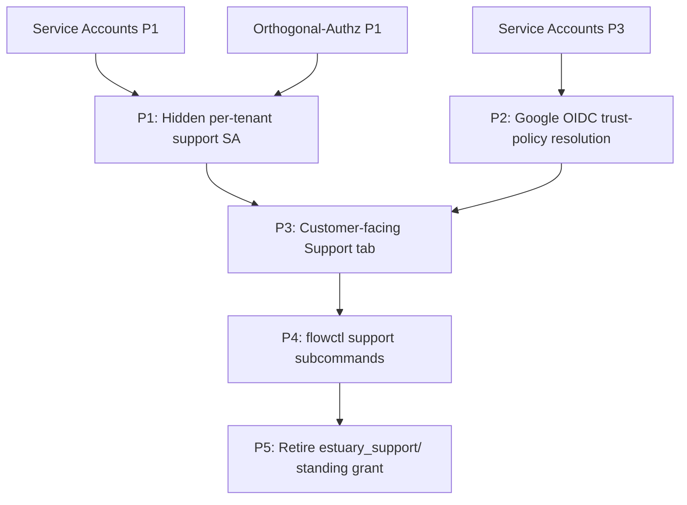

# Customer-Controlled Support Access

## Executive Summary

Today every tenant is automatically granted `estuary_support/` at creation via a
Postgres trigger. Every Estuary engineer who inherits that role has standing
admin on every tenant, always. This predates our compliance posture and doesn't
hold up against SOC 2 audit expectations, the "access under direct control of
Customer" language in our MSA, or the GDPR requirement that support processing
be purpose- and time-bounded.

This plan replaces the standing grant with a **customer-controlled support
session**: each tenant has a hidden support service account scoped to its own
prefix, and the customer opens a time-bounded window during which Estuary
engineers can authenticate as that SA via OIDC federation to Google. When the
window closes (by expiry or explicit revocation), access ends. Estuary-side
membership in the support group is managed entirely through Google Workspace,
so rotations and offboarding propagate immediately across every tenant with
no Estuary-side change.

This is primarily composition of existing work: orthogonal-authz supplies the
narrow `support` capability, the service-accounts plan supplies the identity
and OIDC trust-policy machinery, and Google Workspace supplies the engineer
identity and group gate. The new surface added here is small — the tenant-scoped
hidden SA, the customer-facing Support tab, and the `flowctl support` subcommand.

## Desired Outcome

- **Customers hold the lever.** Opening and closing support windows is a
  customer action in their admin UI. We cannot self-grant access to a tenant.
- **The grant model stays simple.** No `expires_at` column on `user_grants` and
  no new "expiring grant" primitive. Time-boundedness is enforced at the OIDC
  trust policy and at the issued access token — the grant itself is a permanent
  fact about the hidden SA, gated by whether a valid credential can be obtained.
- **Support SA is never usable without a customer-opened window.** By default,
  the trust policy is disabled; no token exchange succeeds.
- **Access revocation at Estuary is a Google Workspace operation.** Removing
  an engineer from the support group instantly cuts their access across every
  tenant, with no per-tenant cleanup.
- **Audit trail is two-sided.** The customer sees "support SA performed X" in
  their publication history. Estuary's internal logs record which Google
  identity exchanged a token and for which tenant, so per-engineer attribution
  is recoverable internally.

## Technical Notes

**The support SA lives under the customer's prefix, not under `estuary_support/`.**
Every tenant gets a hidden SA at creation, named something like `acmeCo/.support`
(or tracked via a flag on `internal.service_accounts` rather than a naming
convention — see Open Questions). Its `user_grants` row carries the eventual
`support` capability (see "Dependency on orthogonal-authz" below) on the tenant
prefix. The customer is the admin of their own tenant, which means the customer
— not Estuary — owns the SA and its trust policies. This is what makes the
MSA language ("access under direct control of Customer") structurally true
rather than just a claim.

**The `estuary_support/` role stops being how engineers access customer data.**
Once this lands, the current blanket trigger and the standing per-tenant grants
go away. `estuary_support/` remains as a role for internal Estuary operations
that don't involve customer tenants (billing tooling, internal ops views), but
it no longer has transitive admin over every tenant. The migration path is
covered in Phase 5.

**OIDC trust policy uses Google Workspace as the issuer.** The policy matches
`iss = https://accounts.google.com` (or the workspace-specific issuer we end up
using) plus a `claims_filter` requiring membership in the `support@estuary.dev`
Google group. Google's standard ID tokens don't include group membership by
default; we resolve this server-side at token-exchange time by calling the
Cloud Identity Groups API for the authenticated `sub`, rather than requiring
Google to emit groups in the ID token itself. From the customer's point of
view the trust policy is still "Google, support group" — the lookup is an
implementation detail of token exchange.

**Windows are expressed as trust policy state, not grant state.** Opening a
support window = enabling the trust policy and setting its `max_token_lifetime`
and overall expiry. Closing the window = disabling or deleting the policy.
Tokens already issued are short-lived (configurable, default ≤1h) and die on
their own. The longest any engineer can retain access after a window closes
is the remaining lifetime of their last-issued access token.

**Engineer UX is `flowctl` first, dashboard later.** `flowctl support begin
<tenant>` performs the Google OIDC → token exchange dance and writes a
short-lived access token into a session-scoped slot (not the normal refresh
token slot). `flowctl support end` clears it. The dashboard mode-switch story
is deferred to a follow-up — most support work already happens via flowctl,
and shipping flowctl-only keeps Phase 2 small.

## Dependency on orthogonal-authz

This plan assumes `support` (or equivalent narrow capability — `diagnose`, or
a split of `admin` that excludes `publish`, `billing`, `user_management`)
exists as a capability in the `user_grants.capabilities` array introduced by
orthogonal-authz Phase 1. Until that lands, the hidden SA can be created with
`capability = admin` as a bootstrap, with the understanding that narrowing it
is a follow-up migration once orthogonal-authz is further along.

This is the right sequencing because the compliance case for customer-opened
windows is strongest when the capability is actually narrow. "We granted you
read and restart access for 24 hours" is defensible; "we granted you full
admin for 24 hours" is a weaker story even if the window is short.

## Dependency on service-accounts

This plan consumes, unchanged:

- **Phase 1 (service account CRUD & tokens)** for the SA data model and
  lifecycle mutations. The hidden support SA is created via the same
  `createServiceAccount` path, with an additional flag.
- **Phase 3 (OIDC token exchange)** for the trust policy data model, the
  `/auth/v1/token-exchange` endpoint, issuer verification, and claims
  filtering. The only new shape is the Google-groups-via-Cloud-Identity-API
  resolution, which is a token-exchange-time implementation detail.

Phases 2, 4, 5, 6, 7 of the service-accounts plan are unrelated to this
feature and can ship independently.

## Open Questions

1. **How do we hide the support SA from the normal list?** Two candidates:
   (a) a `kind: support` or `hidden: true` flag on `internal.service_accounts`
   that the default `serviceAccounts` query filters out; or (b) a reserved
   naming convention (`<tenant>/.support`). A flag is cleaner and doesn't
   bake assumptions into the prefix namespace.

2. **Default support window durations and maximum.** 24h / 7d / 30d as the
   user-facing options, with what hard ceiling? Mike's June 2025 writeup
   floated 30 days as an "introductory support package" framing; worth
   confirming that matches current compliance thinking.

3. **How is consent language captured?** Per the MSA and GDPR Art. 5/9
   discussions, opening a window needs a recorded acknowledgement that the
   customer is authorizing Estuary access for a stated purpose. Is this a
   free-text "reason" field on the window, a structured dropdown, or just
   implicit in the click? A free-text reason stored on the trust policy
   (or on a separate `support_sessions` row — see Q5) is probably the right
   compliance default.

4. **Per-session approval above the group gate.** Google group membership
   answers "who at Estuary _could_ enter a support session." Some customers
   may want "who at Estuary _did_, and was it approved for this specific
   case." A future ticket-integration could write a session ID into the
   trust policy's `claims_filter` so only a specific engineer can redeem it
   for a specific window, but this is explicitly out of scope for v1.
   Confirm with Mike that v1's "group + window" shape is sufficient.

5. **Support session history as a first-class record.** Do we need a
   `support_sessions` table that logs each window (who opened it when, when
   it closed, which engineers authenticated against it, what reason was
   given), or is reconstructing this from trust-policy lifecycle events +
   token-exchange logs good enough? A dedicated table is more auditable and
   gives the customer a clean "Support History" view; it's also more to
   build. Probably worth deferring to a follow-up once the base feature is
   in customers' hands.

6. **Google Workspace OIDC specifics.** We need to confirm the exact issuer
   URL, the Cloud Identity Groups API auth model for our token-exchange
   service, and whether we want to cache group membership (and for how
   long — too long and revocation is delayed; too short and we hammer the
   API on every exchange). A 5-minute cache is probably a reasonable
   default but worth picking deliberately.

7. **Existing `estuary_support/` grants — do they go away all at once, or
   gradually?** See Phase 5; the migration is the riskiest part of this
   plan and deserves its own sequencing decision.

## Phases

### P1: Hidden per-tenant support SA

Extend the tenant-creation path to also create a hidden service account
scoped to the new tenant's prefix, carrying the (eventual) `support`
capability. Add the flag to `internal.service_accounts` that marks it as a
support SA and hides it from the default `serviceAccounts` query (resolving
Open Question 1). Backfill the flag for existing tenants by creating the
hidden SA for each one.

On its own this phase is inert — the SA exists but has no trust policies,
so no one can authenticate as it. The `estuary_support/` standing grant is
untouched. Nothing visible to customers or engineers yet.

This phase depends on service-accounts P1 having landed, since it reuses
the SA creation mutation.

### P2: Google OIDC trust-policy resolution

Extend the token-exchange endpoint from service-accounts P3 to resolve
Google group membership via the Cloud Identity Groups API at exchange time,
rather than relying on group claims being present in the ID token. The
incoming token supplies `iss` and `sub`; the backend calls the Groups API
to check whether that `sub` is a member of any groups named in the trust
policy's `claims_filter`.

A short in-memory cache (5m default) keyed on `(sub, group)` avoids
hammering the Groups API on every exchange. Cache TTL is configurable and
short enough that offboarding (removal from the Google group) propagates
quickly — the longest stale-access window is the cache TTL plus the issued
access token's remaining lifetime.

After this phase, trust policies with Google-group `claims_filter`s work
end-to-end, but no customer has one yet.

### P3: Customer-facing Support tab

Add a "Support" tab to the customer admin UI. It's presented as a single
toggle — "Open support window" — plus a duration dropdown and a required
free-text reason field (resolving Open Question 3, pending confirmation
on its exact shape).

Opening a window creates or enables the trust policy on the hidden SA,
with `claims_filter = {"groups": ["support@estuary.dev"]}` and the
selected duration as `max_token_lifetime` (and on the policy row as its
overall expiry). Closing the window disables or deletes the policy.
The tab also shows the currently-active window with its expiry, and a
history of past windows (read from trust-policy lifecycle events; a
dedicated `support_sessions` table is deferred per Open Question 5).

After this phase, a customer can open a window and the hidden SA's trust
policy activates — but engineers don't have a tool that drives the OIDC
exchange yet, so the window is real but unused.

### P4: `flowctl support` subcommands

Add `flowctl support begin <tenant>` and `flowctl support end`. `begin`
obtains a Google ID token for the authenticated user, posts it to the
token-exchange endpoint along with the target tenant, and on success
writes the resulting short-lived access token into a session-scoped slot
that `refresh_authorizations` prefers over the normal refresh token while
active. `end` clears that slot.

Error handling is explicit: if the caller is not in `support@estuary.dev`,
the exchange returns a clear "not authorized for support access" error;
if the tenant has no open window, it returns "no support window open for
`<tenant>`." Neither falls back to other credentials silently.

After this phase, the end-to-end feature works: customer opens a window,
engineer runs `flowctl support begin AcmeCo/`, operates for the duration
of the access token, runs `flowctl support end` (or lets the token
expire), and customer closes the window.

### P5: Retire the `estuary_support/` standing grant

The migration phase. Steps, in order:

1. Announce the change internally with a cutover date. Surface the new
   `flowctl support` flow in on-call runbooks.
2. Remove the Postgres trigger that auto-grants `estuary_support/` on
   tenant creation. New tenants stop getting the standing grant
   immediately.
3. For existing tenants, remove the `estuary_support/` role grant in
   batches, starting with tenants where we've already seen at least one
   support session go through the new flow successfully (proving the
   new path works for that customer's shape). End with a sweep of the
   remainder.
4. Leave `estuary_support/` as a role for internal operations that don't
   touch customer tenants.

Before each batch removal, confirm there's no pending support work on
those tenants that would be disrupted by losing standing access. Expect
some operational friction during this transition — runbooks that assumed
"just look at the customer's tenant" need to become "open a window first."

This is the phase where most of the risk of this plan lives; every prior
phase is additive and reversible.

## Phase Dependencies

P1 and P2 are independent and can land in either order. P3 depends on both
(the SA to attach policies to, and the resolution path for Google groups).
P4 depends on P3 because there's nothing to authenticate against until a
customer can open a window. P5 is last because it removes the fallback —
until it lands, `estuary_support/` still works and any issue with the new
flow is recoverable by reverting to standing access.
