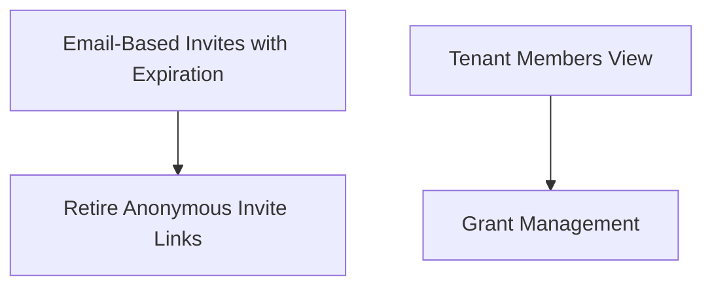

# User Management

consider these before finalizing
https://github.com/estuary/flow/issues/1928
https://github.com/estuary/ui/issues/1457

## Executive Summary

Our existing user-management UX is non-standard and sometimes confusing for new users. The organization membership page shows raw grants rather than people — a single user appears multiple times if they have multiple grants (wait, what's a grant?). Invites are anonymous copy-paste links with no expiration and can be used by anyone.

When we're finished with this work, admins will invite users by email — each invite is locked to its recipient, has a limited lifetime, and an observable status (pending, accepted, expired). Admins will be able to refresh and resend invites. A tenant-members view will show every person with access in one place: name, email, login method, last sign-in, and the grants they hold. Admins will add and remove grants directly on existing users from that view (instead of using invite links as they do today). flowctl's `auth roles` commands will call the same GraphQL mutations the dashboard uses, so CLI and UI enforce identical rules.

> Note that what it means to be an "admin" will change with a separate effort around auth capabilities. Assume "admin" is simply someone authorized to make changes related to users and what access/capabilities they have.

## Technical Notes

**No upsert on grant changes.** `user_grants` has a unique constraint on `(user_id, object_role)`, so changing a capability requires removing the old grant then adding the new one. flowctl preserves upsert behavior during a deprecation window by detecting the conflict and issuing a revoke-then-add, with a warning that future releases will require the explicit two-step.

## Open Questions

- **Snapshot delay on invite redemption:** The auth snapshot refreshes on a 20s–5min cadence, so a newly inserted `user_grants` row isn't visible to the invitee for up to 30s after they redeem. Is this acceptable, or do we need a mechanism to force a snapshot refresh on redemption?

## Phase Dependencies

Two independent branches: the invite branch (P1 → P2) and the members branch (P3 → P4). P1 and P3 can start in parallel.

---

## Phase 1 — Email-Based Invites with Expiration

New invites are email-addressed with a limited lifetime. Existing anonymous and multi-use invites get a two-week expiration and remain visible in the UI so admins can revoke them early if they want, but the "add" button for anonymous invites is disabled.

### Pre-work: Extract Email Infrastructure

Before adding invite emails, extract the generic layers from alert-specific modules:

1. Move `Sender`/`ResendSender`/`EmailSender` out of `agent::alerts::notifier` into `agent::email`. No logic changes.
2. Extract the HTML wrapper template from `crates/notifications/` so non-alert emails can share branding.
3. Pass `Sender` to both `AlertNotifications` and the new invite email code in `main.rs`.

### Schema Changes

Alter `internal.invite_links`:

| Column         | Type                   | Notes                                      |
| -------------- | ---------------------- | ------------------------------------------ |
| `email`        | TEXT                   | Nullable — existing anonymous invites kept |
| `last_sent_at` | TIMESTAMPTZ            | Updated on resend                          |
| `redeemed_by`  | UUID FK → `auth.users` | Who accepted the invite                    |
| `redeemed_at`  | TIMESTAMPTZ            | When it was accepted                       |
| `expires_at`   | TIMESTAMPTZ NOT NULL   | Default `now() + interval '7 days'`        |

Existing anonymous invites backfilled with `expires_at = now() + interval '14 days'`. New email-based invites default to 7 days.

### GraphQL Changes

- `createInviteLink` gains required `email` and optional `expiresInDays` (default 7). The invite is locked to that recipient and the email is sent via Resend. Rejects if email already has `user_grants` on the target prefix.
- `redeemInviteLink` rejects expired and already-redeemed invites. When `email` is set, validates the authenticated user's email matches (case-insensitive). Sets `redeemed_by`/`redeemed_at` instead of deleting the row.
- New `resendInvite(token)` mutation re-sends email, resets `expires_at`, and bumps `last_sent_at`.
- `InviteLink` type gains: `email`, `redeemedBy`, `redeemedAt`, `expiresAt`, `lastSentAt`, `status` (PENDING | ACCEPTED | EXPIRED — computed from the columns)
- `inviteLinks` query gains `status` filter

### Frontend

- Create invite dialog requires email address and has "expires in X days" field
- Existing anonymous/multi-use invites remain visible with status badges, expiration countdown, and a revoke button — but the "add" button for anonymous invites is disabled
- Invite list shows recipient email, status badge, expiration date, redeemed-by user
- "Resend" button on pending email invites
- Surfaces the "already a member" error from the pre-flight check

### Verification

- [ ] Create invite → email sent, invite locked to recipient, status is PENDING, `expires_at` is 7 days out
- [ ] Redeem invite → `user_grants` row inserted, status is ACCEPTED, `redeemed_by`/`redeemed_at` set, row not deleted
- [ ] Wrong email redeems invite → rejected
- [ ] Let invite expire → status is EXPIRED, redemption rejected
- [ ] Redeem already-accepted invite → rejected
- [ ] Existing anonymous/multi-use link still redeemable until its expiration
- [ ] Existing anonymous invites show `expires_at` ~14 days from migration
- [ ] Admin revokes anonymous invite before expiration → invite no longer redeemable
- [ ] Invite for email that already has access to the prefix → rejected with clear error
- [ ] Resend invite → new email sent, `expires_at` reset, `last_sent_at` updated
- [ ] Filter `inviteLinks` by status → correct results
- [ ] UI "add" button for anonymous invites is disabled

---

## Phase 2 — Retire Anonymous Invite Links

Once all legacy anonymous invites have expired (~2 weeks after Phase 1 deploys), remove the anonymous invite UI entirely and enforce email on all invites at the schema level.

- `email` becomes NOT NULL on `internal.invite_links` (all remaining anonymous rows are expired — delete or keep as historical)
- Remove anonymous invite list from the UI
- `createInviteLink` already requires email — no GraphQL changes needed

### Verification

- [ ] No anonymous invite rows with NULL email remain active
- [ ] Anonymous invite UI elements fully removed
- [ ] Schema enforces NOT NULL on `email`

---

## Phase 3 — Tenant Members View

Replaces the raw grants list with a people-centric view. Admins see who has access, how they got in, and when they last showed up.

### GraphQL API

New `TenantMember` type:

| Field          | Source                          | Notes                                                         |
| -------------- | ------------------------------- | ------------------------------------------------------------- |
| `userId`       | `auth.users`                    |                                                               |
| `email`        | `auth.users`                    |                                                               |
| `fullName`     | `auth.users.raw_user_meta_data` |                                                               |
| `avatarUrl`    | `auth.users.raw_user_meta_data` |                                                               |
| `loginMethod`  | `auth.identities`               | password / Google / SSO                                       |
| `lastSignInAt` | `auth.users`                    |                                                               |
| `grants`       | `user_grants`                   | Scoped to the queried tenant's prefix                         |
| `inviteStatus` | `invite_links`                  | ACTIVE or PENDING_INVITE (invite exists but not yet redeemed) |

New `Tenant.members(after, first, search)` query — paginated, admin-only. Joins `auth.users` for profile info, `auth.identities` for login method, `invite_links` to distinguish pending invitees from active members.

### Frontend

- New "Members" tab in tenant admin area
- Table: avatar, name, email, login method, last sign-in, grants
- Search bar, click-through to grant details
- Pending invitees visually distinguished from active members

### Verification

- [ ] Members list shows each user once, with all their grants aggregated
- [ ] Pending invitee (invite sent, not yet redeemed) shows PENDING_INVITE status
- [ ] Search by name or email returns correct results
- [ ] Pagination works with > 20 members
- [ ] Non-admin cannot access the members query

---

## Phase 4 — Grant Management

Admins add and remove grants directly on existing users from the members view — no invite required. This is also where flowctl migrates off PostgREST for grant writes, aligning CLI and UI on one authorization path.

### GraphQL Mutations

- `addUserGrant(userId, catalogPrefix, capability, detail?)` — requires admin on prefix, errors on duplicate (no upsert). `detail` is a free-form audit string, preserved from flowctl's existing surface.
- `removeUserGrant(grantId)` — requires admin on prefix
- `addRoleGrant` / `removeRoleGrant` — mirrored for role-to-role grants, also accepting `detail`
- No update mutation — remove then add for capability changes

### flowctl Migration

Reimplement `flowctl auth roles grant` and `revoke` against the new GraphQL mutations instead of direct PostgREST writes on `user_grants` / `role_grants`. The `--detail` flag is preserved end-to-end via the mutation argument.

**Preserve upsert behavior during a deprecation window.** When `grant` is called against an existing `(subject, object)` pair, flowctl detects the conflict and issues a revoke-then-add to keep current scripts working. Each upsert prints a deprecation warning explaining that a future release will require an explicit revoke-then-grant. Removal of the auto-revoke fallback is a follow-up effort, not part of this plan.

`flowctl auth roles list` can stay on `combined_grants_ext` for now — read paths aren't on the critical path for this migration.

### Frontend

- "Add grant" action in members view
- "Remove" button per grant
- UI streamlines "change capability" as remove + add

### Verification

- [ ] Add grant via dashboard → user sees new prefix immediately
- [ ] Add duplicate grant → clear error, no upsert
- [ ] Remove grant → user loses access
- [ ] `flowctl auth roles grant` against new GraphQL → works
- [ ] `flowctl auth roles grant` with existing `(subject, object)` → auto revoke-then-add + deprecation warning
- [ ] `flowctl auth roles revoke` → works
- [ ] Non-admin on prefix → mutations rejected

---

## Phase 5 — Retire Anonymous Invite Links

Email becomes required on all new invites.

- `email` becomes NOT NULL on `createInviteLink`
- Transition window: existing anonymous links remain redeemable
- Dashboard: email field becomes required, copyable link kept as secondary action

### Verification

- [ ] Create invite without email → rejected
- [ ] Existing anonymous link still redeemable during transition
