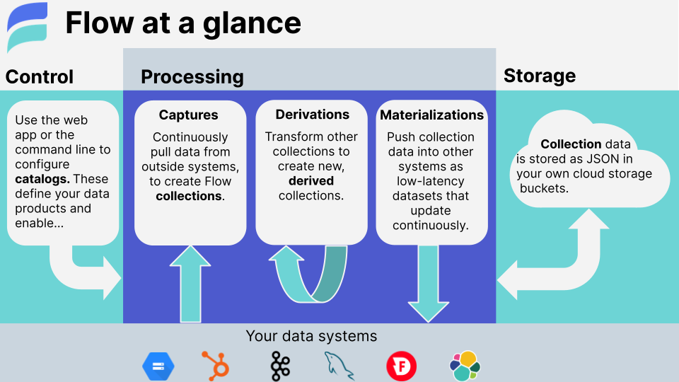

# Concepts

Flow helps you define data pipelines, known as **Data Flows**, that connect multiple data systems, APIs, and storage, and optionally transform data along the way.
Data Flows are defined by a set of **Flow specifications** and deployed using either the web application or the command-line interface.

This page introduces concepts and terms that will help you begin working with Flow and better understand its underlying mechanisms.
These concepts are discussed in more detail on subsequent pages.

## Working with Flow

There are two main environments in which you can work with Flow:
the web application or your preferred local environment using the flowctl command-line tool.

### Web application

The Flow web application is where you'll most likely create, monitor, and update your Data Flows.
You can find it at [dashboard.estuary.dev](https://dashboard.estuary.dev).
The app is backed by secure, cloud-hosted infrastructure that Estuary manages.

[Take a tour of the web app](web-app.md).

[Create your first Data Flow with the web app](../guides/create-dataflow.md).

### flowctl

flowctl is a command-line interface for working with Flow's public API.
Using flowctl, developers can inspect, edit, test, and publish Data Flows — just as with the web application.
For example, you can create a Data Flow with the web app, and then use flowctl to fetch it into files that you manage within a Git repo.

[Learn more about flowctl](flowctl.md)

## Essential concepts

*In this section, you'll find the most important Flow terms and concepts. If you're new to Flow, start here.*

A complete end-to-end **Data Flow** between two systems has three components:

* **Capture**: Flow ingests data from an outside source.
* **Collections**: Flow maintains the captured data in cloud storage.
* **Materialization**: Flow pushes data to an outside destination.

import Mermaid from '@theme/Mermaid';

<Mermaid chart={`
	graph LR;
		Capture-->Collection;
        Collection-->Materialization;
`}/>

It may also include:

* **Derivations**: You apply a transformation to data in a collection, resulting in a new collection.

All of these entities are described in the **catalog**.

### Catalog

The **catalog** is the set of active entities that comprise all **Data Flows**: captures, materializations, derivations, collections, schemas, tests, and more.

All catalog entities are defined in **Flow specification files** — either manually, by you, or generated by the Flow web app. You create the specifications as **drafts**, and **publish** them to add them to the catalog.

You can mix and match catalog entities to create a variety of Data Flows.

[Learn more about the catalog](./catalogs.md)

***

### Collections

**Collections** represent datasets within Flow.
All captured documents are written to a collection, and all materialized documents are read from a collection.

Collections are a real-time data lake.
Like a traditional data lake, the documents that make up a collection are stored as plain JSON in your cloud storage bucket.
Unlike a traditional data lake, updates to the collection are reflected downstream in the data flow
within milliseconds.

Documents in collections are stored indefinitely in your cloud storage bucket (or may be managed with your regular bucket lifecycle policies).
This means that the full historical content of a collection is available to support future data operations and perform backfills without going back to the source.

Each collection has a keyed [schema](#schemas) against which incoming documents are validated.
This ensures that data is always clean and organized.

[Learn more about collections](collections.md)

***

### Captures

A **capture** is a Flow task that ingests data from an external source into one or more Flow collections.
Documents continuously move from the source into Flow;
as new documents become available at the source,
Flow validates their schema and adds them to their corresponding collection.
Captures interface with source systems using [connectors](#connectors).

[Learn more about captures](captures.md)

***

### Materializations

A **materialization** is a Flow task that pushes data from one or more collections
to an external destination.
Documents continuously moves from each Flow collection to the destination.
Materializations are the conceptual inverse of **captures.**

As new documents become available within bound collections, the materialization
keeps the destination up to date within milliseconds, or as fast as that system allows.
Materializations interface with destinations using [connectors](#connectors).

[Learn more about materializations](/concepts/materialization)

***

### Endpoints

**Endpoints** are the source systems from which Flow captures data and the destination systems to which Flow materializes data. All kinds of data systems can be endpoints, including databases, key/value stores, streaming pub/sub systems, SaaS products, and cloud storage locations.

Flow connects to this wide variety of endpoints using **connectors**.

***

### Connectors

**Connectors** are plugin components that allow Flow to interface with endpoint data systems.
They power captures and materializations.

Flow uses an open-source connector model.
Many connectors are made by Estuary, and others are made by third parties.
Because connectors are open-source and kept separate from Flow itself,
new integrations can be added and updated quickly.
This is important, as the landscape of data systems and platforms is constantly evolving.

All currently supported connectors are ready to use in the Flow web application.
They're also available as Docker images, each encapsulating the details of working with
a particular source or destination system.

[Learn more about connectors](./connectors.md)

***

## Intermediate concepts

*In this section, you'll find important concepts that are optional for basic usage.
Read this to unlock more powerful workflows.*

### Derivations

A **derivation** is a collection that results from the transformation of one or more other collections,
which is continuously updated in sync with its source collection(s).

You can use derivations to map, reshape, and filter documents.
They can also be used to tackle complex stateful streaming workflows,
including joins and aggregations,
without windowing and scaling limitations.

[Learn more about derivations](derivations/)

***

### Schemas

All collections in Flow have an associated
[JSON schema](https://json-schema.org/understanding-json-schema/)
against which documents are validated every time they're written or read.
Schemas are critical to how Flow ensures the integrity of your data.
Flow validates your documents to ensure that
bad data doesn't make it into your collections — or worse,
into downstream data products!

JSON schema is a flexible standard for representing structure, invariants,
and other constraints over your documents.
Schemas can be very permissive, highly exacting, or somewhere in between.

Flow pauses catalog tasks when documents don't match the collection schema,
alerting you to the mismatch and allowing you to fix it before it creates a bigger problem.

[Learn more about schemas](schemas.md)

***

### Reductions

Every Flow collection [schema](#schemas) includes a  **key**.
The key is used to identify collection documents and determine how they are grouped.
When a collection is materialized into a database table, for example, its key becomes
the SQL primary key of the materialized table.

Flow also uses the key to **reduce** documents in collections, making storage and materializations more efficient.
If multiple documents of a given key are added to a collection,
by default, the most recent document supersedes all previous documents of that key.

You can exert more control over your data by changing the default reduction strategy.
By doing so, you can deeply merge documents, maintain running counts,
and achieve other complex aggregation behaviors.

[Learn more about reductions](./schemas.md#reductions)

***

### Tests

**Tests** become an important part of your Data Flows when you add derivations and customized reduction behavior.
You use tests to verify the end-to-end behavior of your collections and derivations.

A test is a sequence of ingestion or verification steps.
Ingestion steps ingest one or more document fixtures into a collection,
and verification steps assert that the contents of another derived collection match a test expectation.

[Learn more about tests](tests.md)

***

### Tasks

Captures, derivations, and materializations are collectively referred to as catalog **tasks**.
They are the "active" components of a Data Flow, each running continuously and reacting to documents
as they become available.

Collections, by way of comparison, are inert. They reflect data at rest, and are acted upon by
catalog tasks:

* A capture adds documents to a collection pulled from a source endpoint.
* A derivation updates a collection by applying transformations to other collections.
* A materialization reacts to changes of a collection to update a destination endpoint.

***

### Resources and bindings

A **resource** is an addressable collection of data within a source or destination system.
The exact meaning of a resource is up to the endpoint and its connector. For example:

* Resources of a database endpoint might be its individual tables.
* Resources of a Kafka cluster might be its topics.
* Resources of a SaaS connector might be its various API feeds.

When you create capture or materialization, it connects a collection to a resource through a **binding**.
A given capture or materialization may have multiple bindings, which connect multiple collections to different resources.

***

### Storage mappings

Flow [collections](#collections) use cloud storage buckets for the durable storage of data.
Storage mappings define how Flow maps your various collections into your storage buckets and prefixes.

[Learn more about storage mappings](./storage-mappings.md)

## Advanced concepts

*This section discusses advanced Flow concepts. The information here unlocks
a more technical understanding of how Flow works, and may be helpful in advanced use cases.*

### Journals

**Journals** provide the low-level storage for Flow collections.
Each logical and physical partition of a collection is backed by a journal.

Task [shards](#task-shards) also use journals to provide for their durability
and fault tolerance.
Each shard has an associated **recovery log**, which is a journal into which
internal checkpoint states are written.

[Learn more about journals](./advanced/journals.md)

### Task shards

Task **shards** are the unit of execution for a catalog [task](#tasks).
A single task can have many shards, which allow the task to scale across
many machines to achieve more throughput and parallelism.

Shards are created and managed by the Flow runtime.
Each shard represents a slice of the overall work of the catalog task,
including its processing status and associated internal checkpoints.
Catalog tasks are created with a single shard,
which can be repeatedly subdivided at any time — with no downtime — to
increase the processing capacity of the task.

[Learn more about shards](./advanced/shards.md)

### Projections

Flow leverages your JSON schemas to produce other types of schemas as needed,
such as TypeScript types and SQL `CREATE TABLE` statements.

In many cases these projections provide comprehensive end-to-end type safety
of Data Flows and their TypeScript transformations, all statically verified
at build time.

[Learn more about projections](./advanced/projections.md)
