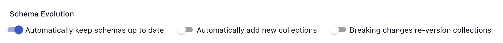

# Captures

A **capture** is how Flow ingests data from an external source.
Every Data Flow starts with a capture.

Captures are a type of Flow **task**.
They connect to an external data source, or **endpoint**,
and bind one or more of its resources, such as database tables.
Each binding adds documents to a corresponding Flow **collection**.

Captures run continuously:
as soon as new documents are made available at the endpoint resources,
Flow validates their schema and adds them to the appropriate collection.
Captures can process [documents](./collections.md#documents) up to 16 MB in size.


You define and configure captures in **Flow specifications**.

[See the guide to create a capture](../guides/create-dataflow.md#create-a-capture)

## Connectors

Captures extract data from an endpoint using a [connector](../#connectors).
Estuary builds and maintains many real-time connectors for various technology systems,
such as database change data capture (CDC) connectors.

See the [source connector reference documentation](../reference/Connectors/capture-connectors/README.md).

### Batch sources

Flow supports running both first and third party connectors to batch sources as well as natively-written Estuary connectors.
These connectors tend to focus on SaaS APIs, and do not offer real-time streaming integrations.
Flow runs the connector at regular intervals to capture updated documents.

Third-party source connectors are independently reviewed and sometimes updated for compatibility with Flow.
Estuary's [source connectors](../reference/Connectors/capture-connectors/README.md) documentation includes all actively supported connectors.
If you see a connector you'd like to prioritize for access in the Flow web app, [contact us](mailto:support@estuary.dev).

## Discovery

To help you configure new pull captures, Flow offers the guided **discovery** workflow in the Flow web application.

To begin discovery, you tell Flow the connector you'd like to use and basic information about the endpoint.
Flow automatically generates a capture configuration for you. It identifies one or more
**resources** — tables, data streams, or the equivalent — and generates **bindings** so that each will be mapped to a
data collection in Flow.

You may then modify the generated configuration as needed before publishing the capture.

:::info
Discovers can also be run when editing an existing capture. This is commonly done in order to add new bindings, or update the collection specs and schemas associated with existing bindings.
:::

## Automatically update captures

You can choose to run periodic discovers in the background by adding the `autoDiscover` property to the capture. Flow will periodically check for changes to the source and re-publish the capture to reflect those changes.

There are several options for controlling the behavior of `autoDiscover`:

* The `addNewBindings` option determines whether to add newly discovered resources, such as database tables, to the capture as *bindings*. If set to `false`, autoCapture will only update the collection specs for existing bindings.

* The `evolveIncompatibleCollections` option determines how to respond when the discovered updates would cause a breaking change to the collection. If `true`, it will trigger an [evolution](./advanced/evolutions.md) of the incompatible collection(s) to prevent failures.

In the Flow web app, you can set these properties when you create or edit a capture.



The toggles in the web app correspond directly to the properties above:

- "Automatically keep schemas up to date" enables `autoDiscover`
- "Automatically add new collections" corresponds to `addNewBindings`
- "Breaking changes re-versions collections" corresponds to `evolveIncompatibleCollections`

## Specification

Captures are defined in Flow specification files per the following format:

```yaml
# A set of captures to include in the catalog.
# Optional, type: object
captures:
  # The name of the capture.
  acmeCo/example/source-s3:
    # Automatically performs periodic discover operations, which updates the bindings
    # to reflect what's in the source, and also updates collection schemas.
    # To disable autoDiscover, either omit this property or set it to `null`.
    autoDiscover:
      # Also add any newly discovered bindings automatically
      addNewBindings: true
      # How to handle breaking changes to discovered collections. If true, then existing
      # materialization bindings will be re-created with new names, as necessary. Or if
      # collection keys have changed, then new Flow collections will be created. If false,
      # then incompatible changes will simply result in failed publications, and will
      # effectively be ignored.
      evolveIncompatibleCollections: true

    # Endpoint defines how to connect to the source of the capture.
    # Required, type: object
    endpoint:
      # This endpoint uses a connector provided as a Docker image.
      connector:
        # Docker image that implements the capture connector.
        image: ghcr.io/estuary/source-s3:dev
        # File that provides the connector's required configuration.
        # Configuration may also be presented inline.
        config: path/to/connector-config.yaml

    # Bindings define how collections are populated from the data source.
    # A capture may bind multiple resources to different collections.
    # Required, type: array
    bindings:
      - # The target collection to capture into.
        # This may be defined in a separate, imported specification file.
        # Required, type: string
        target: acmeCo/example/collection

        # The resource is additional configuration required by the endpoint
        # connector to identify and capture a specific endpoint resource.
        # The structure and meaning of this configuration is defined by
        # the specific connector.
        # Required, type: object
        resource:
          stream: a-bucket/and-prefix
          # syncMode should be set to incremental for all Estuary connectors
          syncMode: incremental

      - target: acmeCo/example/another-collection
        resource:
          stream: a-bucket/another-prefix
          syncMode: incremental

    # Interval of time between invocations of non-streaming connectors.
    # If a connector runs to completion and then exits, the capture task will
    # restart the connector after this interval of time has elapsed.
    #
    # Intervals are relative to the start of an invocation and not its completion.
    # For example, if the interval is five minutes, and an invocation of the
    # capture finishes after two minutes, then the next invocation will be started
    # after three additional minutes.
    #
    # Optional. Default: Five minutes.
    interval: 5m
```
