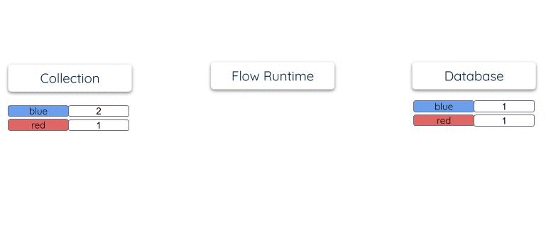

# Materializations

A **materialization** is how Flow pushes data to an external destination.

Materializations are a type of Flow **task**.
They connect to an external destination system,
or **endpoint**, and bind one or more Flow collections to resources at the endpoint, such as database tables.

As documents added to the bound collections,
the materialization continuously pushes it to the destination resources, where it is reflected with very low latency.
Materializations can process [documents](./collections.md#documents) up to 16 MB in size.

Materializations are the conceptual inverse of [captures](captures.md).


You define and configure materializations in **Flow specifications**.

[See the guide to create a materialization](../guides/create-dataflow.md#create-a-materialization)

## Discovery

Materializations use real-time [connectors](./connectors.md) to connect to many endpoint types.

When you use a materialization connector in the Flow web app,
Flow helps you configure it through the **discovery** workflow.

To begin discovery, you tell Flow the connector you'd like to use, basic information about the endpoint,
and the collection(s) you'd like to materialize there.
Flow maps the collection(s) to one or more **resources** — tables, data streams, or the equivalent —
through one or more **bindings**.

You may then modify the generated configuration as needed before publishing the materialization.

## Specification

Materializations are defined in Flow specification files per the following format:

```yaml
# A set of materializations to include in the catalog.
# Optional, type: object
materializations:
  # The name of the materialization.
  acmeCo/example/database-views:
    # Endpoint defines how to connect to the destination of the materialization.
    # Required, type: object
    endpoint:
      # This endpoint uses a connector provided as a Docker image.
      connector:
        # Docker image that implements the materialization connector.
        image: ghcr.io/estuary/materialize-postgres:dev
        # File that provides the connector's required configuration.
        # Configuration may also be presented inline.
        config: path/to/connector-config.yaml

    # Bindings define how one or more collections map to materialized endpoint resources.
    # A single materialization may include many collections and endpoint resources,
    # each defined as a separate binding.
    # Required, type: object
    bindings:
      - # Source collection read by this binding.
        # Required, type: object or string
        source:
          # Name of the collection to be read.
          # Required.
          name: acmeCo/example/collection
          # Lower bound date-time for documents which should be processed.
          # Source collection documents published before this date-time are filtered.
          # `notBefore` is *only* a filter. Updating its value will not cause Flow
          # to re-process documents that have already been read.
          # Optional. Default is to process all documents.
          notBefore: 2023-01-23T01:00:00Z
          # Upper bound date-time for documents which should be processed.
          # Source collection documents published after this date-time are filtered.
          # Like `notBefore`, `notAfter` is *only* a filter. Updating its value will
          # not cause Flow to re-process documents that have already been read.
          # Optional. Default is to process all documents.
          notAfter: 2023-01-23T02:00:00Z

        # The resource is additional configuration required by the endpoint
        # connector to identify and materialize a specific endpoint resource.
        # The structure and meaning of this configuration is defined by
        # the specific connector.
        # Required, type: object
        resource:
          # The materialize-postgres connector expects a `table` key
          # which names a table to materialize into.
          table: example_table

        # Priority applied to documents processed by this binding.
        # When all bindings are of equal priority, documents are processed
        # in order of their associated publishing time.
        #
        # However, when one binding has a higher priority than others,
        # then *all* ready documents are processed through the binding
        # before *any* documents of other bindings are processed.
        #
        # Optional. Default: 0, integer >= 0
        priority: 0

    # A sourceCapture allows bindings to be managed automatically based on the
    # bindings of the given capture. As new bindings are added to the capture,
    # they will automatically be added to the materialization. This property
    # is optional.
    sourceCapture: acmeCo/example/a-capture
```

## How continuous materialization works

Flow materializations are **continuous materialized views**.
They maintain a representation of the collection within the endpoint system
that is updated in near real-time. It's indexed on the
[collection key](collections.md#keys).
As the materialization runs, it ensures that all collection documents
and their accumulated [reductions](../#reductions) are reflected in this
managed endpoint resource.

When you first publish a materialization,
Flow back-fills the endpoint resource with the historical documents of the collection.
Once caught up, Flow applies new collection documents using incremental and low-latency updates.

As collection documents arrive, Flow:

* **Reads** previously materialized documents from the endpoint for the relevant keys
* **Reduces** new documents into these read documents
* **Writes** updated documents back into the endpoint resource, indexed by their keys

For example, consider a collection and its materialization:

```yaml

collections:
  acmeCo/colors:
    key: [/color]
    schema:
      type: object
      required: [color, total]
      reduce: {strategy: merge}
      properties:
        color: {enum: [red, blue, purple]}
        total:
          type: integer
          reduce: {strategy: sum}

materializations:
  acmeCo/example/database-views:
    endpoint: ...
    bindings:
      - source: acmeCo/colors
        resource: { table: colors }
```

Suppose documents are periodically added to the collection:
```json
{"color": "red", "total": 1}
{"color": "blue", "total": 2}
{"color": "blue", "total": 3}
```

Its materialization into a database table will have a single row for each unique color.
As documents arrive in the collection, the row `total` is updated within the
materialized table so that it reflects the overall count:



Flow does _not_ keep separate internal copies of collection or reduction states,
as some other systems do. The endpoint resource is the one and only place
where state "lives" within a materialization. This makes materializations very
efficient and scalable to operate. They are able to maintain _very_ large tables
stored in highly scaled storage systems like OLAP data warehouses.

## Projected fields

Many endpoint systems are document-oriented and can directly work
with collections of JSON documents.
Others are table-oriented and require an up-front declaration
of columns and types to be most useful, such as a SQL `CREATE TABLE` definition.

Flow uses collection [projections](./advanced/projections.md) to relate locations within
a hierarchical JSON document to equivalent named fields.
A materialization can in turn select a subset of available projected fields
where, for example, each field becomes a column in a SQL table created by
the connector.

It would be tedious to explicitly list projections for every materialization,
though you certainly can if desired.
Instead, Flow and the materialization connector _negotiate_ a recommended field selection
on your behalf, which can be fine-tuned.
For example, a SQL database connector will typically *require* that fields
comprising the primary key be included, and will *recommend* that scalar
values be included, but will by default exclude document locations that
don't have native SQL representations, such as locations which can have
multiple JSON types or are arrays or maps.

```yaml
materializations:
  acmeCo/example/database-views:
    endpoint: ...
    bindings:
      - source: acmeCo/example/collection
        resource: { table: example_table }

        # Select (or exclude) projections of the collection for materialization as fields.
        # If not provided, the recommend fields of the endpoint connector are used.
        # Optional, type: object
        fields:
          # Whether to include fields that are recommended by the endpoint connector.
          # If false, then fields can still be added using `include`.
          # Required, type: boolean
          recommended: true

          # Fields to exclude. This is useful for deselecting a subset of recommended fields.
          # Default: [], type: array
          exclude: [myField, otherField]

          # Fields to include. This can supplement recommended fields, or can
          # designate explicit fields to use if recommended fields are disabled.
          #
          # Values of this map are used to customize connector behavior on a per-field basis.
          # They are passed directly to the connector and are not interpreted by Flow.
          # Consult your connector's documentation for details of what customizations are available.
          # This is an advanced feature and is not commonly used.
          #
          # default: {}, type: object
          include:  {goodField: {}, greatField: {}}
```

## Partition selectors

Partition selectors let you materialize only a subset of a collection that has
[logical partitions](./advanced/projections.md#logical-partitions).
For example, you might have a large collection that is logically partitioned
on each of your customers:

```yaml
collections:
  acmeCo/anvil/orders:
    key: [/id]
    schema: orders.schema.yaml
    projections:
      customer:
        location: /order/customer
        partition: true
```

A large customer asks if you can provide an up-to-date accounting of their orders.
This can be accomplished with a partition selector:

```yaml
materializations:
  acmeCo/example/database-views:
    endpoint: ...
    bindings:
      # The source can be specified as an object, which allows setting a partition selector.
      - source:
          name: acmeCo/anvil/orders
          # Process partitions where "Coyote" is the customer.
          partitions:
            include:
              customer: [Coyote]
        resource: { table: coyote_orders }
```

[Learn more about partition selectors](./advanced/projections.md#partition-selectors).

## Destination-specific performance

Flow processes updates in transactions, as quickly as the destination endpoint can handle them.
This might be milliseconds in the case of a fast key/value store,
or many minutes in the case of an OLAP warehouse.

If the endpoint is also transactional, Flow integrates its internal transactions
with those of the endpoint for integrated end-to-end “exactly once” semantics.

The materialization is sensitive to back pressure from the endpoint.
As a database gets busy, Flow adaptively batches and combines documents to consolidate updates:

* In a given transaction, Flow reduces all incoming documents on the collection key.
  Multiple documents combine and result in a single endpoint read and write during the transaction.
* As a target database becomes busier or slower, transactions become larger.
  Flow does more reduction work within each transaction, and each endpoint read or write
  accounts for an increasing volume of collection documents.

This allows you to safely materialize a collection with a high rate of changes into a small database,
so long as the cardinality of the materialization is of reasonable size.

## Delta updates

As described [above](#how-continuous-materialization-works), Flow's standard materialization
mechanism involves querying the target system for data state before reducing new documents
directly into it.

For these standard updates to work, the endpoint must be a stateful system, like a relational database.
However, other systems — like Webhooks and Pub/Sub — may also be endpoints.
None of these typically provide a state representation that Flow can query.
They are write-only in nature, so Flow cannot use their endpoint state
to help it fully reduce collection documents on their keys.
Even some stateful systems are incompatible with Flow's standard updates due to their unique
design and architecture.

For all of these endpoints, Flow offers a **delta-updates** mode.
When using delta updates, Flow does not attempt to maintain
full reductions of each unique collection key.
Instead, Flow locally reduces documents within each transaction
(this is often called a "combine"), and then materializes one
_delta_ document per key to the endpoint.

In other words, when delta updates are used, Flow sends information about data changes by key,
and further reduction is left up to the endpoint system.
Some systems may reduce documents similar to Flow; others use a different
mechanism; still others may not perform reductions at all.

A given endpoint may support standard updates, delta updates, or both.
This depends on the [materialization connector](../reference/Connectors/materialization-connectors/README.md). Expect that a connector will use
standard updates only unless otherwise noted in its documentation.

### Delta updates for every binding in a Materialization

When configuring a materialization, you can set delta updates as the materialization mechanism
for every binding. Afterwards, you are able to modify this setting individually for each binding
for further customization.

:::note
This functionality is only supported for Materialization connectors that have the `x-delta-updates`
field implemented. Consult the individual connector documentation for details.
:::

## Using `sourceCapture` to synchronize capture and materialization bindings

In some cases, you just want a destination system to always reflects the source
system as closely as possible, even as the source system changes over time. The
`sourceCapture` property of a materialization allows you to do exactly that.
If you set a `sourceCapture` on your materialization, then the bindings of the
materialization will be automatically kept in sync with the bindings of the
capture. As bindings are added to the capture, they will be automatically added
to the materialization. This works regardless of whether the bindings were added
to the capture manually or automatically. Bindings that are removed from the
capture are _not_ removed from the materialization.

## Default Schema Names in Destinations

Estuary Flow supports configuring the default destination schema on the materialization level.

When a capture provides a schema or namespace, it will automatically be used as the default schema value
for all bindings in the materialization.

While schema names are automatically assigned based on the capture, you can still
manually set the schema name for individual bindings if needed.

You can also set a default schema name at the materialization level.
This applies to all bindings within that materialization, ensuring a consistent schema naming convention throughout the
data pipeline.

:::note
This functionality is only supported for Materialization connectors that have the `x-schema-name`
field implemented. Consult the individual connector documentation for details.
:::

### How It Works

1. **Source Capture Level:**

   If the source capture provides a schema or namespace, it will be used as the default schema for all bindings in the materialization.

2. **Manual Overrides:**

   You can still manually configure schema names for each binding, overriding the default schema if needed.

3. **Materialization-Level Configuration:**

   The default schema name can be set at the materialization level, ensuring that all new captures within that materialization automatically inherit the default schema name.

### Configuration Steps

1. **Set Default Schema at Source Capture Level:**

   When defining your source capture, specify the schema or namespace. If no schema is provided, Estuary Flow will automatically assign a default schema.

2. **Override Schema at Binding Level:**

   For any binding, you can manually override the default schema by specifying a different schema name.

3. **Set Default Schema at Materialization Level:**

   During the materialization configuration, set a default schema name for all captures within the materialization.
