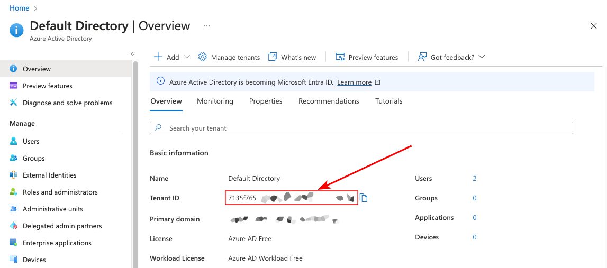
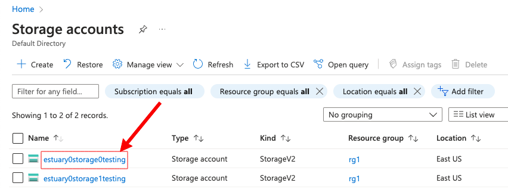
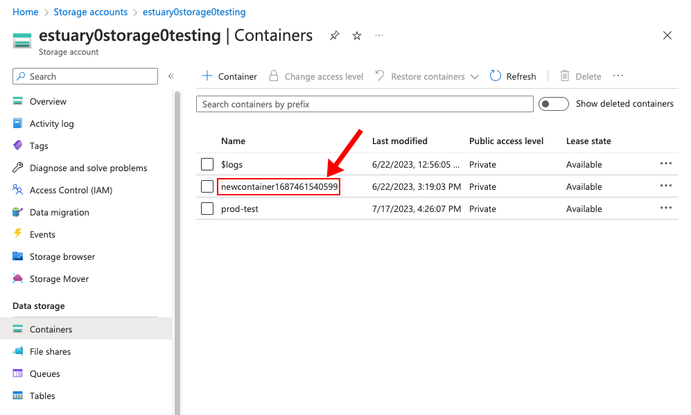

Setting up a Flow account to store data in your Azure Blob storage account requires you to grant our application access to your storage account and container, as well as providing us with some identifying information. At the moment storage mappings are not self-service, so once you have granted access and gathered the required information, reach out to your account manager who will configure your account.

### Gathering information

In order to complete this process, you will need to gather the following data:

-   Your **Azure AD tenant ID**. This can be found in the "Azure Active Directory" page here:
    
-   Your **Azure Blob Storage account ID**. This can be found in the "Storage Accounts" page here:
    
-   Your **Azure Blob Storage container ID**. This can be found inside your storage account here:
    

### Granting Access

We use an [Azure Application](https://learn.microsoft.com/en-us/azure/active-directory/manage-apps/what-is-application-management) to allow granting access to storage resources between your tenant and ours. In order for Flow to write to your storage account, it needs the [`Storage Blob Data Owner`](https://learn.microsoft.com/en-us/azure/role-based-access-control/built-in-roles#storage-blob-data-owner) IAM role for the storage account in question. In order to grant this role, you must first add our application to your tenant.

#### Add application to your tenant

import { AzureAuthorizeComponent } from "./azureAuthorize";

<AzureAuthorizeComponent />

#### Authorize application to your storage account

Once the application has been added, you must grant it the [`Storage Blob Data Owner`](https://learn.microsoft.com/en-us/azure/role-based-access-control/built-in-roles#storage-blob-data-owner) IAM role for your storage account.

-   Inside your storage account's "Access Control (IAM)" tab, click "Add Role Assignment"
-   Search for the string `Storage Blob Data Owner` and select it
-   On the next page, make sure `User, group, or service principal` is selected, then click "+ Select Members"
-   You must search for the exact name of the application, otherwise it won't show up: `Estuary Storage Mappings Prod`
-   Once you've selected the application, finish granting the role and you should be all set

### Give us a ring

Once you've finished the above steps, the next part is to contact us. Self-service storage mapping configuration is on our roadmap, but for the moment we're happy to configure your account by hand. Send support@estuary.dev an email containing all of the information you gathered above, as well as whether you want the storage mapping to apply to your whole Flow account, or just a subset of it. We'll get back to you letting you know when it's done, and that's it!
