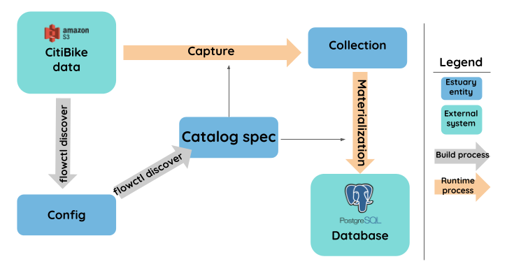

# Hello Flow


This tutorial is currently under construction due to ongoing changes to Flow's CLI.

**At this time, an up-to-date introductory tutorial can be found** [**on GitHub**](https://github.com/estuary/flow-template).&#x20;


### Introduction

In this tutorial, we’ll walk through a simple end-to-end data flow on your local machine. We’ll **capture** data from an outside source and **materialize** it into a database for viewing, showing a simple real-time ELT use case. This provides a quick foundation from which we can begin to refine our pipeline.

Before you begin, make sure you’ve [set up a development environment](../installation.md). We'll briefly introduce concepts as we go, but if you'd like, you can reference the [high-level concepts](../../concepts/README.md) page for more detailed explanations.

We’ll work with data published by [CitiBike](https://www.citibikenyc.com/system-data), which details trips taken by thousands of rental bikes throughout New York City. The data is in an [Amazon S3 bucket](https://s3.amazonaws.com/tripdata/index.html).&#x20;

To start building our pipeline, we need a **catalog spec**: a YAML file that defines our **catalog:** the connected components that will comprise our pipeline. These entities include:

* **Captures**: the processes that ingest data from an external source: in this case, the S3 bucket
* **Collections**: how datasets are kept in intermediate stages within Flow: in this case, our captured Citibike data.
* **Materializations**: The processes that push data out of Flow to a storage destination: in this case, a PostgreSQL database.

We don’t need to write the whole thing manually — we can use the  `flowctl discover` command to automate much of the process. From there, we’ll refine the catalog spec further.&#x20;

Here’s an outline of our workflow:

* Run `flowctl discover` the first time to generate a config file.
* Fill out the config with the necessary parameters.
* Run `flowctl discover` again to generate the catalog spec from the config.
* Add a materialization to the catalog spec, to write the data to a PostgreSQL database.
* Run `flowctl develop` to start the data flow locally and examine the output.



### **Generating the catalog spec**

Flow includes several [endpoint configurations](../../reference/catalog-reference/captures/endpoint-configurations.md) that allow you to use open-source connectors to connect to specific types of systems. In this case, we need to run `discover` using the S3 configuration.

Open the [S3 configuration](https://github.com/estuary/connectors/pkgs/container/source-s3) package source in GitHub. Copy the most recent link to the docker package (it's included in the box titled **Install from the command line**, and begins with `ghcr.io`).&#x20;

Open a terminal window in VS Code. Run the command,  but use the most recent docker image link:

`flowctl discover --image=ghcr.io/estuary/source-s3:be66f08`

The terminal output notifies you that the config file that was created, with the name `/workspace/discover-source-s3.config.yaml` or similar. Open that file, and note that the required values for S3 buckets are listed. Fill in the following:

* `bucket: “tripdata”`
* `matchKeys: “202106-citibike-tripdata.csv.zip”`&#x20;
  * Or pick any other file from the bucket with the .csv.zip extension.
* `region: “us-east-1”`&#x20;
  * Where the data is stored in AWS, as chosen by the data owner.&#x20;

Save the file and run the command again, eg:

`flowctl discover --image=ghcr.io/estuary/source-s3:be66f08`

The output notifies you that the catalog spec has been created, with a file name of `/discover-source-s3.flow.yaml` or similar. Open the file and note that two sections were created automatically: captures and collections. The **captures** section includes the information we supplied in the config, and the **collections** section describes the collection created by the capture.

### **Customizing the catalog spec**

Now, we’ll perpetuate the contents of the collection to a database. To do so, we’ll add a [materializations](../../reference/catalog-reference/materialization/) section to the catalog spec. Our materialization will include the PostgreSQL endpoint configuration because we're materializing to this database type. You can learn about other endpoint configurations [here](../../reference/catalog-reference/materialization/endpoints.md).

At the bottom of catalog spec, add the following:

```yaml
materializations:
  # Materialization names can be anything, but be mindful of the global namespace and include
  # the organization name - acmeCo, in this case.
  acmeCo/postgres:
    # Bindings are how you specify the collections the materialization will use. In this case, there's just one.
    bindings:
      # The name of the collection, from the Collections section of the catalog.
      - source: acmeCo/tripdata
        # The target for this binding to be created in the endpoint.
        # For databases, the resource is a table, but this varies.
        resource:
          #Provide a unique table name to be created within the database.
          table: trips1
    endpoint:
      # Specify the type of endpoint. Required fields appear below.
      postgres:
        # This template includes a pre-configured database but you can use your own.
        host: localhost
        password: flow
        user: flow
```

Save the catalog spec and run the following command:

`flowctl develop --source=/discover-source-s3.flow.yaml`

Once the terminal output indicates that Flow is listening on port 8080, we can check our table for the materialized output. Click the **SQLTools** side tab, and then **Container databases > flow > Schemas > public > Tables**. Click the **Show Table Records** button (magnifying glass).&#x20;

The data is in the raw state from the CitiBike source. (Note that Flow is designed to ingest continuous streaming data, but to keep this tutorial straightforward, we’ve used static csv data here, so we won’t see any updates.)

Now that we’ve seen the data, we can begin to refine the data flow.&#x20;

* We may want to query it or bring it to an external system, but the current format is not really queryable. To resolve this, we could add a [projection](https://app.gitbook.com/@estuary/s/flow/concepts/catalog-entities/other-entities) to our catalog spec.&#x20;
* We could add a [derivation](https://app.gitbook.com/@estuary/s/flow/concepts/catalog-entities/derivations) to the catalog spec to perform a transform within the data flow itself, and materialize the already-transformed data to the database.&#x20;

Using `flowctl discover` has helped us quickly create the backbone of our catalog and set us up to refine our workflow.\
