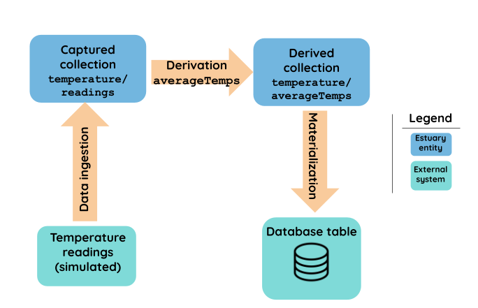

# Transformation basics: reductions and lambdas

### Introduction

In the [Hello Flow](hello-flow.md) tutorial, you learned how to capture data from an external source and materialize it to a database. In this tutorial, we'll add an intermediate step: transforming data prior to storage.&#x20;

We'll be working with a network of temperature sensors that take individual readings over time, but we're not interested in storing the readings permanently. Instead, we want to maintain some basic statistics, such as the average temperature, and continually update them with the most recent data.

The key process we'll use is called a **data reduction.** Data reductions in Flow are powerful tools that help you aggregate data before materializing it into the endpoints you care about. They do this by defining strategies to combine multiple JSON documents based on a key. Reducing data can improve target systems' query time, lower their costs, and ensure they are always up-to-date.

Data reductions happen across almost all Flow processes —captures, materialization, etc — but in many cases, they're automatic. We'll use a **derivation** to maximize our control over the reduction process and significantly reshape the data with the help of a **lambda function**.&#x20;

Here's an outline of our workflow:

* Create a new catalog spec
* **Reduce** our data volume using a schema with **reduction annotations**
* **Map**, or re-shape our data to the desired output state using a **lambda function**
* Add a materialization to create a table in a SQLite database
* Run the data flow to begin syncing the data in real time
* Use SQL queries to see our results



This is the first of a two-part tutorial. In [part two](your-first-derivation.md) will add stateful transformations and testing. The complete example is available in our [GitHub repository](https://github.com/estuary/flow/tree/master/examples/temp-sensors).&#x20;

### Creating the catalog spec for flow-ingester

Open up VS Code and make sure your Flow devcontainer is [set up](../installation.md).

Now, let's begin by creating the catalog spec. Make a new file and name it`temp-tutorial.flow.yaml.` Add a `collections` section with the following content:


```yaml
collections:
  # Stream of readings that come from temperature sensors.
  # Aggregate of temperature readings by sensor
  temperature/readings:
    schema: schemas.yaml#/$defs/tempReading
    key: [/sensorId, /timestamp]

  # Derive the average temps at any time given sensor readings
  temperature/averageTemps:
    schema: schemas.yaml#/$defs/tempAverage
    key: [/sensorId]
    derivation:
      transform:
        averageTemps:
          source:
            name: temperature/readings
          publish:
            lambda: typescript
```


There are a lot of components here. Let's dig into what they all mean.&#x20;

* Unlike in the Hello Flow tutorial, the catalog spec doesn't define a capture. This is by design. Instead, we'll use a different data collection method, [`flow ingestor`](../../reference/pushing-data-into-flow/#flow-ingester), to collect readings directly from the sensors into the`temperature/readings` collection. We'll explore this more later when we `develop` the catalog.
* Both collections reference a `schema`, which we have not yet written. It's a best practice to store schemas separately from catalog specs.&#x20;
* The `temperature/readings`collection can be thought of as a "data lake" that captures data directly from the sensors as it appears. However, its schema will impose a basic structure.
* `temperature/readings` includes a compound key. In captures, Flow reduces automatically based on your key. We need to include both `sensorID` and `timestamp` to keep the reduction from happening here.&#x20;
* The `temperature/averageTemps` collection will be derived from `temperature/readings`.  The derivation needs to turn raw data into consolidated statistics. It needs two components to succeed:
  * &#x20;A typescript lambda function to map the data, or re-shape it. Flow will help us create this later.
  * A schema with reduction annotations, which will tell Flow how to consolidate incoming data.

Next, we need to implement the two schemas and the typescript lambda.

### Reducing data with schema annotations

Each of our collections needs a schema, which will achieve very different goals.

First, we'll define `tempReading`, the schema for our `readings` collection. Its goal is to store as much raw, unaggregated data as possible.

The `averageTemps` collection is the one we'll materialize to an external database, so we want to reduce data volumes in that collection. This will enable faster, cheaper queries. Our second schema, `tempAverage` will do just that: reduce data to provide a constantly up-to-date view of temperature statistics. &#x20;

Create a new file, `schemas.yaml`, and add the following to it:


```yaml
 $defs:
   tempReading:
    description: "A reading of a temperature from a sensor"
    type: object
    properties:
      sensorId:
        type: integer
        description: "The id of the sensor that produced the reading"
      timestamp:
        type: string
        format: timestamp
        description: "An RFC-3339 formatted string holding the time of the reading"
      tempC:
        type: number
        description: "The temperature in degrees celsius"
    required: [sensorId, timestamp, tempC]

  tempAverage:
    description: "Average temperature information for a particular sensor"
    type: object
    properties:
      sensorId: { type: integer }
      # locationName may be null if we've received readings before the corresponding sensor
      # documents. That's OK because we'll later update the locationName once it becomes known.
      numReadings:
        type: integer
        reduce: { strategy: sum }
      totalC:
        type: number
        reduce: { strategy: sum }
      minTempC:
        type: number
        reduce: { strategy: minimize }
      maxTempC:
        type: number
        reduce: { strategy: maximize }
      lastReading:
        type: string
        format: timestamp
        description: "Timestamp of the most recent reading for this named location"
        # Since our timestamps are in RFC 3339 format, the lexicographic comparison done by
        # maximize will pick the most recent time.
        reduce: { strategy: maximize }
    # Sets the reduce strategy for the top-level object. This is needed for reduction strategies in
    # child properties to take effect.
    reduce: { strategy: merge }
    required: [sensorId, numReadings, totalC, minTempC, maxTempC, lastReading]
```


We can expect `tempReading` to be defined by an external system. It does the simple but important job of maintaining basic structure across a large data collection.&#x20;

`tempAverage` is more complex, as it will power a bigger transformation. It uses reduction annotations to reduce data based on specific strategies.  For example, `minTempC` uses `strategy: minimize` to ensure we correctly select the minimum value.&#x20;

A full listing of currently supported reduction strategies can be found in our [reference section](../../reference/catalog-reference/schemas-and-data-reductions.md).

### Typescript lambdas as mappers

Now we'll create a lambda function that will properly shape our data for our reduction annotation. Both components are necessary to produce output data in our desired state.&#x20;

At this point, you have a catalog spec file and a schema file in your devcontainer workspace.

Open a terminal window and run `flowctl test --source temp-tutorial.flow.yaml`.&#x20;

Flow will run and stub out a typescript file for you to update called `temp-tutorial.flow.ts`.  It looks like the following:


```javascript
import { collections, interfaces, registers } from 'flow/modules';

// Implementation for derivation examples/temp-sensors/flow.yaml#/collections/temperature~1averageTemps/derivation.
export class TemperatureAverageTemps implements interfaces.TemperatureAverageTemps {
    averageTempsPublish(
        _source: collections.TemperatureReadings,
        _register: registers.TemperatureAverageTemps,
        _previous: registers.TemperatureAverageTemps,
    ): collections.TemperatureAverageTemps[] {
        throw new Error("Not implemented");
    }
}
```


First, remove the underscore from `_source` in line 6. This tells the linter to use this parameter.&#x20;

Now all we have to do is update the function body with our mapper.  Let's replace `throw new Error("Not implemented");` (line 10) with the following:

```javascript
        return[{ sensorId: source.sensorId,
            numReadings: 1,
            totalC: source.tempC,
            minTempC: source.tempC,
            maxTempC: source.tempC,
            lastReading: source.timestamp}]
```

This simply shapes data as our reduction annotations expect. We need all the fields in our `averageTemps` schema:

* The `sensorId`
* The number of readings, which will be summed, acting as a counter. This gives us an accurate view of how many readings have happened.
* Our temperature stats, which will use the proper reduction annotations to sum, minimize, and maximize their values
* The timestamp of our `lastReading`, which will use [last write wins](../../reference/catalog-reference/schemas-and-data-reductions.md#firstwritewins-and-lastwritewins) to ensure accuracy (last write wins is the default reduction behavior when nothing else is specified)

Our catalog spec is almost built up. All we need to do is materialize the data into a database.

### Materialization

Let's set up materialization to a database and then run a query there to make sure everything works as expected. We'll name a new SQLite database, which will be created automatically when we develop the catalog.

First, we'll add the following to the bottom of `temp-tutorial.flow.yaml`, after the `collections` section:


```yaml
materializations:
  temperature/outputAvgTemp:
    bindings:
      - source: temperature/averageTemps
        resource:
            table: temperatures
    endpoint:
      sqlite:
        path: temperatures.db
```


The new database will be called `temperatures.db`, and will include a table called `temperatures`. We'll bind `temperature/averageTemps` to that new table.

Save the file and run `flowctl develop --source flow.yaml` in the terminal. This runs flow locally and listens to port 8080 for documents to ingest. &#x20;

Leave this running and open up a separate terminal. We don't actually have temperature sensors set up, but we'll simulate new data and check the results.&#x20;

Try running the below curl commands to ingest some data.

```yaml
curl -d @- -H 'Content-Type: application/json' http://localhost:8080/ingest <<EOF
{
  "temperature/readings": [
    {"sensorId": 1, "timestamp": "2020-08-26T07:31:32Z", "tempC": 18.2},
    {"sensorId": 2, "timestamp": "2020-08-26T08:01:31Z", "tempC": 19.0},
    {"sensorId": 5, "timestamp": "2020-08-26T05:00:20Z", "tempC": 27.8}
  ]
}
EOF
```

```yaml
curl -d @- -H 'Content-Type: application/json' http://localhost:8080/ingest <<EOF
{
  "temperature/readings": [
    {"sensorId": 2, "timestamp": "2020-08-26T07:31:32Z", "tempC": 18.2},
    {"sensorId": 3, "timestamp": "2020-08-26T08:01:31Z", "tempC": 19.0},
    {"sensorId": 5, "timestamp": "2020-08-26T05:00:20Z", "tempC": 27.8}
  ]
}
EOF
```

Next, run the following SQL query to see if everything worked correctly:

`sqlite3 -readonly -header temperatures.db 'select sensorID, totalC/numReadings as avg, minTempC, maxTempC from temperatures;'`

We can now check out the results. You will see output like the following, combining the sensor readings that were passed in:

```
sensorId|avg|minTempC|maxTempC
1|18.2|18.2|18.2
2|18.6|18.2|19.0
3|19.0|19.0|19.0
5|27.8|27.8|27.8
```

We're beginning to see how we can customize Flow catalogs to meet our needs. Transformations are always optional, but once you master them, you begin to unlock Flow's potential.&#x20;

In this tutorial, we created our first derivation between two collections. It used reductions to re-size data, and a typescript lambda to re-shaped it.&#x20;

In our next tutorial, we'll take transformations a step further. We'll build onto this example and add location information for each sensor with stateful joins.

### Learn more

* [Stateful transformations and testing](your-first-derivation.md)
* [Derivations](../../concepts/catalog-entities/derivations/)
* [Schemas and data reductions](../../concepts/catalog-entities/schemas-and-data-reductions.md)
* [Lambdas](../../concepts/catalog-entities/derivations/#lambdas)

