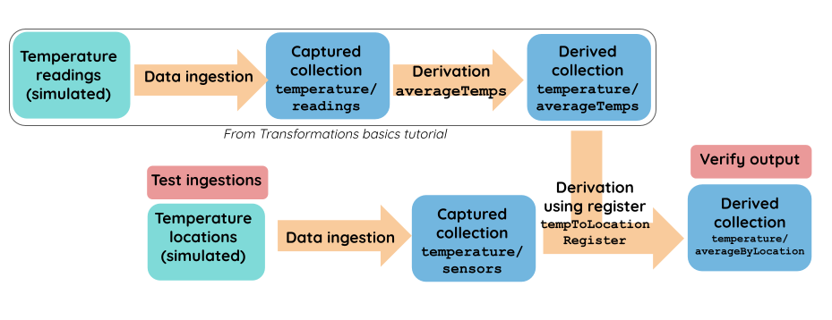

# Stateful transformations and testing

### Introduction

This tutorial will introduce some more powerful tools for creating derivations. It builds on the output of the [Transformations basics](transformation-basics.md) tutorial, so make sure you complete that one first.

As in the previous tutorial, we're working with data from a network of temperature sensors. At this point, you should already have a working catalog spec that creates two collections: `temperature/readings` and `temperature/averageTemps`.&#x20;

We'll build on this by capturing data about the sensor locations. We'll join it to `temperature/averageTemps` to create a new derived collection that contains the average temperatures for each location.&#x20;

Flow must keep track of various sensor locations and temperature readings in order to join appropriate records together as they appear. For that reason, the join is considered a **stateful** transformation. In contrast, the derivation in our previous tutorial was stateless; the reduction was applied equally to all records as they flowed through.&#x20;

We'll finish our workflow by adding a few tests. Testing is always necessary to ensure that any data product is functioning properly. We'll create functional tests that check our data quality by comparing input fixtures to output documents.

Here's an outline of our workflow:

* Create a new collection for sensor locations
* Join the sensor locations with our existing collection of temperature statistics. This creates a derived collection showing average temperatures by location
  * Add the required schemas and lambdas for the join
* Create and run tests to verify that everything works



### Capturing sensor locations

Let's first create a collection for sensor locations called `temperature/sensors`, like we did for `temperature/readings` in the last tutorial. We'll define the collection in the catalog spec and add the corresponding schema to our schema file.&#x20;

Copy the updates to both files below and save the files.&#x20;



```yaml
# Paste the following under collections:

  temperature/sensors:
    schema: schemas.yaml#/$defs/tempSensor
    # Each unique id represents a sensor that may produce readings
    key: [/id]
```



```yaml
  # Paste the following under $defs:

  tempSensor:
    description: "A sensor that produces temperature readings"
    type: object
    properties:
      id:
        type: integer
        description: "The unique id of this sensor"
      locationName:
        type: string
        description: "Human readable name of the sensor location"
        examples: ["Behind the couch"]
      location:
        $ref: https://geojson.org/schema/Point.json
        description: "The precise geographic location of the sensor"
    required: [id]
```



### Joining with register states

We want to join this dataset to the `temperature/averageTemps` collection we created in the previous tutorial to enrich that collection with each sensor's location information. We'd like this join to be fully **reactive**, meaning that it won't matter whether you add the sensors before the readings or the other way around. You can think of our goal as creating an outer join: records from both collections will be returned, even if the join condition hasn't yet been met. &#x20;

The join process is another example of a **derivation**, because it transforms data and produces a new collection. In order to work, it relies on the concept of a **register**. Registers are states that Flow constantly maintains so you can enrich collections when particular events happen. They are based on keys — in this case, the sensor ID.&#x20;

* If a sensor location arrives first, Flow keeps the location in the register and keys off its ID. When a reading occurs with the same key, Flow performs the join immediately.&#x20;
* If a reading arrives first, Flow keeps the statistics about that reading in the register and keys off the ID. When a location with the same ID arrives, Flow performs the join immediately.

Here's what it looks like. Add the following to your catalog spec and save the file:




```yaml
#paste the below under collections:

  temperature/averageByLocation:
    schema: schemas.yaml#/$defs/avgTempsWithLocation
    key: [/sensorId]
    derivation:
      register:
        schema: schemas.yaml#/$defs/tempToLocationRegister
        # All registers will start out with a default locationName. This allows us to publish
        # aggregates based on readings that are received before the sensor information has been
        # processed.
        initial: { locationName: null }

      transform:
        avgTempLocationSensors:
          source:
            name: temperature/sensors
          # Update the register when a new sensor location arrives.
          update: { lambda: typescript }
          # Update the collection if a new sensor arrived which had readings.
          publish: { lambda: typescript }
        avgTempLocationTemps:
          source:
            name: temperature/averageTemps
          # Update the register when a new reading arrives.
          update: { lambda: typescript }
          # Update the collection when a new reading arrives.
          publish: { lambda: typescript }
```




Let's dive deeper into how this works.

A register represents a user-defined JSON document that is shared amongst all the individual transforms that make up a derivation. Each transform may update the register value using an `update` lambda, read the current and previous values, and then publish to the collection using a `publish` lambda.&#x20;

As mentioned, this derivation is an outer join. When Flow reads a document from the `sensors` collection, it saves the location name in the register and keys off the sensor ID. Using that register, it later joins with the `avgTempLocationTemps` transformation process using the equivalent of the SQL statement `tempSensor.Id = tempReadings.sensorId`. This gives the transform access to the `locationName` in its `publish` lambda. Thus the two collections are joined and Flow publishes a document that includes data from both collections. This works regardless of which event happens first.&#x20;


Though an outer join is appropriate for this example, the types of join you use for different workflows will vary. You can find more examples [here](../../reference/catalog-reference/derivations/derivation-patterns.md#types-of-joins).


Let's take a closer look at how the registers are updated for each temperature reading. Every time a new value appears in one of the source collections, the appropriate  `update` lambda reduces it into the previous register value. The lambdas use the default reduction behavior, last write wins, meaning the most recent data is retained.&#x20;

To understand this, we'll look at the register's JSON schema.  Paste the following into your `schemas.yaml` file and save it. Note that the schema for the derived collection we're creating is also included.


```yaml
  avgTempsWithLocation:
    description: "Average temperature with location added"
    type: object
    $ref: schemas.yaml#/$defs/tempToLocationRegister
    properties:
      sensorId: { type: integer }
      # locationName may be null if we've received readings before the corresponding sensor
      # documents. That's OK because we'll later update the locationName once it becomes known.
    required: [sensorId]

  tempToLocationRegister:
    type: object
    properties:
      numReadings:
        type: integer
      totalC:
        type: number
      minTempC:
        type: number
      maxTempC:
        type: number
      avgC:
        type: number
      lastReading:
        type: string
        format: timestamp
        description: "Timestamp of the most recent reading for this named location"
        # Since our timestamps are in RFC 3339 format, the lexicographic comparison done by
        # maximize will pick the most recent time.
      locationName: { type: [string, "null"] }
      location:
        $ref: https://geojson.org/schema/Point.json
        description: "The precise geographic location of the sensor"
    reduce: { strategy: merge }
```


Update lambdas will update location values when a new piece of information comes from the `temperature/sensors` collection, and update everything else when information arrives to our `temperature/averageTemps` collection. The return values from these functions are **reduced** into the current register value using the `reduce` annotations in the schema. &#x20;

Normally, you'd run `flowctl test --source temp-tutorial.flow.yaml` to stub out a typescript file, and you'd simply fill in function definitions. Since you already have a typescript lambda from the previous tutorial, just copy and paste the following into that same file,`temp-tutorial.flow.ts`.


```typescript

export class TemperatureAverageByLocation implements interfaces.TemperatureAverageByLocation {
    avgTempLocationSensorsUpdate(
        source: collections.TemperatureSensors,
    ): registers.TemperatureAverageByLocation[] {
        // Update the register when a new location arrives.
        return [{ locationName: source.locationName }];
    }
    avgTempLocationSensorsPublish(
        source: collections.TemperatureSensors,
        register: registers.TemperatureAverageByLocation,
        _previous: registers.TemperatureAverageByLocation,
    ): collections.TemperatureAverageByLocation[] {
        // If we have a reading for a new location, update the collection.  Else, don't update it
        // but keep it around in the register for when a reading arrives.
        if (register.numReadings) {
            var avg = Math.round(register.totalC! / register.numReadings! * 100) / 100.0;
            return [{
                sensorId: source.id,
                numReadings: register.numReadings,
                avgC: avg,
                totalC: register.totalC,
                minTempC: register.minTempC,
                maxTempC: register.maxTempC,
                lastReading: register.lastReading,
                locationName: source.locationName
            }];
        } else {
            return []
        }
    }
    avgTempLocationTempsUpdate(
        source: collections.TemperatureAverageTemps,
    ): registers.TemperatureAverageByLocation[] {
        // Update the register with stats when a new reading comes in.  This can be used later
        // if a location arrives in for this sensor to ensure a fully reactive join.
        return [{
            numReadings: source.numReadings,
            totalC: source.totalC,
            minTempC: source.minTempC,
            maxTempC: source.maxTempC,
            lastReading: source.lastReading,
        }];
    }
    avgTempLocationTempsPublish(
        source: collections.TemperatureAverageTemps,
        register: registers.TemperatureAverageByLocation,
        _previous: registers.TemperatureAverageByLocation,
    ): collections.TemperatureAverageByLocation[] {
        var avg = Math.round(source.totalC! / source.numReadings! * 100) / 100.0;
        // Always update the collection when a new reading comes in.
        return [{
            sensorId: source.sensorId,
            numReadings: source.numReadings,
            avgC: avg,
            totalC: source.totalC,
            minTempC: source.minTempC,
            maxTempC: source.maxTempC,
            lastReading: source.lastReading,
            locationName: register.locationName
        }];
    }
}
```


Let's walk through what this mapper is doing. It contains four lambdas.

* **Sensors update** updates the register with its location value when a new sensor location arrives.
* **Sensor publish** publishes combined data (including the register's statistical data) to the collection if there have already been readings for that sensor.
* **Temps update** updates the register with statistical data when a new reading is taken.
* **Temps publish** publishes combined data (including the register's location if one exists) to the collection whenever a new reading arrives.

As you can see, unlike joins in SQL, real-time joins need to consider the time domain. However, it's possible to model these similarly to SQL joins by simply deciding what the register stores, when it's updated, and what you publish to collections. Registers effectively expose the inner workings of joins to you, which provides a lot of power.

### Testing

In the [previous tutorial](transformation-basics.md), we performed a materialization to a database. In this tutorial, we're going to take advantage of Flow's built-in testing to ensure everything is working as intended.

Flow allows you to define ingestions and expected results as contract tests. This means that as catalogs evolve, you can be confident that their data pipelines are working as intended. And because the data is defined in the test itself, we still don't need to capture data from real sensors to use our catalog in this tutorial.

Add the following to the end of your catalog spec file:


```yaml
tests:
  "test average temperature, then by location":
    - ingest: &readings
        collection: temperature/readings
        documents:
          - { sensorId: 1, timestamp: "2020-08-26T06:30:31Z", tempC: 18.9 }
          - { sensorId: 1, timestamp: "2020-08-26T11:39:57Z", tempC: 21.1 }
          - { sensorId: 2, timestamp: "2020-08-26T13:32:44Z", tempC: 23.2 }
          - { sensorId: 1, timestamp: "2020-08-26T17:19:00Z", tempC: 21.0 }
          - { sensorId: 2, timestamp: "2020-08-26T19:26:53Z", tempC: 20.9 }

    - verify: &expected
        collection: temperature/averageTemps
        documents:
          - sensorId: 1
            numReadings: 3
            totalC: 61
            minTempC: 18.9
            maxTempC: 21.1
            lastReading: "2020-08-26T17:19:00Z"
          - sensorId: 2
            numReadings: 2
            totalC: 44.1
            minTempC: 20.9
            maxTempC: 23.2
            lastReading: "2020-08-26T19:26:53Z"
```


This follows the basic structure of testing in Flow. It allows us to ingest some temperature readings and verify that the `temperature/averageTemps` collection produces expected and valid results.&#x20;

Run the test by running the following command in the terminal: &#x20;

`flowctl test --source temp-tutorial.flow.yaml`

The terminal output should tell you that the test passed.&#x20;

Now let's test our fully reactive join to make sure it's working as expected.  We should be able to ingest documents to either our `temperature/readings` or `temperature/sensors` collection first and end up with the same result.  Add this to the end of your catalog spec and save the file:


```yaml
 # Paste the following under tests

 "test ingestion of sensors, then readings":
    - ingest: &sensors
        collection: temperature/sensors
        documents:
          - { id: 1, locationName: "Office" }
          - { id: 2, locationName: "Workshop" }
    - ingest: *readings

    - verify: &expected1
        collection: temperature/averageByLocation
        documents:
          - sensorId: 1
            locationName: "Office"
            numReadings: 3
            totalC: 61
            avgC: 20.33
            minTempC: 18.9
            maxTempC: 21.1
            lastReading: "2020-08-26T17:19:00Z"
          - sensorId: 2
            locationName: "Workshop"
            numReadings: 2
            totalC: 44.1
            avgC: 22.05
            minTempC: 20.9
            maxTempC: 23.2
            lastReading: "2020-08-26T19:26:53Z"

  "test readings produced before sensor info":
    - ingest: *readings
    # Expect that the same results are produced, only without the location name
    - verify:
        collection: temperature/averageByLocation
        documents:
          - sensorId: 1
            locationName: null
            numReadings: 3
            totalC: 61
            minTempC: 18.9
            maxTempC: 21.1
            avgC: 20.33
            lastReading: "2020-08-26T17:19:00Z"
          - sensorId: 2
            locationName: null
            numReadings: 2
            avgC: 22.05
            totalC: 44.1
            minTempC: 20.9
            maxTempC: 23.2
            lastReading: "2020-08-26T19:26:53Z"
    - ingest: *sensors
    # Expect that the locationNames have been added
    - verify: *expected1

```


As you can see, this section first ingests `temperature/sensors`, then `temperature/readings`, and verifies that `temperature/averageByLocation` contains location and statistical data. It then ingests only `temperature/readings` and verifies that `temperature/averageByLocation` has statistical data but null location names. Finally, it ingests `temperature/sensors` and verifies that location information was added to the collection.

Run the command again to give it a try:&#x20;

`flowctl test --source temp-tutorial.flow.yaml`

The terminal output should indicate that all three tests passed.

Derivations and reduction annotations are powerful tools, which together can handle virtually any transformation use case. Testing is one of Flow's most important features and can help you guarantee that the data products you create always meet business requirements.

## Learn more

* [Working with remote URLs](working-with-remote-urls.md)
* [Collections ](../../concepts/catalog-entities/collections.md)
* [Derivations ](../../concepts/catalog-entities/derivations/)
* [Tests](../../concepts/catalog-entities/tests.md)
* [Schemas and data reductions](../../concepts/catalog-entities/schemas-and-data-reductions.md)

####
