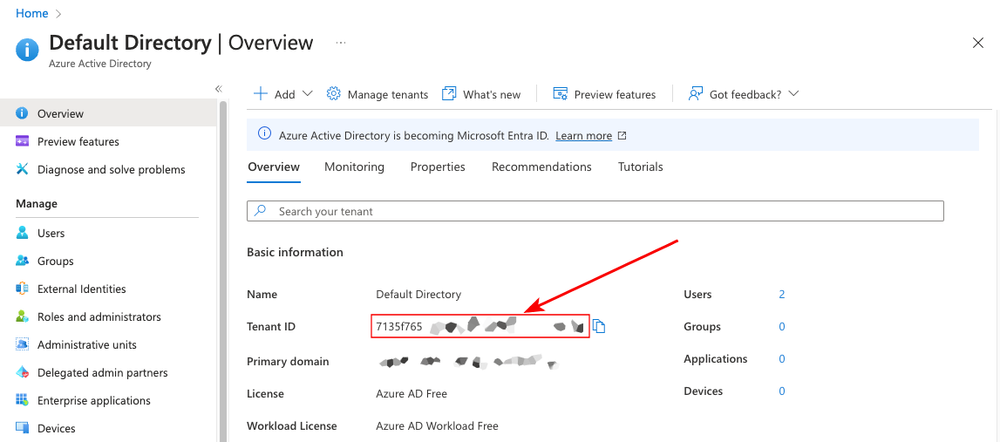
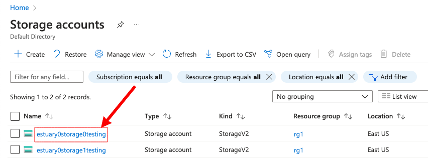
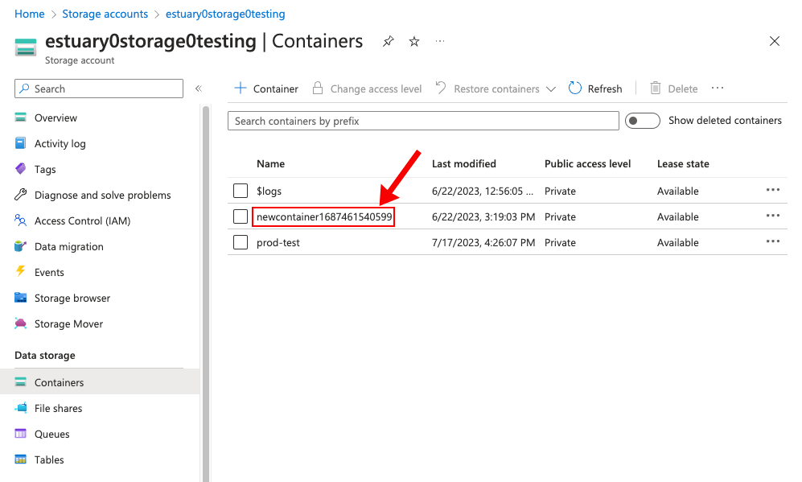

# Registration and setup

Estuary Flow is a fully managed web application that also offers a robust CLI.
Once you register in the web application, you can seamlessly use either or both tools to do your work.

## Get started with the Flow web application

To start using Flow for free, visit the [web application](https://go.estuary.dev/dashboard).
See what the free tier includes on the [Pricing](https://estuary.dev/pricing/) page.

When you register for Flow, your account will use Flow's secure cloud storage bucket to store your data.
Data in Flow's cloud storage bucket is deleted 30 days after collection.

For production use cases, you should [configure your own cloud storage bucket to use with Flow](#configuring-your-cloud-storage-bucket-for-use-with-flow).

## Get started with the Flow CLI

After your account has been activated through the [web app](#get-started-with-the-flow-web-application), you can begin to work with your data flows from the command line.
This is not required, but it enables more advanced workflows or might simply be your preference.

Flow has a single binary, **flowctl**.

flowctl is available for:

- **Linux** x86-64. All distributions are supported.
- **MacOS** 11 (Big Sur) or later. Both Intel and M1 chips are supported.

To install, copy and paste the appropriate script below into your terminal. This will download flowctl, make it executable, and add it to your `PATH`.

- For Linux:

```console
sudo curl -o /usr/local/bin/flowctl -L 'https://github.com/estuary/flow/releases/latest/download/flowctl-x86_64-linux' && sudo chmod +x /usr/local/bin/flowctl
```

- For Mac:

```console
sudo curl -o /usr/local/bin/flowctl -L 'https://github.com/estuary/flow/releases/latest/download/flowctl-multiarch-macos' && sudo chmod +x /usr/local/bin/flowctl
```

Alternatively, Mac users can install with Homebrew:

```console
brew tap estuary/flowctl
brew install flowctl
```

flowctl isn't currently available for Windows.
For Windows users, we recommend running the Linux version inside [WSL](https://learn.microsoft.com/en-us/windows/wsl/),
or using a remote development environment.

The flowctl source files are also on GitHub [here](https://go.estuary.dev/flowctl).

Once you've installed flowctl and are ready to begin working, authenticate your session using an access token.

1. Ensure that you have an Estuary account and have signed into the Flow web app before.

2. In the terminal of your local development environment, run:

   ```console
   flowctl auth login
   ```

   In a browser window, the web app opens to the CLI-API tab.

3. Copy the access token.

4. Return to the terminal, paste the access token, and press Enter.

The token will expire after a predetermined duration. Repeat this process to re-authenticate.

[Learn more about using flowctl.](../concepts/flowctl.md)

## Configuring your cloud storage bucket for use with Flow

New Flow accounts are connected to Flow's secure cloud storage bucket to store collection data.
To switch to your own bucket, choose a cloud provider and complete the setup steps:

* [Google Cloud Storage](#google-cloud-storage-buckets)

* [Amazon S3](#amazon-s3-buckets)

* [Azure Blob Storage](#azure-blob-storage)

Once you're done, [get in touch](#give-us-a-ring).

### Google Cloud Storage buckets

You'll need to grant Estuary Flow access to your GCS bucket.

1. [Create a bucket to use with Flow](https://cloud.google.com/storage/docs/creating-buckets), if you haven't already.

2. Follow the steps to [add a principal to a bucket level policy](https://cloud.google.com/storage/docs/access-control/using-iam-permissions#bucket-add).
   As you do so:

   - For the principal, enter `flow-258@helpful-kingdom-273219.iam.gserviceaccount.com`

   - Select the [`roles/storage.admin`](https://cloud.google.com/storage/docs/access-control/iam-roles) role.

### Amazon S3 buckets

You'll need to grant Estuary Flow access to your S3 bucket.

1. [Create a bucket to use with Flow](https://docs.aws.amazon.com/AmazonS3/latest/userguide/create-bucket-overview.html), if you haven't already.

2. Follow the steps to [add a bucket policy](https://docs.aws.amazon.com/AmazonS3/latest/userguide/add-bucket-policy.html), pasting the policy below.
Be sure to replace `YOUR-S3-BUCKET` with the actual name of your bucket.

```json
{
  "Version": "2012-10-17",
  "Statement": [
    {
      "Sid": "AllowUsersToAccessObjectsUnderPrefix",
      "Effect": "Allow",
      "Principal": {
        "AWS": "arn:aws:iam::789740162118:user/flow-aws"
      },
      "Action": ["s3:GetObject", "s3:PutObject", "s3:DeleteObject"],
      "Resource": "arn:aws:s3:::YOUR-S3-BUCKET/*"
    },
    {
      "Effect": "Allow",
      "Principal": {
        "AWS": "arn:aws:iam::789740162118:user/flow-aws"
      },
      "Action": "s3:ListBucket",
      "Resource": "arn:aws:s3:::YOUR-S3-BUCKET"
    },
    {
      "Effect": "Allow",
      "Principal": {
        "AWS": "arn:aws:iam::789740162118:user/flow-aws"
      },
      "Action": "s3:GetBucketPolicy",
      "Resource": "arn:aws:s3:::YOUR-S3-BUCKET"
    }
  ]
}
```

### Azure Blob Storage

You'll need to grant Estuary Flow access to your storage account and container.
You'll also need to provide some identifying information.

1. [Create an Azure Blob Storage container](https://learn.microsoft.com/en-us/azure/storage/blobs/storage-quickstart-blobs-portal#create-a-container) to use with Flow, if you haven't already.

2. Gather the following information. You'll need this when you contact us to complete setup.

   - Your **Azure AD tenant ID**. You can find this in the **Azure Active Directory** page.
  

   - Your **Azure Blob Storage account ID**. You can find this in the **Storage Accounts** page.
  

   - Your **Azure Blob Storage container ID**. You can find this inside your storage account.
  

   You'll grant Flow access to your storage resources by connecting to Estuary's
   [Azure application](https://learn.microsoft.com/en-us/azure/active-directory/manage-apps/what-is-application-management).

3. Add Estuary's Azure application to your tenant.

import { AzureAuthorizeComponent } from "./azureAuthorize";
import BrowserOnly from "@docusaurus/BrowserOnly";

<BrowserOnly>{() => <AzureAuthorizeComponent />}</BrowserOnly>

4. Grant the application access to your storage account via the
[`Storage Blob Data Owner`](https://learn.microsoft.com/en-us/azure/role-based-access-control/built-in-roles#storage-blob-data-owner) IAM role.

   - Inside your storage account's **Access Control (IAM)** tab, click **Add Role Assignment**.

   - Search for `Storage Blob Data Owner` and select it.

   - On the next page, make sure `User, group, or service principal` is selected, then click **+ Select Members**.

   - You must search for the exact name of the application, otherwise it won't show up: `Estuary Storage Mappings Prod`

   - Once you've selected the application, finish granting the role.

   For more help, see the [Azure docs](https://learn.microsoft.com/en-us/azure/role-based-access-control/role-assignments-portal).

### Add the Bucket

If your bucket is for Google Cloud Storage or AWS S3, you can add it yourself.  Once you've finished the above steps, head to "Admin", "Settings" then "Configure Cloud Storage" 
and enter the relevant information there and we'll start to use your bucket for all data going forward.

If your bucket is for Azure, send support@estuary.dev an email with the name of the storage bucket and any other information you gathered per the steps above.
Let us know whether you want to use this storage bucket to for your whole Flow account, or just a specific [prefix](../concepts/catalogs.md#namespace).
We'll be in touch when it's done!

## Self-hosting Flow

The Flow runtime is available under the [Business Source License](https://github.com/estuary/flow/blob/master/LICENSE-BSL). It's possible to self-host Flow using a cloud provider of your choice.

:::caution Beta
Setup for self-hosting is not covered in this documentation, and full support is not guaranteed at this time.
We recommend using the [hosted version of Flow](#get-started-with-the-flow-web-application) for the best experience.
If you'd still like to self-host, refer to the [GitHub repository](https://github.com/estuary/flow) or the [Estuary Slack](https://join.slack.com/t/estuary-dev/shared_invite/zt-86nal6yr-VPbv~YfZE9Q~6Zl~gmZdFQ).
:::

## What's next?

Start using Flow with these recommended resources.

- **[Create your first data flow](../guides/create-dataflow.md)**:
  Follow this guide to create your first data flow in the Flow web app, while learning essential flow concepts.

- **[High level concepts](../concepts/README.md)**: Start here to learn more about important Flow terms.
