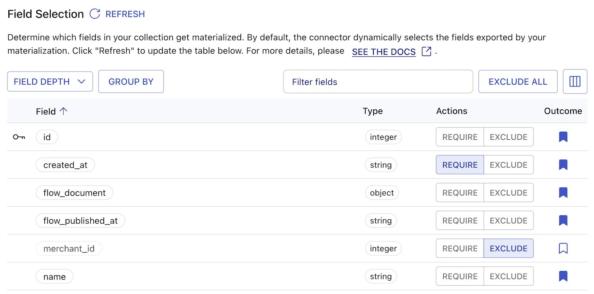

# Customize Materialized Fields

Estuary Flow can auto-discover data resources and schemas, and implements a priority-based system that intelligently selects fields to materialize.
However, you may wish to override these defaults to customize the final format of your materialized tables.
For example, columns you require may be missing or may need specific names to work with downstream systems.
Or you might wish to keep columns with sensitive data from materializing entirely.

This happens when the collection's JSON schema doesn't map to a table schema appropriate for your use case.

You can control the shape and appearance of materialized tables using a two-step process.

First, you modify the source collection **schema**.
You can change column names by adding **[projections](../concepts/advanced/projections.md)**:
JSON pointers that turn locations in a document's JSON structure into custom named fields.

Then, you add the `fields` stanza to the materialization specification, telling Flow which fields to materialize.

You can manage both of these options through Estuary's dashboard or modify them directly in the resource specification file.

The following sections break down the process in more detail.

:::info Hint
If you just need to add a field that isn't included by default and it's already present in the schema
with a name you like, skip ahead to [include desired fields in your materialization](#field-selection-for-materializations).
:::

## Capture desired fields and generate projections

Any field you eventually want to materialize must be included in the collection's schema.
It's ok if the field is nested in the JSON structure; you'll flatten the structure with **projections**.

:::caution
In this workflow, you'll edit a collection. This change can impact other downstream materializations and derivations.
Use caution and be mindful of any edit's consequences before publishing.
:::

### Captured collections

If the collection you're using was captured directly, follow these steps.

1. Go to the [Captures](https://dashboard.estuary.dev/captures) page of the Flow web app
and locate the capture that produced the collection.

2. Select your capture and click the **Edit** button.

3. Under **Target Collections**, choose the binding that corresponds to the collection.
Then, click the **Collection** tab.

4. In the list of fields, look for the fields you want to materialize.
If they're present and correctly named, you can skip to
[including them in the materialization](#field-selection-for-materializations).

:::info hint
Compare the field name and pointer.
For nested pointers, you'll probably want to change the field name to omit slashes.
:::

5. If you need to change your fields, you can edit the collection schema.

   If your desired fields aren't present and your capture does not automatically keep schemas up to date, you can edit the schema directly:

   1. Click **Edit**.

   2. Add missing fields to the schema in the correct location based on the source data structure.

   3. Click **Close**.

   If you simply want to rename existing fields, you can provide alternate names for individual fields:

   1. In the Schema table, click the **Rename** button for the field you wish to change.

   2. In the **Alternate Name** modal, provide the field's **New Name**.

   3. Click **Apply**.

6. Repeat steps 3 through 5 with other collections, if necessary.

7. You can [backfill](../reference/backfilling-data.md) affected collections to ensure historical data is populated with your new projections.

8. Click **Save and Publish**.

:::info
You can also add projections manually with `flowctl`.
Refer to the guide to [editing with flowctl](./flowctl/edit-specification-locally.md) and
[how to format projections](../concepts/collections.md#projections).
:::

### Derived collections

If the collection you're using came from a derivation, follow these steps.

1. [Pull the derived collection's specification locally](./flowctl/edit-specification-locally.md#pull-specifications-locally) using `flowctl`.

```
flowctl catalog pull-specs --name <yourOrg/full/collectionName>
```

2. Review the collection's schema to see if the fields of interest are included. If they're present, you can skip to
[including them in the materialization](#field-selection-for-materializations).

3. If your desired fields aren't present or are incorrectly named, add any missing fields to the schema in the correct location based on the source data structure.

4. Use schema inference to generate projections for the fields.

```
flowctl preview --infer-schema --source <full\path\to\flow.yaml> --collection <yourOrg/full/collectionName>
```

5. Review the updated schema. Manually change the names of projected fields. These names will be used by the materialization and shown in the endpoint system as column names or the equivalent.

6. [Re-publish the collection specification](./flowctl/edit-specification-locally.md#edit-source-files-and-re-publish-specifications).

## Field selection for materializations

Now that all your fields are present in the collection schema as projections,
you can choose which ones to include in the materialization.

Every included field will be mapped to a table column or equivalent in the endpoint system.

1. If you haven't created the materialization, [begin the process](./create-dataflow.md#create-a-materialization). Pause once you've selected the collections to materialize.

   If your materialization already exists, navigate to the [edit materialization](./edit-data-flows.md#edit-a-materialization) page.

2. In the Collection Selector, choose the collection whose output fields you want to change. Click its **Collection** tab.

3. Review the listed fields in the field selection table.

   Estuary automatically detects fields and uses a priority-based selection system to determine the fields to include or exclude in the materialization.

   These [selection and rejection reasons](#field-selection-and-rejection-reasons) inform the default materialized fields.
   You can customize this behavior further with **modes** and individual **field overrides**.

   The field selection table will provide an **Outcome** for each field:

   * **Field included**: The field will be included in the materialization. Symbolized by a filled bookmark.
   * **Field excluded**: The field will not be included in the materialization. Symbolized by an empty bookmark.
   * **Conflict**: The field matches criteria for both selection and rejection.
   Symbolized by a warning sign. The outcome tooltip provides detailed information on the conflict.

4. Choose whether to start with one of Flow's field selection **modes**. You can customize individual fields later. Modes include and exclude fields based on field depth:

   * **Depth Zero:** Only selects top-level fields
   * **Depth One:** Selects object fields with one degree of nesting
   * **Depth Two:** Selects object fields with two degrees of nesting
   * **Unlimited Depth:** Selects all fields

   Selecting a depth limit can help prevent over-materializing complex document structures.
   If you don't select a mode, Estuary will default to **Depth One**.

5. You can modify individual fields by choosing to **require** or **exclude** them.

   

6. Repeat steps 2 through 5 with other collections, if necessary.

7. Click **Save and Publish**.

The named, included fields will be reflected in the endpoint system.

### Field selection and rejection reasons

Estuary uses a priority-based system to determine which fields to materialize.
This means that, for each field, a stronger selection reason will override a weaker rejection reason, and vice versa.
This helps ensure that critical fields get materialized.

When fields have both selection and rejection reasons, conflicts are surfaced to users to resolve.

**Selection reasons**, starting from the strongest priority, include:

* **Group-By Key:** Part of the materialization group-by key
* **Current Document:** Currently used to store the document
* **User Requires:** Required by user's field selection
* **Connector Requires:** Required by connector
* **Partition Key:** Collection partition key
* **Current Value:** Part of current materialization
* **User Defined:** User-projected field
* **Connector Requires Location:** Location-based connector requirement
* **Core Metadata:** Essential system fields
* **Desired Depth:** Within user-specified depth

**Rejection reasons**, starting from the strongest priority, include:

* **User Excludes:** Excluded by user's field selection
* **Connector Forbids:** Forbidden by connector
* **Connector Incompatible:** Requires backfill to resolve
* **Collection Omits:** Field doesn't exist in source
* **Connector Omits:** No connector constraint provided
* **Duplicate Fold:** Ambiguous folded field name
* **Duplicate Location:** Location already materialized
* **Covered Location:** Location covered by parent field
* **Not Selected:** Doesn't meet selection criteria

Note that fields may be excluded by default simply if they do not match any selection criteria.
