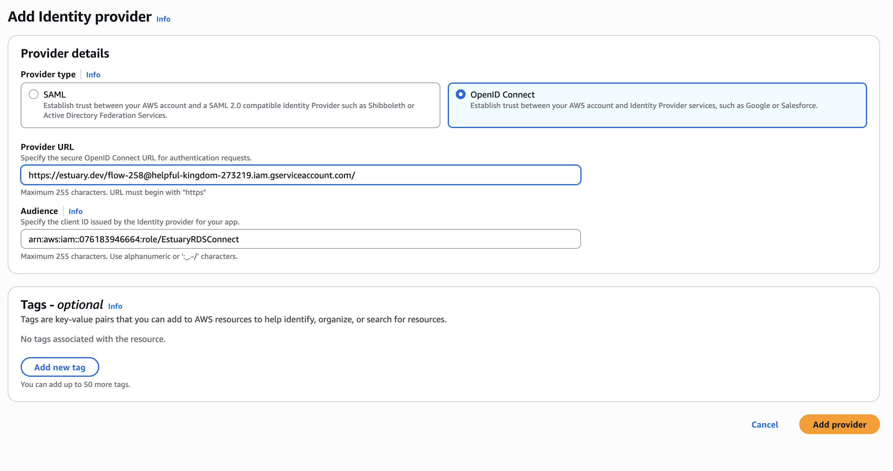

# AWS IAM Authentication

Estuary supports IAM authentication with Amazon Web Services such as RDS and S3 using a role created by you which has access to the resources, and has trusted identity tokens signed by us as the OIDC (OpenID Connect) provider. Note however that not all connectors currently support using IAM authentication.

## Role with Resource Access

In order to authenticate using AWS IAM, you need a IAM role which has access to the resource you are trying to authenticate with. Before we can setup the Identity Provider and the Role's Trust Relationship we need to know the Role ARN, so initially we will just create a placeholder role and later update it with the final Trust Relationship.

To create the role, select "AWS Account" and click next, select the required permissions for your resource, set the role name, and create the role.

Next we need to update the maximum session duration for the role, view the role you created and select **Edit** in the summary box. Set the maximum session duration to 12 hours.

For more information about role creation check the [IAM User Guide](https://docs.aws.amazon.com/IAM/latest/UserGuide/id_roles_create.html).

## Identity Provider for Estuary

Next, you need to create an IAM OIDC (OpenID Connect) provider by heading to IAM -> Identity Providers and creating a new provider with the Audience set to the ARN of the role you just created.
The **issuer** will depend on your chosen data plane in Estuary.

To find the correct issuer value:

1. Navigate to the [Admin section](https://dashboard.estuary.dev/admin) of your Estuary dashboard.

2. Select the **Settings** tab.

3. Find the **Data Planes** table and make sure you're viewing the correct tab for your data plane (either **public** or **private**).
Select your data plane to open additional configuration details.

4. Copy the value from the **IAM OIDC** field. This should look something like: `https://openid.estuary.dev/your-data-plane-identifier.dp.estuary-data.com/`

For example, these are the issuer values for a few common public data planes:

| Data Plane | Issuer |
|---|---|
| US east-1 AWS data plane | `https://openid.estuary.dev/aws-us-east-1-c1.dp.estuary-data.com/` |
| US central-1 GCP data plane | `https://openid.estuary.dev/gcp-us-central1-c2.dp.estuary-data.com/` |
| US west-2 AWS data plane | `https://openid.estuary.dev/aws-us-west-2-c1.dp.estuary-data.com/` |
| EU west-1 AWS data plane | `https://openid.estuary.dev/aws-eu-west-1-c1.dp.estuary-data.com/` |



## Trust Relationship in Role

Finally, return to the details page of your role, head to "Trust relationships" tab and add the following trust policy, replacing:

* The OpenID URL with the correct issuer value for your data plane
* The principal with the ARN of the Identity Provider you created in the previous step. This provider lives in your own AWS account, so copy its ARN from the IAM console rather than writing it by hand
* The `:sub` condition with your tenant name so only tasks from your tenant are allowed to assume this role

:::tip
Make sure the `:aud` and `:sub` values use the correct issuer. Minor discrepancies with the value you used for the ARN, such as differences in trailing slashes, will lead to access failures down the line.
:::

```json
{
    "Version": "2012-10-17",
    "Statement": [
        {
            "Effect": "Allow",
            "Principal": {
                "Federated": "<ARN OF IDENTITY PROVIDER>"
            },
            "Action": "sts:AssumeRoleWithWebIdentity",
            "Condition": {
                "StringEquals": {
                    "openid.estuary.dev/gcp-us-central1-c2.dp.estuary-data.com/:aud": "<ARN OF ROLE>"
                },
                "StringLike": {
                    "openid.estuary.dev/gcp-us-central1-c2.dp.estuary-data.com/:sub": "acmeCo/*"
                }
            }
        }
    ]
}
```

## Resources in a Different AWS Account

Estuary makes a single `sts:AssumeRoleWithWebIdentity` call. There is no second, chained `AssumeRole`, so a role in one account cannot be used as a stepping stone to a role in another.

An IAM OIDC identity provider is a per-account resource, and a role's trust policy can only name a provider in the same account as the role. If the resource you want to connect to lives in a different AWS account from one you have already set up, create both the identity provider and the role in the account that owns the resource, then use that role's ARN in your endpoint configuration. Nothing needs to change in your original account.

A task's endpoint configuration holds a single role ARN, so resources spread across several accounts need one task per account.

Granting your existing role cross-account access through a resource-based policy is not a substitute. Connectors often call account-level APIs during discovery, such as `dynamodb:ListTables`, which a resource-based policy on an individual resource cannot grant.
