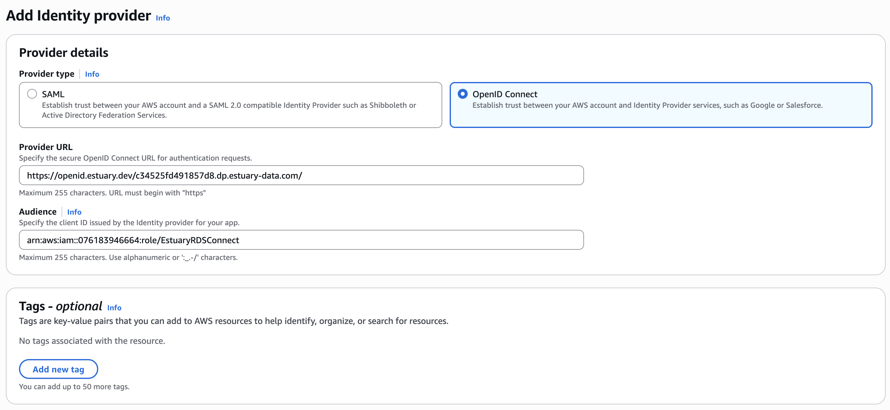

# AWS IAM Authentication

Flow supports IAM authentication with Amazon Web Services such as RDS and S3 using a role created by you which has access to the resources, and has trusted identity tokens signed by us as the OIDC (OpenID Connect) provider. Note however that not all connectors currently support using IAM authentication.

## Role with Resource Access

In order to authenticate using AWS IAM, you need to have a role set up which has access to the resource you are trying to authenticate with. Follow the guide [here](https://docs.aws.amazon.com/IAM/latest/UserGuide/id_roles_create.html) to create a role which has access to your resource and allows a maximum session of 12 hours.

## Identity Provider for Estuary

Next, you need to create an IAM OIDC (OpenID Connect) provider by heading to IAM -> Identity Providers and creating a new provider with the Audience set to the ARN of the role you just created and the issuer set to one of the following values:



| Data Plane | Issuer |
|---|---|
| US central-1 GCP data plane | https://estuary.dev/gcp-us-central1-c2.dp.estuary-data.com/ |
| EU west-1 AWS data plane | https://estuary.dev/aws-eu-west-1-c1.dp.estuary-data.com/ |

# Trust Relationship in Role

Finally, in the details page of your role, head to "Trust relationships" tab and add the following trust policy, replacing the principal with one of the AWS user ARNs in the table below depending on the data plane (if you use a private deployment or BYOC, we will provide you with this value) you use and `:sub` condition with your tenant name so only tasks from your tenant are allowed to assume this role:

```
{
    "Version": "2012-10-17",
    "Statement": [
        {
            "Effect": "Allow",
            "Principal": {
                "Federated": "<ARN OF IDENTITY PROVIDER>"
            },
            "Action": "sts:AssumeRoleWithWebIdentity",
            "Condition": {
                "StringEquals": {
                    "estuary.dev/gcp-us-central1-c2.dp.estuary-data.com/:aud": "<ARN OF ROLE>"
                },
                "StringLike": {
                    "estuary.dev/gcp-us-central1-c2.dp.estuary-data.com/:sub": "daveCo/*"
                }
            }
        }
    ]
}
```
