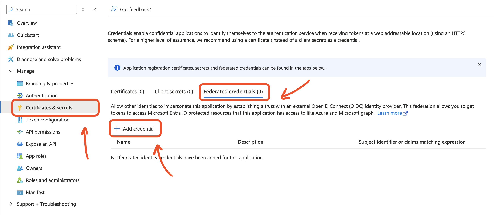
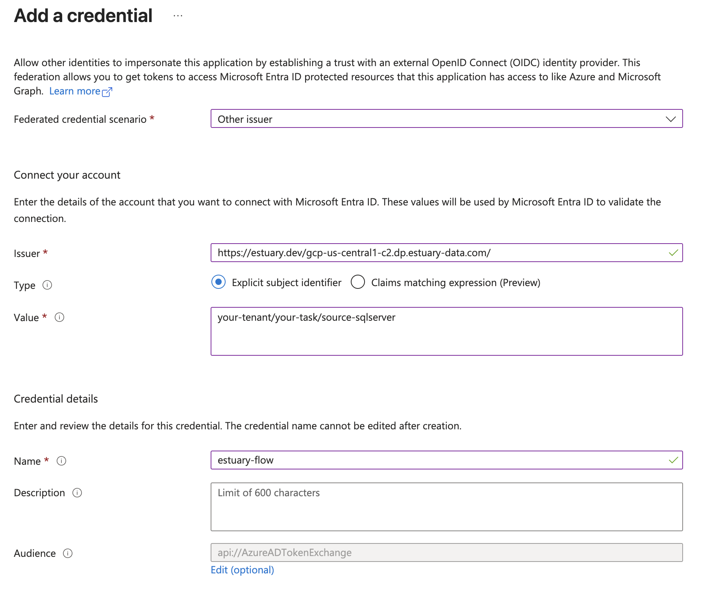

# Azure IAM Authentication

Estuary supports IAM authentication with Azure services such as Azure SQL and Azure Storage using an application created by you which has access to the resources, and has trusted identity tokens signed by us as the OIDC (OpenID Connect) provider. Note however that not all connectors currently support using IAM authentication.

## App Registration with Resource Access

You need to have an Azure App Registration set up which has access to the resource you are trying to authenticate with. Follow the guide [here](https://learn.microsoft.com/en-us/entra/identity-platform/quickstart-register-app) to register an application has access to your resource.

## Federated Credentials

Next, you need to create a Federated Credential by heading to Certificates & Secrets section of your app, and creating a new provider.

The subject should be set to your task name while the **issuer** will depend on your chosen data plane in Estuary.

To find the correct issuer value:

1. Navigate to the [Admin section](https://dashboard.estuary.dev/admin) of your Estuary dashboard.

2. Select the **Settings** tab.

3. Find the **Data Planes** table and make sure you're viewing the correct tab for your data plane (either **public** or **private**).
Select your data plane to open additional configuration details.

4. Copy the value from the **IAM OIDC** field. This should look something like: `https://openid.estuary.dev/your-data-plane-identifier.dp.estuary-data.com/`

For example, these are the issuer values for a few common public data planes:

| Data Plane | Issuer |
|---|---|
| US east-1 AWS data plane | `https://openid.estuary.dev/aws-us-east-1-c1.dp.estuary-data.com/` |
| US central-1 GCP data plane | `https://openid.estuary.dev/gcp-us-central1-c2.dp.estuary-data.com/` |
| US west-2 AWS data plane | `https://openid.estuary.dev/aws-us-west-2-c1.dp.estuary-data.com/` |
| EU west-1 AWS data plane | `https://openid.estuary.dev/aws-eu-west-1-c1.dp.estuary-data.com/` |

Now take note of the Application ID and Tenant ID of your App Registration and use it when configuring Azure IAM.

## Token Lifetime

Microsoft Entra ID issues access tokens with a lifetime of roughly 1 hour by default.

Estuary gracefully restarts long-running task sessions shortly before their credentials expire, minting fresh tokens on each restart. A 1-hour lifetime is sufficient for most tasks, but if your task runs very large transactions — for example, a materialization whose commits take a substantial fraction of an hour — a longer token lifetime gives each transaction more time to complete.

To extend the lifetime, attach a [token lifetime policy](https://learn.microsoft.com/en-us/entra/identity-platform/configurable-token-lifetimes) to your App Registration's service principal. Estuary honors whatever lifetime your tenant grants automatically — no Estuary-side configuration is needed.
