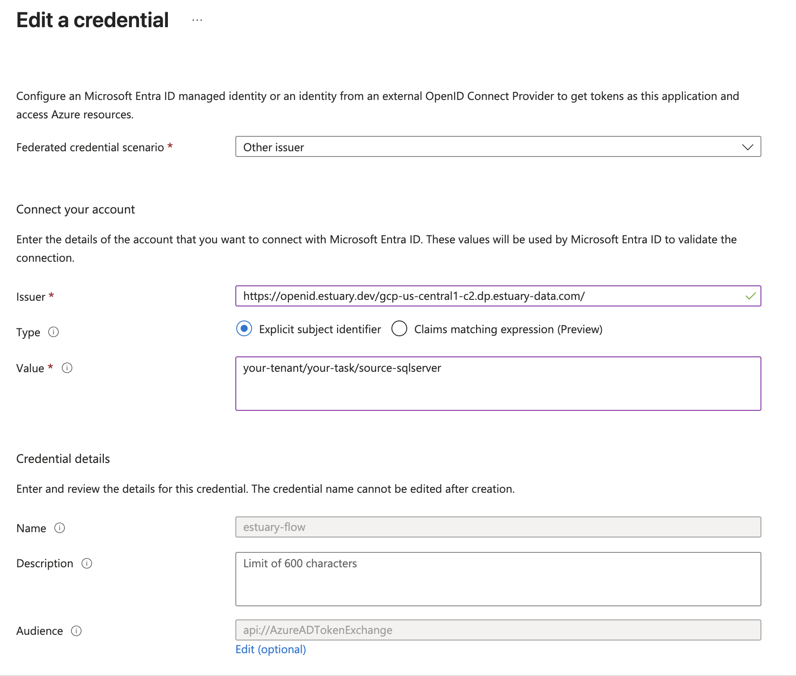

# Azure IAM Authentication

Flow supports IAM authentication with Azure services such as Azure SQL and Azure Storage using aan application created by you which has access to the resources, and has trusted identity tokens signed by us as the OIDC (OpenID Connect) provider. Note however that not all connectors currently support using IAM authentication.

## App Registration with Resource Access

You need to have an Azure App Registration set up which has access to the resource you are trying to authenticate with. Follow the guide [here](https://learn.microsoft.com/en-us/entra/identity-platform/quickstart-register-app) to register an application has access to your resource.

## Federated Credentials

Next, you need to create a Federated Credential by heading to Certificates & Secrets section of your app, and creating a new provider with the subject set to your task name and the issuer set to one of the following values:

| Data Plane | Issuer |
|---|---|
| US central-1 GCP data plane | https://openid.estuary.dev/gcp-us-central1-c2.dp.estuary-data.com/ |
| EU west-1 AWS data plane | https://openid.estuary.dev/aws-eu-west-1-c1.dp.estuary-data.com/ |

Now take note of the Application ID and Tenant ID of your App Registration and use it when configuring Azure IAM.
