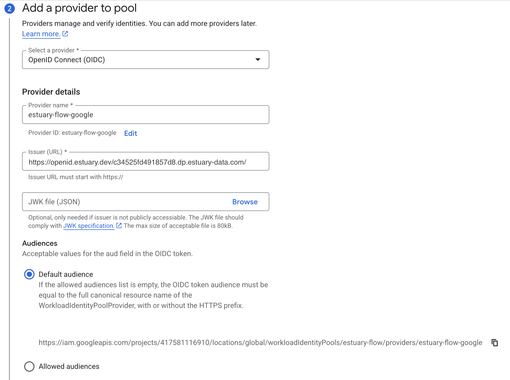
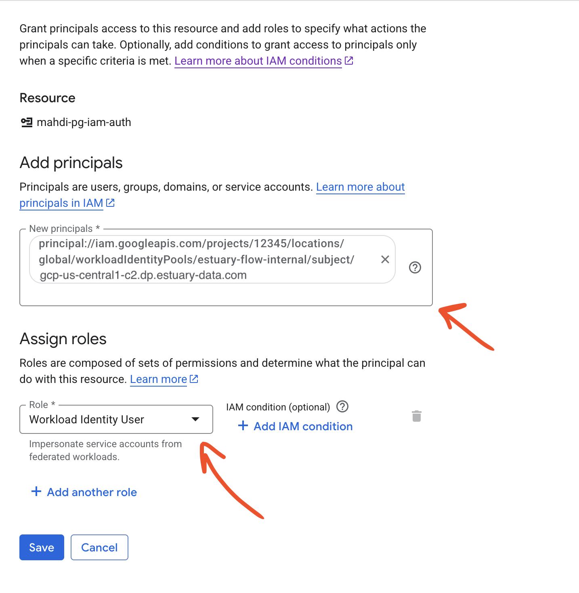

# Google Cloud IAM Authentication

Estuary supports IAM authentication with Google Cloud Platform services such as Cloud SQL and Storage, and here you can find instructions for setting up your GCP account to prepare for using IAM authentication. Note however that not all connectors currently support using IAM authentication.

## Service Account with Resource Access

In order to authenticate using Google Cloud IAM, you need to have a service account set up in your project which has access to the resource you are trying to authenticate with. Follow the guide [here](https://cloud.google.com/iam/docs/service-accounts-create) to create a service account and navigate to IAM & Admin -> Service Accounts, find your service account and in the "Principals with access" tab, use "Grant access" to grant the "Service Account Token Creator" to the service account itself.

## Workload Identity Pool and Provider

We use [Workload Identity Federation](https://cloud.google.com/iam/docs/workload-identity-federation) to enable IAM authentication in a secure manner. The first step to prepare for IAM authentication is creating a Workload Identity Pool. Navigate to Google Console and find [IAM & Admin] -> [Workload Identity Federation](https://console.cloud.google.com/iam-admin/workload-identity-pools) and use the "Create pool" button:


Give your workload identity pool your desired name, and select OpenID Connect (OIDC) as the provider.

Set the **provider name** to `estuary-flow-google`.

The **issuer** will depend on your chosen data plane in Estuary.

To find the correct issuer value:

1. Navigate to the [Admin section](https://dashboard.estuary.dev/admin) of your Estuary dashboard.

2. Select the **Settings** tab.

3. Find the **Data Planes** table and make sure you're viewing the correct tab for your data plane (either **public** or **private**).

4. Copy the value from the **IAM OIDC** column. This should look something like: `https://openid.estuary.dev/your-data-plane-identifier.dp.estuary-data.com/`

For example, these are the issuer values for a few common public data planes:

| Data Plane | Issuer |
|---|---|
| US east-1 AWS data plane | https://openid.estuary.dev/aws-us-east-1-c1.dp.estuary-data.com/ |
| US central-1 GCP data plane | https://openid.estuary.dev/gcp-us-central1-c2.dp.estuary-data.com/ |
| US west-2 AWS data plane | https://openid.estuary.dev/aws-us-west-2-c1.dp.estuary-data.com/ |
| EU west-1 AWS data plane | https://openid.estuary.dev/aws-eu-west-1-c1.dp.estuary-data.com/ |

At this step, take note of the audience value as you will need this when configuring connectors with GCP IAM.



Finally set up provider attributes to the following values, replacing your tenant name in the attribute condition:

| Field | Value |
|---|---|
| google.subject | assertion.sub |
| attribute.task_name | assertion.task_name |
| Attribute Conditions | attribute.task_name.startsWith("acmeCo/") |


Next, copy the IAM principal you see in the workload identity pool details page and replace SUBJECT_ATTRIBUTE_VALUE with your data plane domain name.
This will be the second half of the OpenID issuer value you used before. For example:

| Data Plane | SUBJECT_ATTRIBUTE_VALUE |
|---|---|
| US east-1 AWS data plane | aws-us-east-1-c1.dp.estuary-data.com |
| US central-1 GCP data plane | gcp-us-central1-c2.dp.estuary-data.com |
| US west-2 AWS data plane | aws-us-west-2-c1.dp.estuary-data.com |
| EU west-1 AWS data plane | aws-eu-west-1-c1.dp.estuary-data.com |


Now in IAM & Admin -> Service Accounts, find your service account which has access to the resource you want to authenticate to, and in its Principals with access tab, grant the "Workload Identity User" role to the workload identity principal with the SUBJECT_ATTRIBUTE_VALUE filled in, e.g.

```
principal://iam.googleapis.com/projects/12345/locations/global/workloadIdentityPools/estuary-flow-internal/subject/gcp-us-central1-c2.dp.estuary-data.com
```



Now when configuring the connector which supports GCP, you will need to provide the service account identifier which has access to the resource and the workload identity pool's audience (which you can find in the pool provider details page, also noted in the step when creating the provider).
