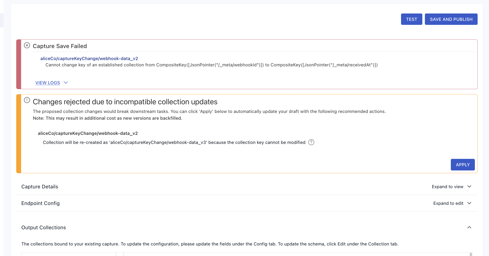

# Schema evolution

How to deal with changing schemas in your materializations

## Background

Flow [collections](../concepts/collections.md) serve not only as a data storage and retrieval mechanism, but also as a contract between producers and consumers of the data. This contract is defined in terms of the collection spec, which includes the JSON schema, the `key`, and [projections](../concepts/advanced/projections.md). This guide helps you figure out how to respond to different types of changes in the collection spec.

## Schema evolution scenarios

This guide is broken down into sections for different common scenarios, depending on which properties of the collection spec have changed.

- [The `key` pointers have changed](#re-creating-a-collection)
- [The logical partitioning configuration has changed](#re-creating-a-collection)
- The `schema` (or `readSchema` if defined separately) has changed
    - A new field is added
    - A field's data type has changed
    - A field was removed

:::info
There are a variety of reasons why these properties may change, and also different mechanisms for detecting changes in source data. In general, it doesn't matter why the collection spec has changed, only _what_ has changed. However, [auto-discovers](../concepts/captures.md#AutoDiscover) are able to handle some of these scenarios automatically. Where applicable, auto-discover behavior will be called out under each section.
:::

### Re-creating a collection

The `key` of a Flow collection cannot be changed after the collection is created. The same is true of the logical partitioning, which also cannot be changed after the collection is created. If you need to change either of those parts of a collection spec, then you'll need to create a new collection and update the bindings of any captures or materializations that reference the old collection. If you're working in the Estuary UI, then you'll see an error message and an offer to re-create the collection by clicking the "Apply" button, as shown in the example below.



**Flowctl workflow:**

If you're working with flowctl, then you'll follow some different steps, but the net effect will be the same. You'll have to rename the collection in your `flow.yaml`, making sure to also update any captures or materializations that reference it. For example, say you started out with the following YAML specs:

```yaml
captures:
  acmeCo/inventory/source-postgres:
    endpoint:
      connector:
        image: ghcr.io/estuary/source-postgres:v1
        config: encrypted-pg-config.sops.yaml
    bindings:
      - resource:
          namespace: public
          stream: anvils
          mode: Normal
        target: acmeCo/inventory/anvils

collections:
  acmeCo/inventory/anvils:
    key: [/sku]
    schema:
      type: object
      properties:
        sku: { type: string }
        warehouse_id: { type: string }
        quantity: { type: integer }
      required: [sku, warehouse_id, quantity]

materializations:
  acmeCo/data-warehouse/materialize-snowflake:
    endpoint:
      connector:
        image: ghcr.io/estuary/materialize-snowflake:v1
        config: encrypted-snowflake-config.sops.yaml
    bindings:
      - source: acmeCo/inventory/anvils
        resource:
          table: anvils
          schema: inventory
```

Then to change the collection key, you would update the YAML like so:

```yaml
captures:
  acmeCo/inventory/source-postgres:
    endpoint:
      connector:
        image: ghcr.io/estuary/source-postgres:v1
        config: encrypted-pg-config.sops.yaml
    bindings:
      - resource:
          namespace: public
          stream: anvils
          mode: Normal
        target: acmeCo/inventory/anvils_v2

collections:
  acmeCo/inventory/anvils_v2:
    key: [/sku]
    schema:
      type: object
      properties:
        sku: { type: string }
        warehouse_id: { type: string }
        quantity: { type: integer }
      required: [sku, warehouse_id, quantity]

materializations:
  acmeCo/data-warehouse/materialize-snowflake:
    endpoint:
      connector:
        image: ghcr.io/estuary/materialize-snowflake:v1
        config: encrypted-snowflake-config.sops.yaml
    bindings:
      - source: acmeCo/inventory/anvils_v2
        resource:
          table: anvils_v2
          schema: inventory
```

The existing `acmeCo/inventory/anvils` collection will not be modified at all by this, and will remain in place.

Note that the collection is now being materialized into a new table, `anvils_v2`. This is because the primary key of the `anvils` table doesn't match the new collection key. New data going forward will be added to `anvils_v2`.

:::warning
Currently, changing the `target` collection in the capture spec will _not_ cause the capture to perform another backfill. This means that the `anvils_v2` table will end up getting all of the _new_ data going forward, but will not contain the existing data from `anvils`. We plan to soon release updates that make it much easier to keep your destination tables fully in-sync without needing to change the names. In the meantime, feel free to reach out on Slack for help with making this work.
:::

**Auto-Discovers:**

If `autoDiscover` is enabled for your capture, then this re-creation of the collection can optionally be performed automatically by enabling `evolveIncompatibleCollections`. Collections would only be re-created in cases where a new `key` is discovered.

### A new field is added

When a new field appears in the collection schema, it _may_ automatically be added to any materializations that use `recommended` fields. See [the materialization docs](../concepts/materialization.md#projected-fields) for more info about how to enable or disable `recommended` fields.

If the materialization binding uses `recommended: true` in the field selection (it is enabled by default, if unspecified), then new fields will be added automatically if they meet the criteria for the particular materialization connector. For example, scalar fields (strings, numbers, and booleans) are considered "recommended" fields when materializing to database tables.

If your materialization binding uses `recommended: false`, or if the field you want is not recommended, then you can still add it to the materialization. You'll just need to do so explicitly. You can do so either by editing the materialization in the UI and clicking "Show Fields" on the affected binding, or else by adding it to `fields.include` as shown [here](../concepts/materialization.md#projected-fields).

### A field's data type has changed

When the data type of a field has changed, the effect on your materialization depends on the specific connector you're using. Note that these restrictions only apply to fields that are actively being materialized. If a field is excluded from your materialization, either explicitly or because it's not recommended, then the data types may change in any way.

:::warning
You can still get yourself into trouble if your schema changes such that existing data is no longer valid against the new schema. For example, if you have `excluded_field: { type: string }` and you change it to `type: integer`, then it is likely to cause consumers of the collection to fail due to a schema validation failure, since there may be existing data with string values for that field.
:::

Database (or data warehouse) materializations tend to be somewhat restrictive about changing column types. They typically only allow dropping `NOT NULL` constraints. This means that you can safely change a schema to make a required field optional, or to add `null` as a possible type, and the materialization will continue to work normally.  Most other types of changes will require materializing into a new table.

You can always try publishing your changes, and see if the connector allows it. If not, the publication (or test) will fail with an error message pointing to the field that's changed. In this case, you can work around the issue by simply materializing into a new table. For example, if you started out with the specs below:


```
collections:
  acmeCo/inventory/anvils:
    key: [/sku]
    schema:
      type: object
      properties:
        sku: { type: string }
        quantity: { type: integer }
        description: { type: string }
      required: [sku, quantity]

materializations:
  acmeCo/data-warehouse/materialize-snowflake:
    endpoint:
      connector:
        image: ghcr.io/estuary/materialize-snowflake:v1
        config: encrypted-snowflake-config.sops.yaml
    bindings:
      - source: acmeCo/inventory/anvils
        resource:
          table: anvils
          schema: inventory
```

Let's say that the type of `description` is broadened to allow `object` values in addition to `string`. You'd update your specs thusly:


```
collections:
  acmeCo/inventory/anvils:
    key: [/sku]
    schema:
      type: object
      properties:
        sku: { type: string }
        quantity: { type: integer }
        description: { type: [string, object] }
      required: [sku, quantity]

materializations:
  acmeCo/data-warehouse/materialize-snowflake:
    endpoint:
      connector:
        image: ghcr.io/estuary/materialize-snowflake:v1
        config: encrypted-snowflake-config.sops.yaml
    bindings:
      - source: acmeCo/inventory/anvils
        resource:
          table: anvils_v2
          schema: inventory
```

Note that the collection name has remained the same. Only the materialization `resource` is updated to write to a new table, which will backfill from the existing collection data. This works because the type is broadened, so existing values will still validate against the new schema. If this were not the case, then you'd probably want to [re-create the whole collection](#re-creating-a-collection).

**Auto-Discovers:**

If `autoDiscover` is enabled for your capture, then materializing into a new table can optionally be performed automatically by enabling `evolveIncompatibleCollections`.

### A field was removed

Removing fields is generally allowed by all connectors, and does not require new tables or collections. Note that for database materializations, the existing column will _not_ be dropped, and will just be ignored by the materialization going forward. A `NOT NULL` constraint would be removed from that column, but it will otherwise be left in place.
