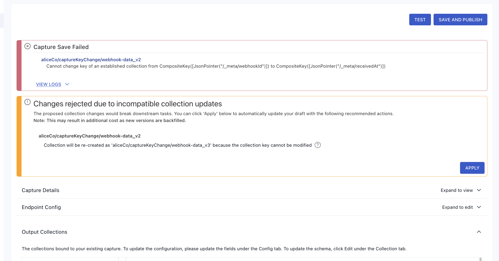

# Schema evolution

When collection specifications and schemas change, you must make corresponding changes in other parts of your Data Flow to avoid errors. In this guide, you'll learn how to respond to different types of collection changes.

Manual methods (using flowctl) as well as features available in the Flow web app are covered here.
For an in-depth overview of the automatic schema evolution feature in the web app and how it works, see [this article](../concepts/advanced/evolutions.md).

## Introduction

Flow [collections](../concepts/collections.md) serve not only as your real-time data storage, but also as a contract between tasks that produce and consume their data. **Captures** are producers, **materializations** are consumers, and **derivations** can act as either.

This contract helps prevent data loss and error in your Data Flows, and is defined in terms of the collection specification, or spec, which includes:

* The JSON schema
* The collection `key`
* [Projections](../concepts/advanced/projections.md), if any

There are many reasons a collection spec might change. Often, it's due to a change in the source data. Regardless, you'll need to make changes to downstream tasks — most often, materializations — to avoid errors.

## Schema evolution scenarios

This guide is broken down into sections for different common scenarios, depending on which properties of the collection spec have changed.

- [The `key` pointers have changed](#re-creating-a-collection)
- [The logical partitioning configuration has changed](#re-creating-a-collection)
- The `schema` (or `readSchema` if defined separately) has changed
    - [A new field is added](#a-new-field-is-added)
    - [A field's data type has changed](#a-fields-data-type-has-changed)
    - [A field was removed](#a-field-was-removed)

:::info
There are a variety of reasons why these properties may change, and also different mechanisms for detecting changes in source data. In general, it doesn't matter why the collection spec has changed, only _what_ has changed. However, [AutoDiscovers](../concepts/captures.md#automatically-update-captures) are able to handle some of these scenarios automatically. Where applicable, AutoDiscover behavior will be called out under each section.
:::

### Re-creating a collection

*Scenario: the `key` pointer or logical partitioning configurations have changed.*

The `key` of a Flow collection cannot be changed after the collection is created. The same is true of the logical partitioning, which also cannot be changed after the collection is created.

If you need to change either of those parts of a collection spec, you'll need to create a new collection and update the bindings of any captures or materializations that reference the old collection.

**Web app workflow**

If you're working in the Flow web app, you'll see an error message and an option to re-create the collection as shown in the example below.



Click **Apply** to re-create the collection and update any tasks that reference the old collection with the new name.

**flowctl workflow:**

If you're working with flowctl, you'll need to re-create the collection manually in your `flow.yaml` file. You must also update any captures or materializations that reference it. For example, say you have a data flow defined by the following specs:

```yaml
captures:
  acmeCo/inventory/source-postgres:
    endpoint:
      connector:
        image: ghcr.io/estuary/source-postgres:v1
        config: encrypted-pg-config.sops.yaml
    bindings:
      - resource:
          namespace: public
          stream: anvils
          mode: Normal
        target: acmeCo/inventory/anvils

collections:
  acmeCo/inventory/anvils:
    key: [/sku]
    schema:
      type: object
      properties:
        sku: { type: string }
        warehouse_id: { type: string }
        quantity: { type: integer }
      required: [sku, warehouse_id, quantity]

materializations:
  acmeCo/data-warehouse/materialize-snowflake:
    endpoint:
      connector:
        image: ghcr.io/estuary/materialize-snowflake:v1
        config: encrypted-snowflake-config.sops.yaml
    bindings:
      - source: acmeCo/inventory/anvils
        resource:
          table: anvils
          schema: inventory
```

To change the collection key, you would update the YAML like so. Note the capture `target`, collection name, and materialization `source`.

```yaml
captures:
  acmeCo/inventory/source-postgres:
    endpoint:
      connector:
        image: ghcr.io/estuary/source-postgres:v1
        config: encrypted-pg-config.sops.yaml
    bindings:
      - resource:
          namespace: public
          stream: anvils
          mode: Normal
        backfill: 1
        target: acmeCo/inventory/anvils_v2

collections:
  acmeCo/inventory/anvils_v2:
    key: [/sku]
    schema:
      type: object
      properties:
        sku: { type: string }
        warehouse_id: { type: string }
        quantity: { type: integer }
      required: [sku, warehouse_id, quantity]

materializations:
  acmeCo/data-warehouse/materialize-snowflake:
    endpoint:
      connector:
        image: ghcr.io/estuary/materialize-snowflake:v1
        config: encrypted-snowflake-config.sops.yaml
    bindings:
      - source: acmeCo/inventory/anvils_v2
        backfill: 1
        resource:
          table: anvils
          schema: inventory
```

The existing `acmeCo/inventory/anvils` collection will not be modified and will remain in place, but won't update because no captures are writing to it.

 Also note the addition of the `backfill` property. If the `backfill` property already exists, just increment its value. For the materialization, this will ensure that the destination table in Snowflake gets dropped and re-created, and that the materialization will backfill it from the beginning. In the capture, it similarly causes it to start over from the beginning, writing the captured data into the new collection.

**Auto-Discovers:**

If you enabled the option to [**Automatically keep schemas up to date** (`autoDiscover`)](../concepts/captures.md#automatically-update-captures) and selected **Breaking change re-versions collections** (`evolveIncompatibleCollections`) for the capture, this evolution would be performed automatically.

### A new field is added

*Scenario: this is one way in which the schema can change.*

When a new field appears in the collection schema, it _may_ automatically be added to any materializations that use `recommended` fields. Recommended fields are enabled by default in each binding. See [the materialization docs](../concepts/materialization.md#projected-fields) for more info about how to enable or disable `recommended` fields.

When recommended fields are enabled, new fields are added automatically if they meet the criteria for the particular materialization connector. For example, scalar fields (strings, numbers, and booleans) are considered "recommended" fields when materializing to database tables.

If your materialization binding is set to `recommended: false`, or if the new field is not recommended, you can manually add it to the materialization.

To manually add a field:

* **In the Flow web app,** [edit the materialization](./edit-data-flows.md#edit-a-materialization), find the affected binding, and click **Show Fields**.
* **Using flowctl,** add the field to `fields.include` in the materialization specification as shown [here](../concepts/materialization.md#projected-fields).

:::info
Newly added fields will not be set for rows that have already been materialized. If you want to ensure that all rows have the new field, just increment the `backfill` counter in the affected binding to have it re-start from the beginning.
:::

### A field's data type has changed

*Scenario: this is one way in which the schema can change.*

When a field's data type has changed, the effect on your materialization depends on the specific connector you're using.

:::warning
Note that these restrictions only apply to fields that are actively being materialized. If a field is [excluded from your materialization](../concepts/materialization.md#projected-fields), either explicitly or because it's not recommended, then the data types may change in any way.

Regardless of whether the field is materialized or not, it must still pass schema validation tests. Therefore, you must still make sure existing data remains valid against the new schema. For example, if you changed `excluded_field: { type: string }` to `type: integer` while there was existing data with string values, your materialization would fail due to a schema validation error.
:::

Database and data warehouse materializations tend to be somewhat restrictive about changing column types. They typically only allow dropping `NOT NULL` constraints. This means that you can safely change a schema to make a required field optional, or to add `null` as a possible type, and the materialization will continue to work normally.  Most other types of changes will require materializing into a new table.

The best way to find out whether a change is acceptable to a given connector is to run a test or attempt to re-publish. Failed attempts to publish won't affect any tasks that are already running.

**Web app workflow**

If you're working in the Flow web app, and attempt to publish a change that's unacceptable to the connector, you'll see an error message and an offer to increment the necessary `backfill` counters, or, in rare cases, to re-create the collection.

Click **Apply** to to accept this solution and continue to publish.

**flowctl workflow**

If you test or attempt to publish a change that's unacceptable to the connector, you'll see an error message pointing to the field that's changed. In most cases, you can work around the issue by manually updating the materialization to materialize into a new table.

For example, say you have a data flow defined by the following specs:

```yaml
collections:
  acmeCo/inventory/anvils:
    key: [/sku]
    schema:
      type: object
      properties:
        sku: { type: string }
        quantity: { type: integer }
        description: { type: string }
      required: [sku, quantity]

materializations:
  acmeCo/data-warehouse/materialize-snowflake:
    endpoint:
      connector:
        image: ghcr.io/estuary/materialize-snowflake:v1
        config: encrypted-snowflake-config.sops.yaml
    bindings:
      - source: acmeCo/inventory/anvils
        backfill: 3
        resource:
          table: anvils
          schema: inventory
```

Let's say the type of `description` was broadened to allow `object` values in addition to `string`. You'd update your specs as follows:

```yaml
collections:
  acmeCo/inventory/anvils:
    key: [/sku]
    schema:
      type: object
      properties:
        sku: { type: string }
        quantity: { type: integer }
        description: { type: [string, object] }
      required: [sku, quantity]

materializations:
  acmeCo/data-warehouse/materialize-snowflake:
    endpoint:
      connector:
        image: ghcr.io/estuary/materialize-snowflake:v1
        config: encrypted-snowflake-config.sops.yaml
    bindings:
      - source: acmeCo/inventory/anvils
        backfill: 4
        resource:
          table: anvils
          schema: inventory
```

Note that the only change was to increment the `backfill` counter. If the previous binding spec did not specify `backfill`, then just add `backfill: 1`.

This works because the type is broadened, so existing values will still validate against the new schema. If this were not the case, then you'd likely need to [re-create the whole collection](#re-creating-a-collection).

**Auto-Discovers:**

If you enabled the option to [**Automatically keep schemas up to date** (`autoDiscover`)](../concepts/captures.md#automatically-update-captures) and selected **Breaking change re-versions collections** (`evolveIncompatibleCollections`) for the capture, this evolution would be performed automatically.

### A field was removed

*Scenario: this is one way in which the schema can change.*

Removing fields is generally allowed by all connectors, and does not require new tables or collections. Note that for database materializations, the existing column will _not_ be dropped, and will just be ignored by the materialization going forward. A `NOT NULL` constraint would be removed from that column, but it will otherwise be left in place.
