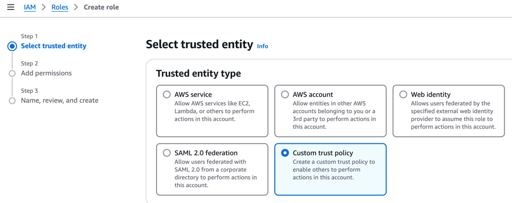
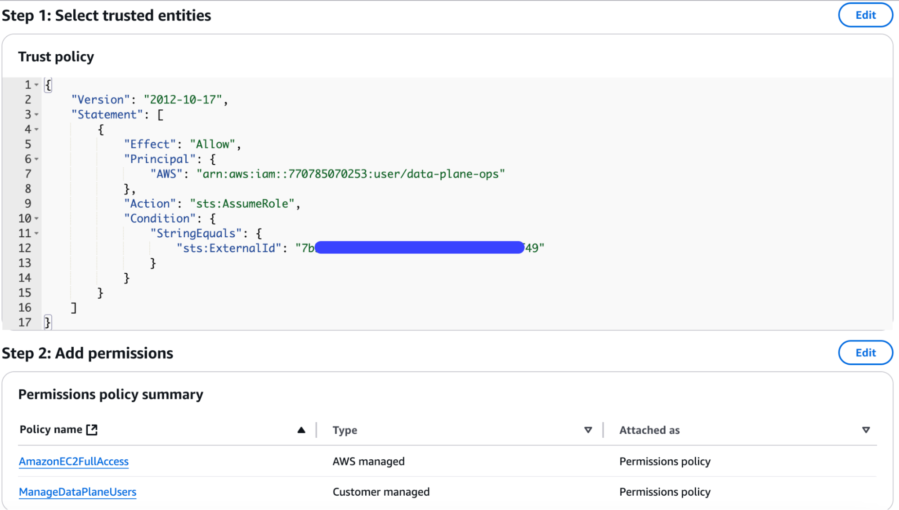

# AWS BYOC Setup

If you want to use your own AWS account for an Estuary Flow private deployment, you will first need to speak with your Estuary account manager. Estuary BYOC deployments require a license and additional setup on Estuary's side.

Once your account manager lets you know that the BYOC deployment can procede, you will need to follow the steps below:

1. Navigate to the **IAM Role** section of the AWS UI and begin the **Create role** workflow.

2. Select a Custom Trust Policy:



3. In the editor box, paste the following policy to allow Estuary's `data-plane-ops` user to assume the role. Replace the external ID with a random UUID to further secure the Trust Policy. You'll need to inform Estuary of what this `ExternalId` is:

```json
{
  "Version": "2012-10-17",
  "Statement": [
    {
      "Effect": "Allow",
      "Principal": {
        "AWS": "arn:aws:iam::770785070253:user/data-plane-ops"
      },
      "Action": "sts:AssumeRole",
      "Condition": {
        "StringEquals": {
          "sts:ExternalId": "replace-with-a-random-uuid"
        }
      }
    }
  ]
}
```

4. Click Next to add permissions to the role. Select `AmazonEC2FullAccess`, then click Next.

5. Give the role a name, like `EstuaryOps`. The summary view in the AWS UI should look similar to:



6. Click **Create Role**.

7. Finally, provide the following information to your Estuary point of contact:

   * The ARN of your created role, found in the AWS UI.
   * The unique `ExternalId` value of your role's Trust Policy.
   * The AWS region for your deployment.
