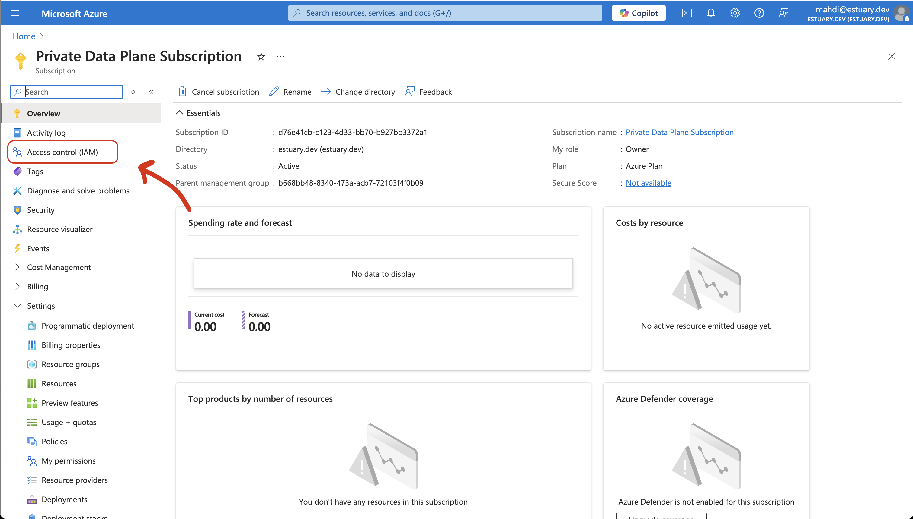
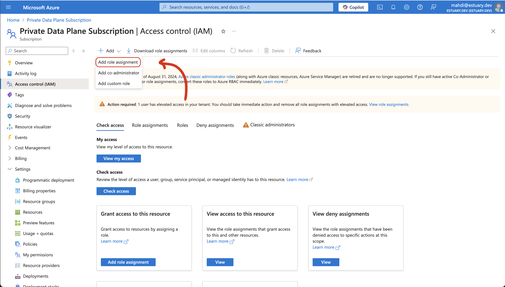
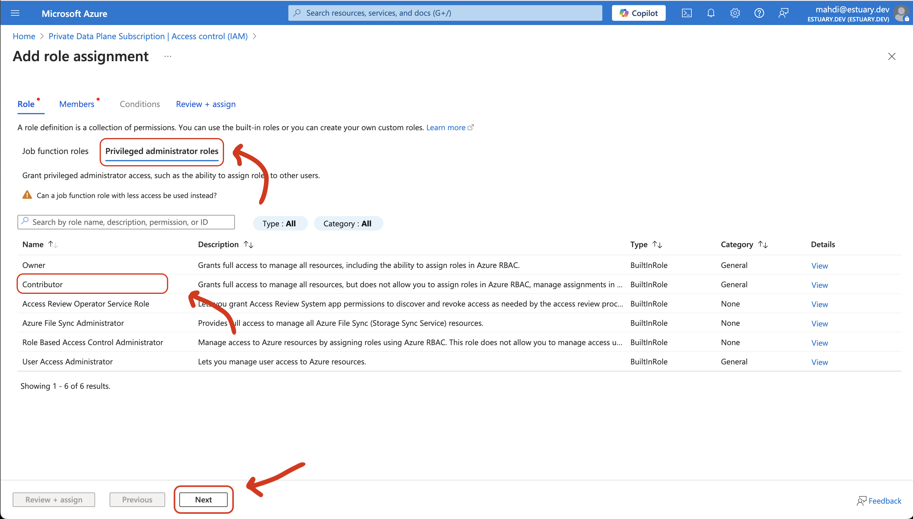
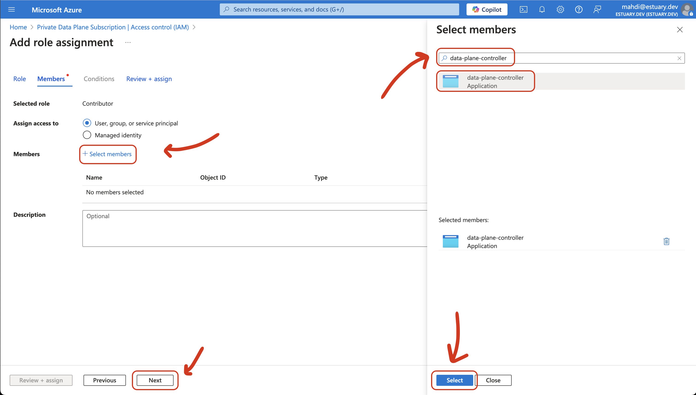
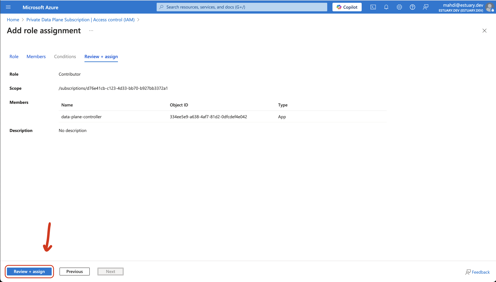

# Azure BYOC Setup

If you want to use your own Azure tenant and subscription for an Estuary Flow private deployment, you will first need to speak with your Estuary account manager. Estuary BYOC deployments require a license and additional setup on Estuary's side.

Once your account manager lets you know that the BYOC deployment can procede, you will need to follow the steps below:

1. Add the `data-plane-controller` Azure Application to your subscription by following this link: [Add data-plane-controller](https://login.microsoftonline.com/common/oauth2/authorize?client_id=76f09062-041b-476e-9c79-1cf8d26fe213&response_type=code&redirect_uri=https%3A%2F%2Feyrcnmuzzyriypdajwdk.supabase.co%2Ffunctions%2Fv1%2Fazure-dpc-oauth)

:::tip
Your account will need Azure admin access to add the application to your Azure tenant.

If the application subscription process is successful, you will be redirected back to Estuary's homepage. You can confirm that the OAuth flow succeeded if there is a `code` query parameter attached to the URL (e.g. `https://estuary.dev/?code=123`).
:::

2. In Azure Portal, search for "Subscriptions" and find your subscription, then click on "Access control (IAM)"

3. Click "Add" and then "Add role assignment"

5. Click "Privileged administrator roles", then "Contributor", then "Next"

6. Click "+ Select Members", search for "data-plane-controller" and "Select" it, then "Next"

7. Click "Review + Assign"

Finally, provide the following information to your Estuary point of contact:

 - Subscription ID (found in Subscriptions -> Overview)
 - Tenant ID (found in Tenant Properties)
