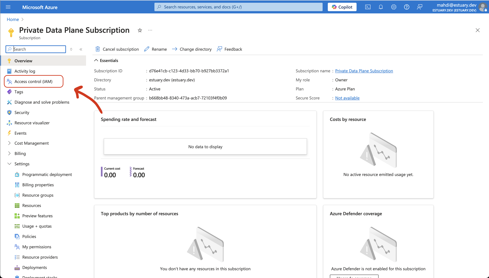
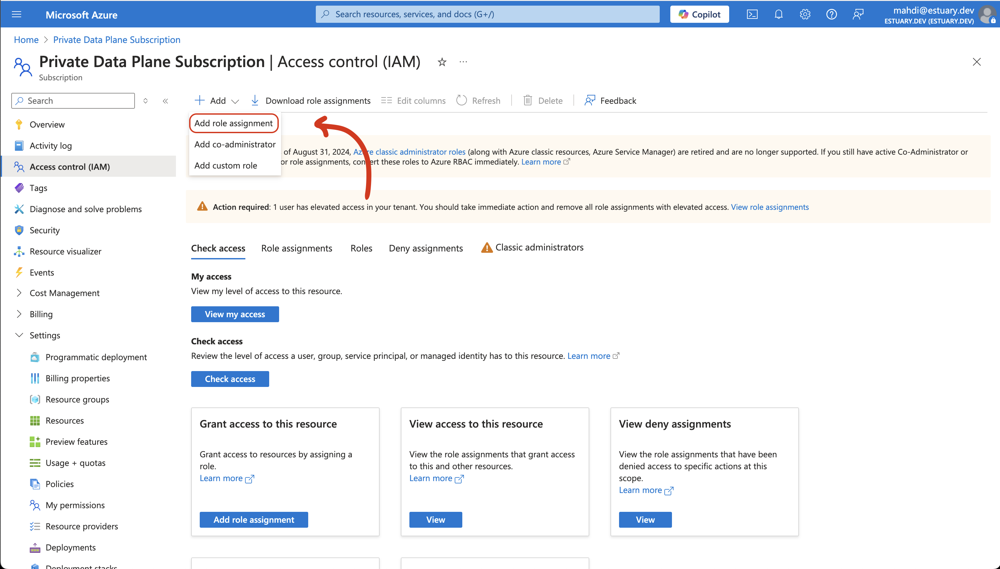
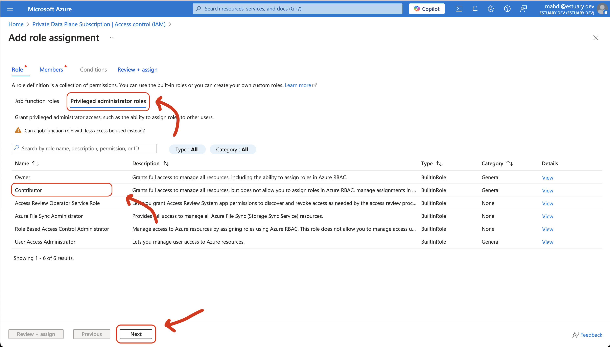
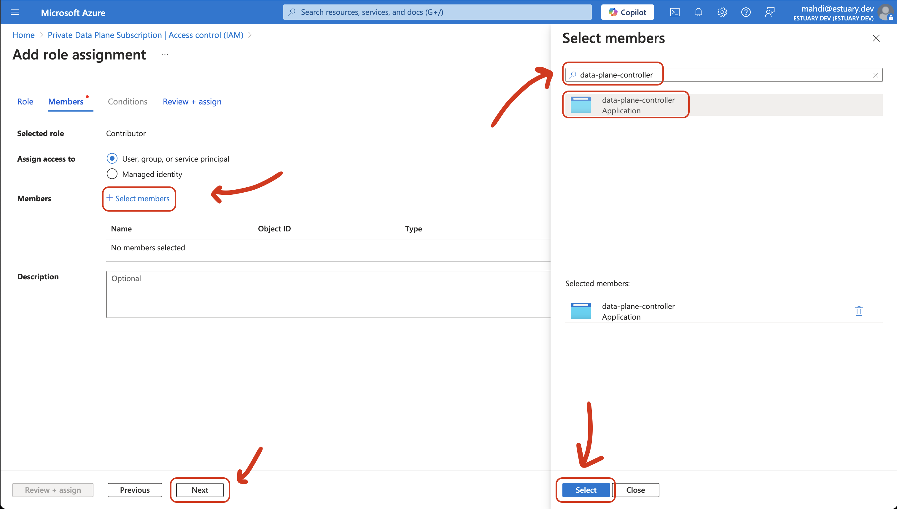
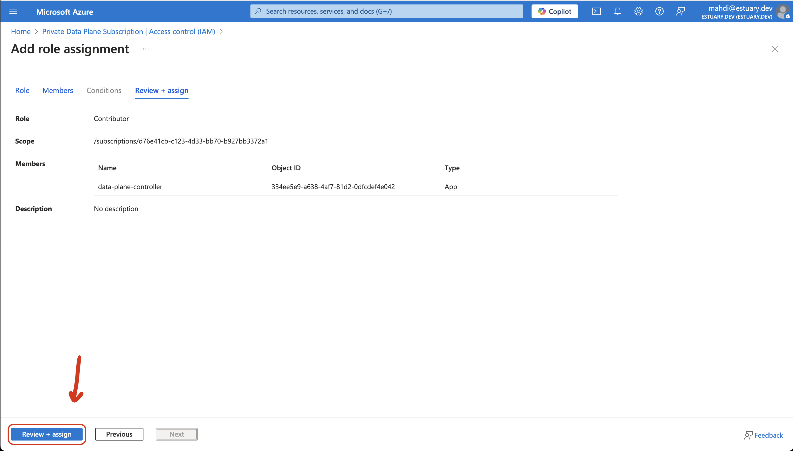

# Azure BYOC Setup

If you want to use your own Azure tenant and subscription for an Estuary private deployment, you will first need to speak with your Estuary account manager. Estuary BYOC deployments require a license and additional setup on Estuary's side.

Once your account manager lets you know that the BYOC deployment can proceed, you will need to follow the steps below:

1. Add the `data-plane-controller` Azure Application to your subscription by following this link: [Add data-plane-controller](https://login.microsoftonline.com/common/oauth2/authorize?client_id=76f09062-041b-476e-9c79-1cf8d26fe213&response_type=code&redirect_uri=https%3A%2F%2Feyrcnmuzzyriypdajwdk.supabase.co%2Ffunctions%2Fv1%2Fazure-dpc-oauth)

:::tip
Your account will need Azure admin access to add the application to your Azure tenant.

If the application subscription process is successful, you will be redirected back to Estuary's homepage. You can confirm that the OAuth flow succeeded if there is a `code` query parameter attached to the URL (e.g. `https://estuary.dev/?code=123`).
:::

If your Azure admin is signed into multiple tenants, the `common` endpoint defaults to whichever they're currently signed into, which may be the wrong one. To force a specific tenant, replace `common` in the `data-plane-controller` link with your tenant ID:
```
https://login.microsoftonline.com/{TENANT_ID}/oauth2/authorize?client_id=76f09062-041b-476e-9c79-1cf8d26fe213&response_type=code&redirect_uri=https%3A%2F%2Feyrcnmuzzyriypdajwdk.supabase.co%2Ffunctions%2Fv1%2Fazure-dpc-oauth
```

2. In Azure Portal, search for "Subscriptions" and find your subscription, then click on "Access control (IAM)"



3. Click "Add" and then "Add role assignment"



5. Click "Privileged administrator roles", then "Contributor", then "Next"



6. Click "+ Select Members", search for "data-plane-controller" and "Select" it, then "Next"



7. Click "Review + Assign"




Finally, provide the following information to your Estuary point of contact:

 - Subscription ID (found in Subscriptions -> Overview)
 - Tenant ID (found in Tenant Properties)
 - Azure region

## Prepare your subscription for provisioning

After you have shared the details above, you may need to raise a few
subscription limits so Estuary can provision the data plane. Depending on your
subscription's existing limits, some of these may already be sufficient. You
can do this in parallel with the steps above.

{/* Quota families and vCPU counts are sourced from est-dry-dock
    est_dry_dock/constants.py (azure_vm_size_by_role + initial_desired_instances,
    at 2x steady-state). Refresh these if the fleet's default SKUs change. */}

- **vCPU quota.** New Azure subscriptions often start with a low or zero vCPU
  limit on many VM families, so you may need to raise quota in your target
  region before Estuary can provision. Estuary's default data plane uses the
  families below; request the following quota (in vCPUs) in your target region.
  The quotas are set at roughly twice steady-state so that rolling upgrades,
  which briefly run old and new VMs side by side, do not exhaust your limit:

  | Azure quota family | vCPUs to request | |
  |---|---|---|
  | Standard DPSv6 Family | 12 | Default |
  | Standard EPSv6 Family | 16 | Default |
  | Standard EASv6 Family | 12 | Default |
  | Standard DSv5 Family | 12 | Fallback |
  | Standard ESv5 Family | 24 | Fallback |

  The fallback families give Estuary an alternate VM generation to fall back on
  if the defaults are capacity-constrained, which improves the chance of a
  first-try deployment.
- **Public IP quota.** Request a regional public IP quota of at least 40. A
  data plane uses roughly 18 public IP addresses at steady state, but rolling
  upgrades temporarily run old and new VMs side by side, so the count can
  nearly double during an upgrade.
- **Region choice.** Some Azure regions (notably East US and East US 2) are
  more frequently capacity-constrained. To maximize the chance of a successful
  deployment, Estuary provisions your data plane regionally by default (drawing
  from the whole region's capacity pool) rather than pinning a specific
  availability zone, which has no durability impact. If you are flexible on
  region, you can also ask your Estuary contact which regions currently have
  the smoothest availability.

:::tip
Estuary never changes your subscription settings without telling you. Quota
increases are zero-cost ceiling changes; anything cost-bearing (such as a
capacity reservation) is always your decision.
:::
