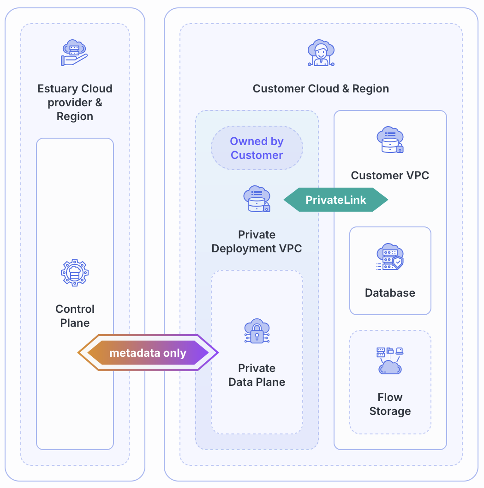

# BYOC Deployments

Bring Your Own Cloud (BYOC) deployments are similar to [private deployments](../private-deployments.md) while allowing users even more control over their data. With this deployment option, you create and own the data plane that Estuary deploys to.

:::tip
You'll need a license for a BYOC deployment. [Reach out to an Estuary representative](mailto:support@estuary.dev) to start the process.
:::

While this option requires more user setup and management, it is also the most customizable and most isolated option.

## Features

BYOC shares many features with [private deployments](../private-deployments.md#features). In addition, you get:

* **Infrastructure control:** With a BYOC deployment, you have complete control over your cloud infrastructure and can manage it according to your company's policies.

* **Leverage existing cloud resources:** Use your current cloud setup. This can be especially beneficial if you have already invested heavily in your cloud architecture.

* **Cost savings:** Since BYOC uses your existing cloud setup, you likewise may be able to make use of existing cloud credits or negotiated rates.

* **Customization:** Fit specific organizational needs by customizing Flow's deployment.
