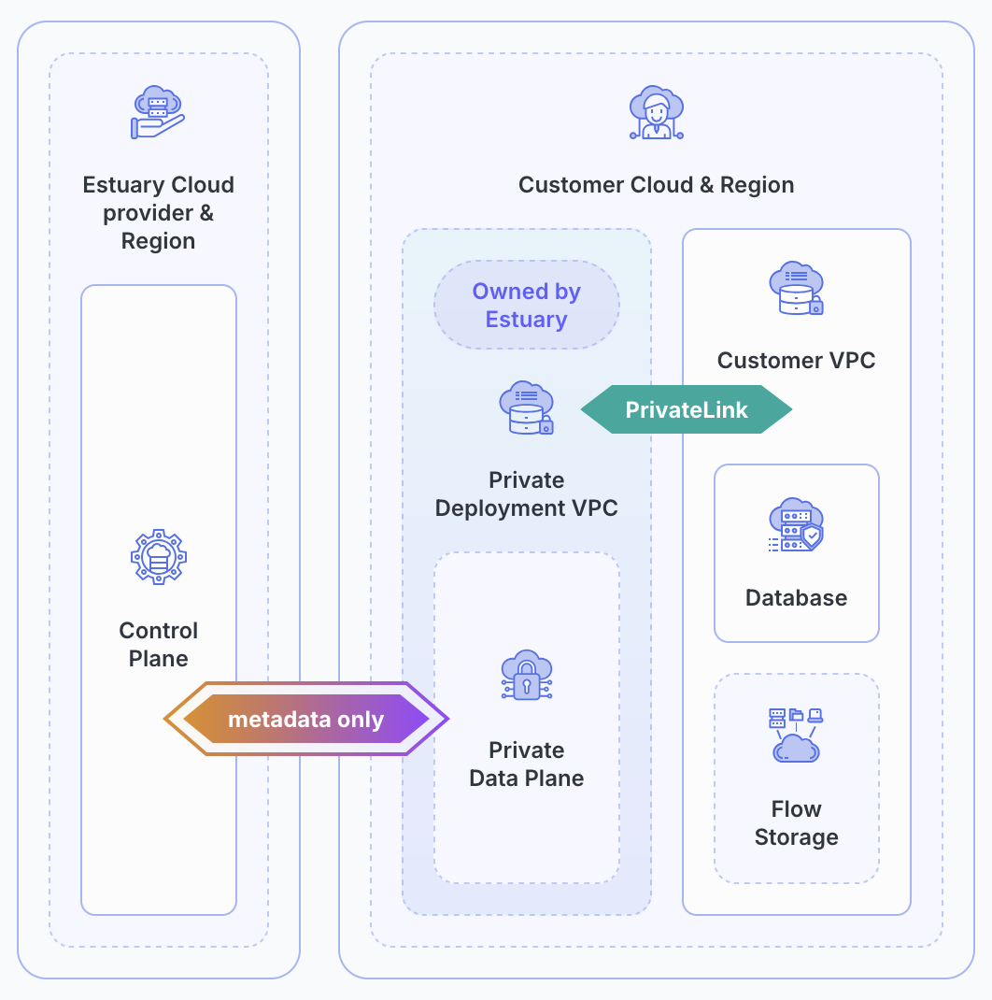

# Private Deployments

Private deployments are a way to run Estuary Flow's data infrastructure within a private environment while maintaining the simplicity of SaaS. This can be especially helpful for enhanced security and compliance. With a private deployment, you have:

* Control over data pathways
* An immutable infrastructure pattern
* The ability to move data across regions

:::tip
You'll need a license for a private deployment. [Reach out to an Estuary representative](mailto:support@estuary.dev) to start the process.
:::

Estuary Flow stores data in [your private account](../getting-started/installation.mdx) with any deployment option. For a private deployment, your data additionally stays within your private network as it moves through your data pipeline.

Estuary supports private deployments in any region in **AWS**, **GCP**, and **Azure**.

## Features

By deploying your data, network, and compute within your own private cloud, you can gain access to the following features.

* **Controlled governance:** Some security and governance standards may require you to maintain control of your data throughout the pipeline. A private deployment helps you meet these standards.

* **Access to SaaS control plane:** You can still make use of Estuary's centralized SaaS control plane when you use your own private data plane. The control and data planes are separate so the control plane cannot access your data.

* **Isolated tenancy:** Provision dedicated, isolated tenancy connectors and compute to help ensure the performance, scalability, and reliability you need for your data pipelines, without getting impacted by others.

* **Lower networking costs and latency:** By keeping everything within the same cloud, you can avoid egress fees and achieve lower latency.

* **Retain flexibility:** Users are able to choose between public and private deployments when creating tasks from the same account.

* **Cross-region access:** Organizations are able to operate across multiple geographic regions: with private deployments, data can be processed and stored within regional boundaries, maintaining compliance with local regulations, while still allowing centralized management and oversight.

* **Data sharing:** Private deployments enable secure and controlled data sharing, allowing for collaboration on data collections without compromising data integrity or confidentiality.

## Using Connectors with Private Data Planes

Once your private deployment is set up, it's straightforward to use it for any of Estuary's data connectors. When creating the connector, simply choose your private data plane in the **Capture Details** section.

Some connectors, such as MongoDB, may additionally require [IP allowlisting](/reference/allow-ip-addresses). Private data planes have their own IP addresses that you will need to allow in the external service.

To find your private data plane's IP addresses and other information:

1. Navigate to the [Admin page](https://dashboard.estuary.dev/admin) in your Estuary dashboard.

2. Select the **Settings** tab.

3. Find the **Data Planes** section.

4. You can toggle between your available private and public data planes.

This table provides information on your private data plane's cloud, region, AWS IAM user ARN, GCP service account email, and CIDR blocks. The CIDR blocks field provides IPv4 and IPv6 (if applicable) addresses.
