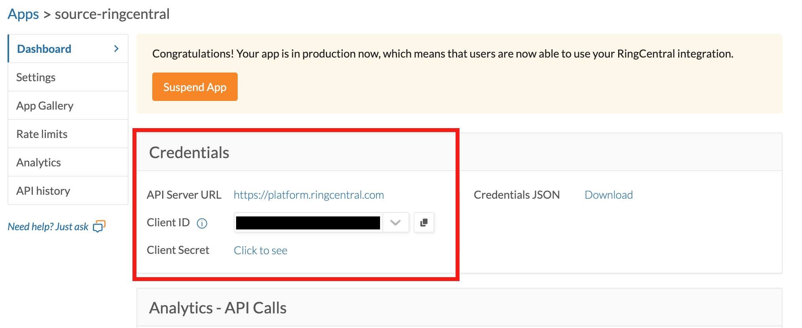

# RingCentral Source Connector

This connector captures data from RingCentral into Estuary collections.

It is available for use in the Estuary web application. For local development or open-source workflows, [`ghcr.io/estuary/source-ringcentral:dev`](https://ghcr.io/estuary/source-ringcentral:dev) provides the latest version of the connector as a Docker image. You can also follow the link in your browser to see past image versions.

## Supported Data Resources

The following data resources are supported:

| Resource | API Endpoint | Mode | Documentation |
|----------|--------------|------|---------------|
| extensions | `/account/~/extension` | Full Refresh | [List Extensions](https://developers.ringcentral.com/api-reference/Extensions/listExtensions) |
| internal_contacts | `/account/~/directory/entries` | Full Refresh | [Search Company Directory](https://developers.ringcentral.com/api-reference/Internal-Contacts/searchDirectoryEntries) |
| external_contacts | `/account/~/extension/~/address-book/contact` | Full Refresh | [List Contacts](https://developers.ringcentral.com/api-reference/External-Contacts/listContacts) |
| user_call_log | `/account/~/extension/~/call-log` | Incremental | [List User Call Log](https://developers.ringcentral.com/api-reference/Call-Log/readUserCallLog) |
| messages | `/account/~/extension/~/message-store` | Incremental | [List Messages](https://developers.ringcentral.com/api-reference/Message-Store/listMessages) |

By default, each resource is mapped to a Estuary collection through a separate binding.

## Prerequisites

You'll need the following to set up the RingCentral source connector:

1. **A RingCentral JWT Auth Application**: Create one at the [RingCentral Developer Console](https://developers.ringcentral.com/console/apps). When creating the app, select "JWT auth flow" as the authentication method.

2. **Client ID and Client Secret**: These are provided when you create your JWT Auth application.

3. **JWT Credential**: Generate a JWT credential at [My Credentials](https://developers.ringcentral.com/console/my-credentials) in the RingCentral Developer Console. Make sure to authorize the JWT for your app.

4. **Required OAuth Scopes**: Your app must have the following scopes enabled depending on which resources you want to capture:

   | Resource | Required Scope |
   |----------|----------------|
   | extensions | `ReadAccounts` |
   | internal_contacts | `ReadAccounts` |
   | external_contacts | `ReadContacts` |
   | user_call_log | `ReadCallLog` |
   | messages | `ReadMessages` |

## Authentication Setup

This section walks through creating a RingCentral JWT Auth application and generating JWT credentials.

### Part 1: Create a JWT Auth Application

#### Step 1: Navigate to Apps

Go to the [RingCentral Developer Console](https://developers.ringcentral.com/console/apps) and click the **Register App** button in the top right.


#### Step 2: Select App Type

Select **REST API App** (most common) as the app type and click **Next**.


#### Step 3: Configure App Settings

Fill out the application settings:

1. **App Gallery promotion**: Select **No** (unless you plan to publish the app publicly).

2. **App Card**: Enter a display name and optional summary for your app.

3. **Auth**: Select **JWT auth flow**. This is the recommended authentication method for server-side applications, scripts, and automated data pipelines.

4. **Issue refresh tokens**: Select **Yes** to allow the connector to maintain long-running sessions.

5. **Application Scopes**: Add the scopes your app needs based on the resources you want to capture:
   - `ReadAccounts` - for extensions and internal_contacts
   - `ReadContacts` - for external_contacts
   - `ReadCallLog` - for user_call_log
   - `ReadMessages` - for messages

6. **App access**: Select **This app is private** to restrict access to your RingCentral account only.

7. Click **Create** to finish creating the app.


#### Step 5: Copy Your Credentials

After the app is created, you'll see the app dashboard. Copy the **Client ID** and **Client Secret** from the Credentials section. You'll need these to configure the connector.



### Part 2: Create a JWT Credential

#### Step 1: Navigate to My Credentials

Click on your username in the top right corner and select **Credentials** from the dropdown menu.

#### Step 2: Create New JWT

On the My Credentials page, click the **Create JWT** button.


#### Step 3: Configure JWT Settings

Fill out the JWT creation form:

1. **Label**: Enter a descriptive name for this credential (e.g., "Estuary Connector").

2. **What apps are permitted to use this credential?**: Select **Only specific apps of my choice**, then enter the **Client ID** of the app you created in Part 1 and click **Add App**.

3. **Expiration Date**: Optionally set an expiration date, or leave blank for no expiration.

4. Click **Create JWT** to generate the credential.


#### Step 4: Copy the JWT

After creation, copy the generated JWT credential. This is a long string that starts with `eyJ...`. Store this securely - you won't be able to view it again.

You now have all three credentials needed to configure the connector:
- **Client ID** (from the app dashboard)
- **Client Secret** (from the app dashboard)
- **JWT** (from the credentials page)

## Configuration

You configure connectors either in the Estuary web app, or by directly editing the catalog specification file.
See [connectors](../../../concepts/connectors.md#using-connectors) to learn more about using connectors. The values and specification sample below provide configuration details specific to the RingCentral source connector.

### Properties

#### Endpoint

| Property | Title | Description | Type | Required/Default |
|---|---|---|---|---|
| **`/credentials/client_id`** | Client ID | Client ID from your RingCentral JWT Auth app. | string | Required |
| **`/credentials/client_secret`** | Client Secret | Client Secret from your RingCentral JWT Auth app. | string | Required |
| **`/credentials/jwt`** | JWT Credential | JWT credential from your RingCentral Developer Console. Create one at https://developers.ringcentral.com/console/my-credentials and authorize it for your JWT Auth app. | string | Required |
| `/start_date` | Start Date | UTC date and time in the format YYYY-MM-DDTHH:MM:SSZ. Any data generated before this date will not be replicated. | string | 7 days before the present date |
| `/advanced/lookback_window` | Call Log Lookback Window (Hours) | Number of hours to look back when fetching call logs during incremental sync. Call log records can be updated after creation, so the connector re-fetches records within this window once per day to capture updates. | integer | 24 (range: 1-168) |

#### Bindings

| Property | Title | Description | Type | Required/Default |
|---|---|---|---|---|
| **`/name`** | Data resource | Name of the data resource. | string | Required |
| `/interval` | Interval | Interval between data syncs | string |          |

### Sample

```yaml
captures:
  ${PREFIX}/${CAPTURE_NAME}:
    endpoint:
      connector:
        image: ghcr.io/estuary/source-ringcentral:dev
        config:
          credentials:
            client_id: <your-client-id>
            client_secret: <secret>
            jwt: <secret>
          start_date: 2024-01-01T00:00:00Z
          advanced:
            lookback_window: 24
    bindings:
      - resource:
          name: user_call_log
        target: ${PREFIX}/user_call_log
      - resource:
          name: messages
        target: ${PREFIX}/messages
      - resource:
          name: extensions
        target: ${PREFIX}/extensions
      - resource:
          name: internal_contacts
        target: ${PREFIX}/internal_contacts
      - resource:
          name: external_contacts
        target: ${PREFIX}/external_contacts
```

## API Reference

For more information about the RingCentral API, see the [RingCentral API Reference](https://developers.ringcentral.com/api-reference).
