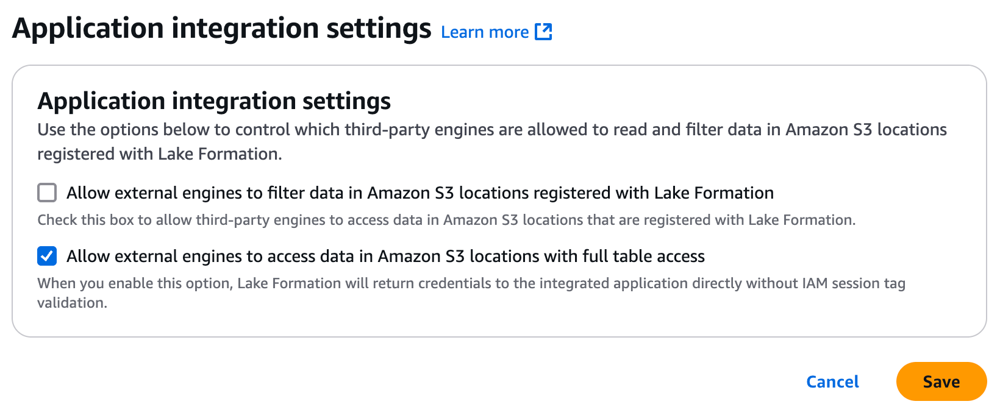

# Apache Iceberg

This connector materializes Flow collections into Iceberg tables. It
orchestrates Spark jobs running on your configured compute system to merge
updates into materialized tables as new data is available in the source
collections.

[`ghcr.io/estuary/materialize-iceberg:dev`](https://ghcr.io/estuary/materialize-iceberg:dev)
provides the latest connector image. You can also follow the link in your
browser to see past image versions.

## Prerequisites

To use this connector, you'll need:
- An Iceberg catalog that implements the [Apache Iceberg REST Catalog
  API](https://github.com/apache/iceberg/blob/main/open-api/rest-catalog-open-api.yaml)
- An [AWS EMR Serverless
  Application](https://docs.aws.amazon.com/emr/latest/EMR-Serverless-UserGuide/emr-serverless.html)
  with the Spark runtime
- An S3 bucket for staging data files to be merged into tables
- A dedicated IAM role for executing jobs on the EMR Serverless Application
- An AWS IAM user for submitting jobs to the EMR Serverless Application

See below for detailed descriptions of how these should be set up.

## Iceberg Catalog

### Using AWS Glue as an Iceberg Catalog

AWS Glue Catalogs are supported by way of the [AWS Glue Iceberg REST
endpoint](https://docs.aws.amazon.com/glue/latest/dg/connect-glu-iceberg-rest.html).

Note the following connector configuration details when using AWS Glue as the
catalog:
- The **Base URL** for the catalog should be
  `https://glue.<region>.amazonaws.com/iceberg`, where `<region>` is the AWS
  region of the catalog
  - Example: `https://glue.us-east-2.amazonaws.com/iceberg` for a Glue catalog
  in `us-east-2`
- The **Warehouse** is your AWS Account ID, without hyphens
  - Example: If your AWS Account ID is `0123-4567-8901`, the **Warehouse** is
  `012345678901`
- **Base Location** is required. This is the base location of where table data
  and metadata will be stored, by default under `/data` and `/metadata`,
  respectively. It must be an S3 path starting with `s3://<bucket>`. For other
  REST catalogs, this is an optional input
- Use **AWS SigV4 Authentication** for the **Catalog Authentication** option.
  Input the **AWS Access Key ID** and **AWS Secret Access Key** for an AWS IAM
  user that has been granted sufficient permissions to read and write metadata
  to the catalog. See below for an example policy that includes the minimum
  required permissions to interact with the Glue catalog and bucket containing
  table metadata.
```json
{
  "Version": "2012-10-17",
  "Statement": [
    {
      "Sid": "GlueIcebergCatalogAccess",
      "Effect": "Allow",
      "Action": [
        "glue:GetCatalog",
        "glue:GetDatabases",
        "glue:CreateTable",
        "glue:GetTables",
        "glue:CreateDatabase",
        "glue:UpdateTable",
        "glue:DeleteTable",
        "glue:GetTable"
      ],
      "Resource": [
        "arn:aws:glue:<region>:<aws-account-id>:*"
      ]
    },
    {
      "Sid": "TableBucketAccess",
      "Effect": "Allow",
      "Action": [
        "s3:PutObject",
        "s3:GetObject",
        "s3:ListBucket",
        "s3:DeleteObject"
      ],
      "Resource": [
        "arn:aws:s3:::<table-bucket>",
        "arn:aws:s3:::<table-bucket>/*"
      ]
    }
  ]
}
```
:::tip
The AWS IAM user configured for the **Catalog Authentication** does not
necessarily need to be the same user as the one configured to access the AWS EMR
Serverless Application, but it can be. Enter the same **AWS Access Key ID** and
**AWS Secret Access Key** in both places if you are using the same user.
:::

#### AWS Glue with Lake Formation

[AWS Lake
Formation](https://docs.aws.amazon.com/lake-formation/latest/dg/what-is-lake-formation.html)
provides an additional layer of permissions that apply after IAM policy
permissions. If you are using AWS Lake Formation to manage access to your Glue
catalog, additional setup is required to grant the necessary access.

The following instructions assume Lake Formation is enabled, and that the bucket
location you are using to store Iceberg table data is a registered location in
Lake Formation. Reference the [AWS Lake Formation Developer
Guide](https://docs.aws.amazon.com/lake-formation/latest/dg/lf-permissions-reference.html)
for comprehensive instructions for adding Lake Formation permissions. Specific
permissions and sample AWS CLI commands for this connector are shown below,
where applicable.

1) Ensure that the registered location is _not_ using the default service-linked
   role (`AWSServiceRoleForLakeFormationDataAccess`). You must create a [custom
   role](https://docs.aws.amazon.com/lake-formation/latest/dg/registration-role.html)
   for registering the location. At a minimum, the role must have an inline
   policy granting access to the registered bucket, as well as a trust
   relationship with the `lakeformation.amazonaws.com` entity. An example inline
   bucket access policy and trust policy are below:
```json
{
  "Version": "2012-10-17",
  "Statement": [
    {
      "Sid": "LakeFormationRegisteredLocationBucketAccessPolicy",
      "Effect": "Allow",
      "Action": [
        "s3:PutObject",
        "s3:GetObject",
        "s3:ListBucket",
        "s3:DeleteObject"
      ],
      "Resource": [
        "arn:aws:s3:::<table-bucket>",
        "arn:aws:s3:::<table-bucket>/*"
      ]
    }
  ]
}
```

```json
{
    "Version": "2012-10-17",
    "Statement": [
        {
            "Sid": "LakeFormationRegisteredLocationTrustPolicy",
            "Effect": "Allow",
            "Principal": {
                "Service": "lakeformation.amazonaws.com"
            },
            "Action": "sts:AssumeRole"
        }
    ]
}
```

2) Give the `lakeformation:GetDataAccess` permission to the configured catalog
user, for example by attaching a policy to the user like this:

```json
{
  "Version": "2012-10-17",
  "Statement": [
    {
      "Effect": "Allow",
      "Action": "lakeformation:GetDataAccess",
      "Resource": "*"
    }
  ]
}
```

3) In the Lake Formation console, under **Administration -> Application
   integration settings**, ensure **Allow external engines to access data in
   Amazon S3 locations with full table access** is **enabled** by checking the
   box for it.


4) Grant `DATA_LOCATION_ACCESS` to the registered location for the catalog user:
```
aws lakeformation grant-permissions \
  --principal DataLakePrincipalIdentifier=<catalog-user-arn> \
  --permissions "DATA_LOCATION_ACCESS" \
  --resource '{"DataLocation":{"CatalogId":"<aws-account-id>","ResourceArn":"<registered-bucket-arn>"}}'
```

5) Grant `CREATE_DATABASE` on the catalog for the catalog user:
```
aws lakeformation grant-permissions \
  --principal DataLakePrincipalIdentifier=<catalog-user-arn> \
  --permissions "CREATE_DATABASE" \
  --resource '{ "Catalog": {"Id": "<aws-account-id>"} }'
```

6) Grant `ALL` access to tables within any pre-existing databases that will
   contain materialized tables to the catalog user. Databases the connector
   creates will automatically have the necessary permissions for the catalog
   user. Run this command for each pre-existing database that matches a
   namespace of a binding configured in the materialization:
```
aws lakeformation grant-permissions \
  --principal DataLakePrincipalIdentifier=<catalog-user-arn> \
  --permissions "ALL" \
  --resource '{ "Table": {"DatabaseName":"<database-name>", "TableWildcard":{}}}'
```

7) Grant `ALL` access to _all_ databases that will contain materialized tables
   to the EMR Execution Role. You may need to do this step after the connector
   has automatically created the databases for the role to have the required
   access. Run this command for each database:
```
aws lakeformation grant-permissions \
  --principal DataLakePrincipalIdentifier=<emr-execution-role-arn> \
  --permissions "ALL" \
  --resource '{ "Table": {"DatabaseName":"<database-name>", "TableWildcard":{}}}'
```

:::info
If you have enabled
[sourceCapture](../../../concepts/materialization.md#using-sourcecapture-to-synchronize-capture-and-materialization-bindings)
for your materialization and a new binding is added with a new namespace, you
will need the repeat step 7 to grant access to that database to the EMR
execution role.
:::

### Using Other REST Catalogs

Configuration for REST catalogs other than AWS Glue will depend on the specific
catalog. These catalogs should use **OAuth 2.0 Client Credentials** for the
**Catalog Authentication** configuration.

:::info Beta
Currently only REST catalogs that use Amazon S3 for external cloud storage are
supported. Support for catalogs backed by GCP or Azure is planned.
:::

#### Example: Snowflake Open Catalog

[Snowflake Open
Catalog](https://www.snowflake.com/en/product/features/open-catalog/) is a
managed Iceberg REST catalog service. Refer to the
[docs](https://other-docs.snowflake.com/en/opencatalog/overview) for detailed
information on how to set it up. These are the high-level steps that must be
completed:
- Create external cloud storage for the catalog. This is where table data and
  metadata files are stored
- Create the catalog and permissions for Snowflake Open Catalog to access your
  cloud storage
- Create a **Role** for the catalog, and grant it these permissions:
  - **CATALOG_MANAGE_CONTENT**
  - **CATALOG_MANAGE_METADATA**
  - **CATALOG_READ_PROPERTIES**
  - **CATALOG_WRITE_PROPERTIES**
  - **NAMESPACE_CREATE**
  - **NAMESPACE_FULL_METADATA**
  - **NAMESPACE_LIST**
  - **NAMESPACE_READ_PROPERTIES**
  - **NAMESPACE_WRITE_PROPERTIES**
  - **TABLE_CREATE**
  - **TABLE_DROP**
  - **TABLE_FULL_METADATA**
  - **TABLE_LIST**
  - **TABLE_READ_DATA**
  - **TABLE_READ_PROPERTIES**
  - **TABLE_WRITE_DATA**
  - **TABLE_WRITE_PROPERTIES**
- Create a **Service Connection** and **Principal Role**. When creating the
  service connection, the input for **Query Engine** can be left blank, or set
  to anything you want. Copy the **Client ID** and **Client Secret** when they
  are shown to you. You will need this credential when setting up the
  materialization's **Catalog Credential**, as `<client id>:<client secret>`
- Grant the **Role** you created in the catalog to the **Principal Role** you
  just created

Now you can configure the materialization:
- The **Base URL** should be `https://<open_catalog_account_identifier>.snowflakecomputing.com/polaris/api/catalog`
- For **Warehouse**, use the name of the Snowflake Open Catalog.
- Enter any **Namespace** you desire. It will be created if it does not already
  exist
- **Base Location** can be left blank to use the default base location you
  specified when creating the Snowflake Open Catalog
- For **Catalog Authentication**, select **OAuth 2.0 Client Credentials**:
  - Use the default `v1/oauth/tokens` for `OAuth 2.0 Server URI`
  - Input the **Catalog Credential** you copied when creating the **Service
    Connection**
  - Set the **Scope** as `PRINCIPAL_ROLE:<your_principal>`, where
    `<your_principal>` is the name of the **Principal Role** you created when
    creating the **Service Connection**

:::tip
You can specify the `<open_catalog_account_identifier>` in the **Base URL**
above as `<account name>.<cloud region>.<cloud provider>`. See the
[docs](https://other-docs.snowflake.com/en/opencatalog/find-account-name) for
how to find your account name. The `cloud region` and `cloud provider` are for
the Snowflake Open Catalog, and are found in the same place as the account name.
For example, if your account name is `ab12345` on `us-east-2.aws`, your **Base
URL** will be
`https://ab12345.us-east-2.aws.snowflakecomputing.com/polaris/api/catalog`.
:::

## AWS EMR Serverless Application Configuration

To use [AWS EMR
Serverless](https://docs.aws.amazon.com/emr/latest/EMR-Serverless-UserGuide/emr-serverless.html)
for compute, a few different AWS items must be set up to work together:
- The connector submits jobs to the **AWS EMR Serverless Application** and
  monitors their progress
- Catalog credentials are stored securely in [AWS Systems Manager Parameter
  Store](https://docs.aws.amazon.com/systems-manager/latest/userguide/systems-manager-parameter-store.html),
  managed by the connector, and read by EMR jobs to connect to the catalog
- Data to merge into tables is staged in an S3 bucket and read by EMR jobs
- EMR jobs are run using an IAM role with a specific **Execution Role ARN**

### Create the AWS EMR Serverless Application

General documentation for creating a new AWS EMR Serverless Application is
available
[here](https://docs.aws.amazon.com/emr/latest/EMR-Serverless-UserGuide/gs-console.html#gs-application-console).

Note the following specific details when creating the application to use with
this connector:
- Select **Spark** for the **Type**.
- Use **emr-7.7.0** for the **Release Version**, and **x86_64** for the
  **Architecture**
- For **Application setup options**, select **Use custom settings**. These options
  can generally be configured as desired, with the specific notes below:
  - **Pre-initialized capacity** is not required, but may help reduce latency for
    streaming updates
  - In **Additional configurations** there is an option for **Use AWS Glue Data
    Catalog as metastore**. This is not required, even if you are using AWS Glue
    as your Iceberg catalog
  - Make sure **Automatically start application on job submission** is enabled
    under **Application behavior**. Enabling **Automatically stop after
    application is idle for** is recommended to stop any pre-initialized capacity
    during periods of low data volume
  - In **Network connections**, you must configure **Virtual private cloud
    (VPC)**, **Subnets**, and **Security groups**  to enable REST API calls to
    your Iceberg catalog. The subnets must have a route to an Internet Gateway,
    and the security group must allow outbound traffic. See the [AWS
    docs](https://docs.aws.amazon.com/emr/latest/EMR-Serverless-UserGuide/vpc-access.html)
    for setting up VPC access for EMR Serverless applications

### Configure Parameter Store

AWS Systems Manager Parameter Store requires minimal additional configuration.
Catalog credentials are stored encrypted in parameter store by the connector,
and retrieved by EMR Serverless jobs to connect to your catalog.

Parameter Store is only used with **OAuth 2.0 Client Credentials**. If you are
using AWS Glue as your catalog, the **Systems Manager Prefix** can be left
blank, since the EMR execution role will have permissions to read from the
catalog associated with it directly. The **Systems Manager Prefix** is a
hierarchical location where the connector will store encrypted credentials. For
example, you may input `/estuary/` as the prefix - note the leading a trailing
slashes are required.

### Create Staging Bucket

Data to merge into Iceberg tables is staged in an S3 bucket under the optional
**Bucket Path** prefix by the connector. Additional connector metadata is stored
in the staging bucket under the `flow_metadata_v1` prefix. The staging bucket
must be in the same region as the EMR application.

### Create IAM Role for EMR Execution

This role must have sufficient permissions to read credentials from Systems
Manager (unless you are using Glue), and access data in the staging bucket. If
you are using AWS Glue as the catalog, this role must also have permissions to
access the catalog.

See the [AWS
docs](https://docs.aws.amazon.com/emr/latest/EMR-Serverless-UserGuide/getting-started.html#gs-runtime-role)
for information on how to create the role.

You must include this **Custom trust policy** for the role type when creating
the role in order for jobs submitted to the application to access other AWS
services on behalf of the IAM user:
```json
{
  "Version": "2012-10-17",
  "Statement": [
    {
      "Effect": "Allow",
      "Principal": {
        "Service": "emr-serverless.amazonaws.com"
      },
      "Action": "sts:AssumeRole"
    }
  ]
}
```

See below for an example policy with the required permissions to attach to the
execution role if you are using a standard REST catalog:
```json
{
  "Version": "2012-10-17",
  "Statement": [
    {
      "Sid": "StagingBucketAccess",
      "Effect": "Allow",
      "Action": [
        "s3:PutObject",
        "s3:GetObject",
        "s3:ListBucket",
        "s3:DeleteObject"
      ],
      "Resource": [
        "arn:aws:s3:::<staging-bucket>/<optional-bucket-path>",
        "arn:aws:s3:::<staging-bucket>/<optional-bucket-path>/*"
      ]
    },
    {
      "Sid": "ParameterStoreAccess",
      "Effect": "Allow",
      "Action": [
        "ssm:GetParameter"
      ],
      "Resource": "arn:aws:ssm:<region>:<aws-account-id>:parameter/<systems-manager-prefix>/*"
    }
  ]
}
```

If you are using a Glue catalog, Parameter Store access is not required, but
access to the Glue catalog is, as well as access to the bucket where Glue stores
the table files:
```json
{
  "Version": "2012-10-17",
  "Statement": [
    {
      "Sid": "StagingBucketAccess",
      "Effect": "Allow",
      "Action": [
        "s3:PutObject",
        "s3:GetObject",
        "s3:ListBucket",
        "s3:DeleteObject"
      ],
      "Resource": [
        "arn:aws:s3:::<staging-bucket>/<optional-bucket-path>",
        "arn:aws:s3:::<staging-bucket>/<optional-bucket-path>/*"
      ]
    },
    {
      "Sid": "TableBucketAccess",
      "Effect": "Allow",
      "Action": [
        "s3:PutObject",
        "s3:GetObject",
        "s3:ListBucket",
        "s3:DeleteObject"
      ],
      "Resource": [
        "arn:aws:s3:::<table-bucket>",
        "arn:aws:s3:::<table-bucket>/*"
      ]
    },
    {
      "Sid": "GlueCatalogTableModification",
      "Effect": "Allow",
      "Action": [
        "glue:GetTable",
        "glue:UpdateTable"
      ],
      "Resource": [
        "arn:aws:glue:<region>:<aws-account-id>:*"
      ]
    }
  ]
}
```

### Create IAM User for Compute Configuration

The **AWS Access Key ID** and **AWS Secret Access Key** set in the **AWS EMR
Serverless** configuration must be for an IAM user with permissions to manage
jobs for the EMR Serverless Application and read and write data to the staging
bucket. If you are using AWS Glue as the catalog, parameter store permissions
are not required.

See below for an example policy with these permissions:
```json
{
  "Version": "2012-10-17",
  "Statement": [
    {
      "Sid": "StagingBucketAccess",
      "Effect": "Allow",
      "Action": [
        "s3:PutObject",
        "s3:GetObject",
        "s3:ListBucket",
        "s3:DeleteObject"
      ],
      "Resource": [
        "arn:aws:s3:::<staging-bucket>/<optional-bucket-path>",
        "arn:aws:s3:::<staging-bucket>/<optional-bucket-path>/*"
      ]
    },
    {
      "Effect": "Allow",
      "Action": "iam:PassRole",
      "Resource": "<emr-execution-role-arn>",
      "Condition": {
        "StringEquals": {
          "iam:PassedToService": "emr-serverless.amazonaws.com"
        }
      }
    },
    {
      "Sid": "EMRServerlessActions",
      "Effect": "Allow",
      "Action": [
        "emr-serverless:ListApplications",
        "emr-serverless:GetApplication",
        "emr-serverless:StartApplication",
        "emr-serverless:StartJobRun",
        "emr-serverless:CancelJobRun",
        "emr-serverless:ListJobRuns",
        "emr-serverless:GetJobRun"
      ],
      "Resource": [
        "arn:aws:emr-serverless:<region>:<aws-account-id>:/applications/<emr-application-id>",
        "arn:aws:emr-serverless:<region>:<aws-account-id>:/applications/<emr-application-id>/jobruns/*"
      ]
    },
    {
      "Sid": "ParameterStoreAccess",
      "Effect": "Allow",
      "Action": [
        "ssm:PutParameter",
        "ssm:GetParameter"
      ],
      "Resource": "arn:aws:ssm:<region>:<aws-account-id>:parameter/<systems-manager-prefix>/*"
    }
  ]
}
```

## Configuration

See below for a full list of configuration options.

### Properties

#### Endpoint

| Property                                            | Title                  | Description                                                                                                                          | Type    | Required/Default              |
|-----------------------------------------------------|------------------------|--------------------------------------------------------------------------------------------------------------------------------------|---------|-------------------------------|
| **`/url`**                                          | URL                    | Base URL for the catalog.                                                                                                            | string  | Required                      |
| **`/warehouse`**                                    | Warehouse              | Warehouse to connect to. For AWS Glue, this is the account ID.                                                                       | string  | Required                      |
| **`/namespace`**                                    | Namespace              | Namespace for bound collection tables (unless overridden within the binding resource configuration).                                 | string  | Required (Pattern: `^[^.]*$`) |
| `/base_location`                                    | Base Location          | Base location for catalog tables. Required if using AWS Glue. Example: `s3://your_bucket/your_prefix/`.                              | string  |                               |
| `/hard_delete`                                      | Hard Delete            | If enabled, items deleted in the source will also be deleted from the destination. Disabled by default (soft-delete).                | boolean |                               |
| **`/catalog_authentication`**                       | Catalog Authentication | Authentication method for the catalog. Supports OAuth 2.0 Client Credentials or AWS SigV4.                                           | object  |                               |
| **`/catalog_authentication/oauth2_server_uri`**     | OAuth 2.0 Server URI   | OAuth 2.0 server URI for requesting access tokens. Usually 'v1/oauth/tokens'.                                                        | string  | Required                      |
| **`/catalog_authentication/credential`**            | Catalog Credential     | Credential for connecting to the REST catalog. Format: `<client_id>:<client_secret>` for OAuth, `<token>` for Bearer authentication. | string  | Required                      |
| `/catalog_authentication/scope`                     | Scope                  | Authorization scope for OAuth client credentials. Example: `PRINCIPAL_ROLE:your_principal`.                                          | string  |                               |
| **`/catalog_authentication/aws_access_key_id`**     | AWS Access Key ID      | Access Key ID for AWS SigV4 authentication.                                                                                          | string  | Required                      |
| **`/catalog_authentication/aws_secret_access_key`** | AWS Secret Access Key  | Secret Access Key for AWS SigV4 authentication.                                                                                      | string  | Required                      |
| **`/catalog_authentication/region`**                | Region                 | AWS region for authentication.                                                                                                       | string  | Required                      |
| **`/compute`**                                      | Compute                | Compute backend for processing. Supports AWS EMR Serverless.                                                                         | object  | Required                      |
| **`/compute/aws_access_key_id`**                    | AWS Access Key ID      | Access Key ID for authenticating with EMR and writing to the staging bucket.                                                         | string  | Required                      |
| **`/compute/aws_secret_access_key`**                | AWS Secret Access Key  | Secret Access Key for authenticating with EMR and writing to the staging bucket.                                                     | string  | Required                      |
| **`/compute/region`**                               | Region                 | Region of the EMR application and staging bucket.                                                                                    | string  | Required                      |
| **`/compute/application_id`**                       | Application ID         | ID of the EMR serverless application.                                                                                                | string  | Required                      |
| **`/compute/execution_role_arn`**                   | Execution Role ARN     | ARN of the EMR serverless execution role used to run jobs.                                                                           | string  | Required                      |
| **`/compute/bucket`**                               | Bucket                 | Bucket to store staged data files.                                                                                                   | string  | Required                      |
| `/compute/bucket_path`                              | Bucket Path            | Optional prefix used to store staged data files.                                                                                     | string  |                               |
| `/compute/systems_manager_prefix`                   | System Manager Prefix  | Prefix for parameters in Systems Manager as an absolute directory path (must start and end with `/`).                                | string  | `/estuary/`                   |

#### Bindings

| Property     | Title            | Description                          | Type   | Required/Default |
|--------------|------------------|--------------------------------------|--------|------------------|
| **`/table`** | Table            | Table name                           | string | Required         |
| `/namespace` | Alternative name | Alternative namespace for this table | string |                  |

## Sync Schedule

This connector supports configuring a schedule for sync frequency. You can read
about how to configure this [here](../../materialization-sync-schedule.md).

## Iceberg Column Types

Flow collection fields are written to Iceberg table columns based on the data type of the field.
Iceberg [V2 primitive type](https://iceberg.apache.org/spec/#primitive-types) columns are created
for these Flow collection fields:

| Collection Field Data Type                  | Iceberg Column Type                          |
|---------------------------------------------|----------------------------------------------|
| **array**                                   | **string**                                   |
| **object**                                  | **string**                                   |
| **boolean**                                 | **boolean**                                  |
| **integer**                                 | **long**                                     |
| **number**                                  | **double**                                   |
| **string** with `{contentEncoding: base64}` | **binary**                                   |
| **string** with `{format: date-time}`       | **timestamptz** (with microsecond precision) |
| **string** with `{format: date}`            | **date**                                     |
| **string** with `{format: integer}`         | **long**                                     |
| **string** with `{format: number}`          | **double**                                   |
| **string** (all others)                     | **string**                                   |

Flow collection fields with `{type: string, format: time}` and `{type: string, format: uuid}` are
materialized as **string** columns rather than **time** and **uuid** columns for compatibility with
Apache Spark. **[Nested types](https://iceberg.apache.org/spec/#nested-types)** are not currently
supported.

## Table Maintenance

To ensure optimal query performance, you should conduct [regular
maintenance](https://iceberg.apache.org/docs/latest/maintenance/) for your materialized tables since
the connector will not perform this maintenance automatically (support for automatic table
maintenance is planned).

If you're using the AWS Glue catalog, you can enable automatic data file compaction by following
[this guide](https://docs.aws.amazon.com/lake-formation/latest/dg/data-compaction.html).
