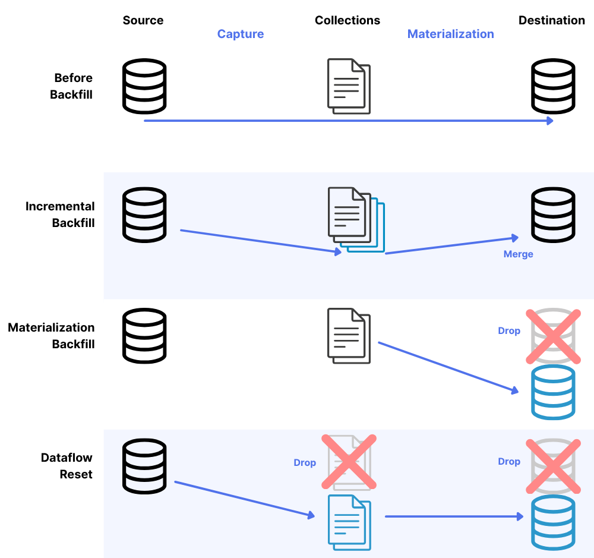

# Backfilling Data

When new captures are created, you often have the option of backfilling data. This captures data in its current state and then switches to capturing change events on an ongoing basis.

This is desirable in most cases, as it ensures that a complete view of your data is captured into Flow.

You also have options to backfill data in either the source, destination, or entire data flow after initial connector setup. This can be useful to refresh data or recover in the event of data corruption.

Also see how [schema evolution](https://docs.estuary.dev/concepts/advanced/evolutions/#what-do-schema-evolutions-do) can help with backfills when a source's schema becomes incompatible with the existing schema.

## Backfill types



### Capture backfill

A capture backfill refreshes data from your source system into Estuary collections without dropping your destination tables.
This is useful when you need to update your collections with the latest source data or recover from data loss in your collections.

When you perform a capture backfill:

* Data is reread from the source system
* The data is stored in Estuary collections
* Existing destination tables remain intact
* New or updated data will be materialized to destinations as part of the normal process

To perform a capture backfill:

1. Navigate to the Sources tab in the Flow web UI
2. Find your capture and click the Backfill option
3. Disable the **Backfill data flow** toggle
4. (Optional) Choose a specific [**Backfill mode**](#backfill-modes) in the collection resource configuration for advanced use cases
5. Save and publish your changes

This option is ideal when you want to ensure your collections have the most up-to-date data without
disrupting your destination systems.

When you perform a capture backfill, all data is pulled into collections again, and
materializations that use those collections will read and process this data. How the data is handled
at the destination depends on your materialization settings:

* **Standard (merge) updates:** The system will query the destination for existing records
with matching keys and merge the incoming data with existing records. This prevents
duplication in your destination tables.
* **Delta updates:** New records are inserted without checking for existing data, which can
result in duplicate records in your destination.

### Materialization backfill

A materialization backfill drops and recreates your destination tables using the data currently stored
in your Estuary collections. This is useful when you need to refresh destination tables without
rereading from the source.

When you perform a materialization backfill:

* Destination tables are dropped and recreated
* Data is read from existing Estuary collections
* No new data is pulled from the source
* Tables are repopulated with data from collections

To perform a materialization backfill:

1. Navigate to the Destinations tab in the Flow web UI
2. Find your materialization and start editing it
3. Select the **Backfill** button to backfill the entire materialization or individually backfill collections in their **Resource configuration**
4. Save and publish your changes

:::tip
Dropping destination tables may create downtime for your destination table consumers while data is backfilled.
:::

This option is best when you need to refresh destination tables but are confident your collections
contain all the necessary historical data.

### Data flow backfill

A data flow backfill is the most comprehensive option, refreshing the entire pipeline from source to
destination. This option drops destination tables, rereads data from the source into collections, and
then materializes that data to the destination.

When you perform a data flow backfill:

* Destination tables are dropped and recreated
* Data is reread from the source system
* Collections are updated with fresh source data
* Materialization bindings are configured to only read from now onwards (they don’t
re-send previously captured data along with the new backfill)
* Destination tables are repopulated with the refreshed data

To perform a data flow backfill:

1. Navigate to the Sources tab in the Flow web UI
2. Find your capture and click the Backfill option
3. Make sure the **Backfill data flow** toggle is enabled
4. Save and publish your changes

This option is ideal when you need a complete refresh of your entire data pipeline, especially when
you suspect data inconsistencies between source, collections, and destinations.

### Backfill Selection

Backfills can be a powerful tool to recover data, but can also result in unnecessary data costs if used incorrectly. This section will help you choose when to backfill and which backfill option to use.

When deciding which backfill type to use, consider:

* **Data retention:** If using Estuary's trial buckets, data expires after approximately 20
days. For full historical data, [configure your own storage bucket](../getting-started/installation.mdx).
* **Table size:** For very large tables (TBs of data), consider the impact (time, data, cost) of
dropping and recreating tables.
* **Downtime tolerance:** Materialization and data flow backfills involve dropping destination
tables, which creates downtime.
* **Update strategy:** Consider whether your materializations use standard (merge) or delta
updates, as this affects how backfilled data is handled at the destination. Using capture
backfills (not dropping the destination tables) when you have materializations that use
delta updates may result in duplicate rows.

By understanding these backfill types, you can choose the appropriate method to maintain data
consistency across your Estuary Flow pipelines while minimizing disruption to your data consumers.

| **If I want to...** | **Then I should...** |
| --- | --- |
| Refresh my collections with source data, without dropping destination tables | Use a **Capture Backfill** to pull all source data into Estuary collections |
| Rebuild destination tables using existing collection data | Use a **Materialization Backfill** to drop and recreate destination tables from collections |
| Completely refresh my entire data pipeline from source to destination | Use a **Data Flow Backfill** to drop destination tables and backfill from source |
| Recover from a replication slot failure in PostgreSQL | Use a **Capture Backfill** to re-establish consistency |
| Add a new table to my existing data flow | Use a **Capture Backfill** for just the new binding |
| Ensure my own storage bucket contains complete historical data | Use a **Capture Backfill** after setting up the new storage mapping |
| Recreate a destination table from scratch when using trial buckets with limited retention | Use a **Data Flow Backfill** to ensure all historical source data is included |
| Update my destination with schema changes from the source | Use a **Data Flow Backfill** to ensure schema changes are properly propagated |
| Recover from data corruption in both collections and destinations | Use a **Data Flow Backfill** for a complete refresh of the entire pipeline |
| Recover from data corruption in both collections and destinations for very large (TBs of data) datasets | Use a **Data Flow Backfill** for a refresh of the pipeline with capture configurations to start the backfill from a particular timestamp or transaction id |

## Preventing backfills

Preventing backfills when possible can help save costs and computational resources. You may find it appropriate to skip the backfill, especially for extremely large datasets or tables.

In this case, many connectors allow you to turn off backfilling on a per-stream or per-table basis. See each individual connector's properties for details.

### Preventing backfills during database upgrades

During an upgrade, some databases invalidate a replication slot, binlog position, CDC tables, or similar. As Flow relies on these methods to keep its place, upgrades will disrupt the Flow pipeline in these cases.

- If a database upgrade **will not** affect these resources, the Flow connector should simply resume when the upgrade completes and no action is required.
- If a database upgrade **will** affect these or similar resources, you may need to trigger a backfill after the upgrade completes.

The easiest and most bulletproof solution when this happens is to backfill all bindings of the impacted capture(s) after performing the upgrade. This will permit the captures to recreate entities as necessary, establish a new CDC position, and then backfill all table contents to ensure that any changes which might have occurred in the meantime are correctly captured.

However, it is common to want to avoid a full backfill when performing this sort of database maintenance, as these backfills may take some time and require a significant amount of extra data movement even if nothing has actually changed. Some connectors provide features which may be used to accomplish this, however they typically require some amount of extra setup or user knowledge to guarantee certain invariants (put simply: if there were a more efficient way to re-establish consistency in the general case, that's what we would already be doing when asked to backfill the data again).

For example, Postgres currently deletes or requires users to drop logical replication slots during a major version upgrade. To prevent a full backfill during the upgrade, follow these steps:

1. Pause database writes so no further changes can occur.

2. Monitor the current capture to ensure captures are fully up-to-date.
   - These two steps ensure the connector won't miss any changes.

3. Perform the database upgrade.

4. Backfill each binding of the capture using the ["Only Changes" backfill mode](#backfill-modes).
   - This will not cause a full backfill. "Backfilling" all bindings at once resets the WAL (Write-Ahead Log) position for the capture, essentially allowing it to "jump ahead" to the current end of the WAL. The "Only Changes" mode will skip re-reading existing table content.

5. Resume database writes.

## Backfill modes

The connectors that use CDC (Change Data Capture) allow fine-grained control of backfills for individual tables. These bindings include a "Backfill Mode" dropdown in their resource configuration. This setting then translates to a `mode` field for that resource in the specification. For example:

```yaml
"bindings": [
    {
      "resource": {
        "namespace": "public",
        "stream": "tableName",
        "mode": "Only Changes"
      },
      "target": "Artificial-Industries/postgres/public/tableName"
    }
  ]
```

:::warning
In general, you should not change this setting. Make sure you understand your use case, such as [preventing backfills](#preventing-backfills-during-database-upgrades).
:::

The following modes are available:

* **Normal:** backfills chunks of the table and emits all replication events regardless of whether they occur within the backfilled portion of the table or not.

   In Normal mode, the connector fetches key-ordered chunks of the table for the backfill while performing reads of the WAL.
   All WAL changes are emitted immediately, whether or not they relate to an unread portion of the table. Therefore, if a change is made, it shows up quickly even if its table is still backfilling.

* **Precise:** backfills chunks of the table and filters replication events in portions of the table which haven't yet been reached.

   In Precise mode, the connector fetches key-ordered chunks of the table for the backfill while performing reads of the WAL.
   Any WAL changes for portions of the table that have already been backfilled are emitted. In contrast to Normal mode, however, WAL changes are suppressed if they relate to a part of the table that hasn't been backfilled yet.

   WAL changes and backfill chunks get stitched together to produce a fully consistent logical sequence of changes for each key. For example, you are guaranteed to see an insert before an update or delete.

   Note that Precise backfill is not possible in some cases due to equality comparison challenges when using varying character encodings.

* **Only Changes:** skips backfilling the table entirely and jumps directly to replication streaming for the entire dataset.

   No backfill of the table content is performed at all. Only WAL changes are emitted.

* **Without Primary Key:** can be used to capture tables without any form of unique primary key.

   The connector uses an alternative physical row identifier (such as a Postgres `ctid`) to scan backfill chunks, rather than walking the table in key order.

   This mode lacks the exact correctness properties of the Normal backfill mode.

If you do not choose a specific backfill mode, Flow will default to an automatic mode.

## Advanced backfill configuration in specific systems

### PostgreSQL Capture

PostgreSQL's `xmin` system column can be used as a cursor to keep track of the current location in a table. If you need to re-backfill a Postgres table, you can reduce the affected data volume by specifying a minimum or maximum backfill `XID`. Estuary will only backfill rows greater than or less than the specified `XID`.

This can be especially useful in cases where you do not want to re-backfill a full table, but cannot complete the steps in [Preventing backfills](#preventing-backfills) above, such as if you cannot pause database writes during an upgrade.

To configure this option:

1. Determine the `xmin` value you want to use.

   You can run a query to find a suitable `XID`, such as:
   `SELECT xmin FROM {your_table_name} WHERE created_at < {desired_timestamp} and created_at > {desired_timestamp};`

2. In the Estuary dashboard, edit your PostgreSQL Capture.

3. Under Endpoint Config, expand **Advanced Options**.

4. Fill out the "Minimum Backfill XID" or "Maximum Backfill XID" field with the `xmin` value you retrieved.

5. Click "Backfill".

6. Save and publish your changes.

In rare cases, this method may not work as expected, as in situations where a database has already filled up its entire `xmin` space. In such cases of `xmin` wrapping, using both Minimum and Maximum Backfill XID fields can help narrow down a specific range to backfill.
